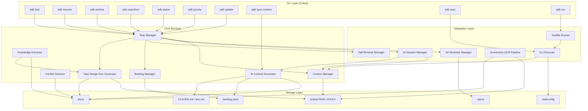
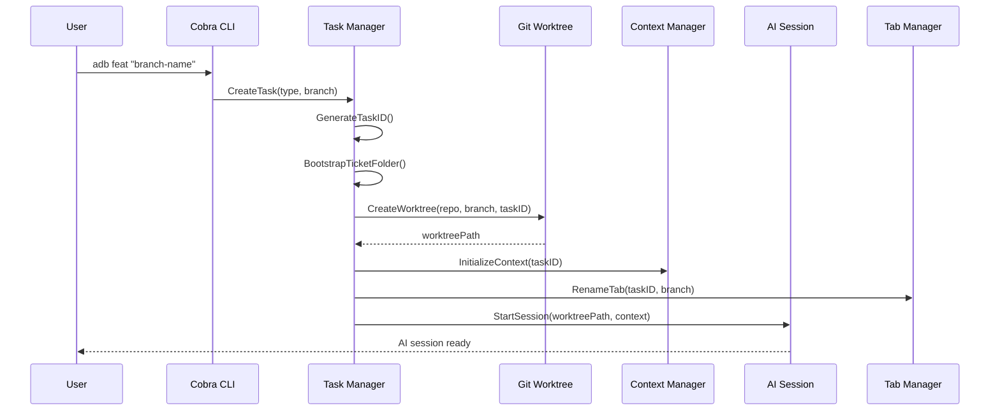

# Design Document: AI Dev Brain

## Overview

AI Dev Brain is a developer productivity system that wraps AI coding assistants with persistent context management, task lifecycle automation, and knowledge accumulation. The system is implemented as a single compiled Go binary (`adb`) using Cobra for CLI commands, Viper for configuration, and standard Go idioms for error handling and interfaces.

The architecture follows a modular design with clear separation between:
- **CLI Layer**: Cobra-based subcommands for task lifecycle operations
- **Core Services**: Task management, context persistence, knowledge extraction
- **Integration Layer**: Git worktrees, AI assistants, terminal/tab management
- **Storage Layer**: YAML/Markdown files for human-readable, git-friendly persistence

Distribution is a single binary placed in `~/.local/bin/` (Linux/Mac) or equivalent on Windows.

## Architecture



### Component Interaction Flow



## Components and Interfaces

### Project Structure

```
ai-dev-brain/
├── cmd/
│   └── adb/
│       └── main.go              # Entry point
├── internal/
│   ├── cli/                     # Cobra command definitions
│   │   ├── root.go
│   │   ├── feat.go
│   │   ├── resume.go
│   │   ├── archive.go
│   │   ├── unarchive.go
│   │   ├── status.go
│   │   ├── priority.go
│   │   ├── update.go
│   │   ├── synccontext.go
│   │   ├── exec.go
│   │   └── run.go
│   ├── core/                    # Business logic
│   │   ├── taskmanager.go
│   │   ├── bootstrap.go
│   │   ├── taskid.go
│   │   ├── templates.go
│   │   ├── knowledge.go
│   │   ├── conflict.go
│   │   ├── updategen.go
│   │   ├── aicontext.go
│   │   └── designdoc.go
│   ├── storage/                 # Persistence layer
│   │   ├── backlog.go
│   │   ├── context.go
│   │   └── communication.go
│   └── integration/             # External system integration
│       ├── worktree.go
│       ├── tab.go
│       ├── screenshot.go
│       ├── offline.go
│       ├── cliexec.go
│       └── taskfilerunner.go
├── pkg/
│   └── models/                  # Shared types and interfaces
│       ├── task.go
│       ├── config.go
│       ├── communication.go
│       └── knowledge.go
├── go.mod
├── go.sum
└── README.md
```

### 1. Task Manager

The central orchestrator for task lifecycle operations.

```go
// pkg/models/task.go

type TaskType string

const (
    TaskTypeFeat     TaskType = "feat"
    TaskTypeBug      TaskType = "bug"
    TaskTypeSpike    TaskType = "spike"
    TaskTypeRefactor TaskType = "refactor"
)

type TaskStatus string

const (
    StatusBacklog    TaskStatus = "backlog"
    StatusInProgress TaskStatus = "in_progress"
    StatusBlocked    TaskStatus = "blocked"
    StatusReview     TaskStatus = "review"
    StatusDone       TaskStatus = "done"
    StatusArchived   TaskStatus = "archived"
)

type Priority string

const (
    P0 Priority = "P0"
    P1 Priority = "P1"
    P2 Priority = "P2"
    P3 Priority = "P3"
)

type Task struct {
    ID          string     `yaml:"id"`
    Title       string     `yaml:"title"`
    Type        TaskType   `yaml:"type"`
    Status      TaskStatus `yaml:"status"`
    Priority    Priority   `yaml:"priority"`
    Owner       string     `yaml:"owner"`
    Repo        string     `yaml:"repo"`
    Branch      string     `yaml:"branch"`
    WorktreePath string   `yaml:"worktree"`
    TicketPath  string     `yaml:"ticket_path"`
    Created     time.Time  `yaml:"created"`
    Updated     time.Time  `yaml:"updated"`
    Tags        []string   `yaml:"tags"`
    BlockedBy   []string   `yaml:"blocked_by"`
    Related     []string   `yaml:"related"`
    Source      string     `yaml:"source,omitempty"`
}

// internal/core/taskmanager.go

type TaskManager interface {
    CreateTask(taskType TaskType, branchName string, repoPath string) (*Task, error)
    ResumeTask(taskID string) (*Task, error)
    ArchiveTask(taskID string) (*HandoffDocument, error)
    UnarchiveTask(taskID string) (*Task, error)
    GetTasksByStatus(status TaskStatus) ([]*Task, error)
    GetAllTasks() ([]*Task, error)
    GetTask(taskID string) (*Task, error)
    ReorderPriorities(taskIDs []string) error
}
```

### 2. Bootstrap System

Handles new task initialization with proper structure.

```go
// internal/core/bootstrap.go

type BootstrapConfig struct {
    Type       TaskType
    BranchName string
    RepoPath   string
    Template   string
}

type BootstrapResult struct {
    TaskID      string
    TicketPath  string
    WorktreePath string
    ContextPath string
}

type BootstrapSystem interface {
    Bootstrap(config BootstrapConfig) (*BootstrapResult, error)
    ApplyTemplate(taskID string, templateType TaskType) error
    GenerateTaskID() (string, error)
}
```

### 3. Context Manager

Manages persistent context for AI session continuity.

```go
// internal/storage/context.go

type TaskContext struct {
    TaskID         string          `yaml:"task_id"`
    Notes          string          `yaml:"notes"`
    Context        string          `yaml:"context"`
    Communications []Communication `yaml:"communications"`
    LastUpdated    time.Time       `yaml:"last_updated"`
}

type AIContext struct {
    Summary        string   `yaml:"summary"`
    RecentActivity []string `yaml:"recent_activity"`
    OpenQuestions  []string `yaml:"open_questions"`
    Decisions      []string `yaml:"decisions"`
    Blockers       []string `yaml:"blockers"`
}

type ContextManager interface {
    InitializeContext(taskID string) (*TaskContext, error)
    LoadContext(taskID string) (*TaskContext, error)
    UpdateContext(taskID string, updates map[string]interface{}) error
    PersistContext(taskID string) error
    GetContextForAI(taskID string) (*AIContext, error)
}
```

### 4. Git Worktree Manager

Handles git worktree operations across multiple repositories.

```go
// internal/integration/worktree.go

type WorktreeConfig struct {
    RepoPath   string
    BranchName string
    TaskID     string
    BaseBranch string
}

type Worktree struct {
    Path    string
    Branch  string
    TaskID  string
    RepoPath string
}

type GitWorktreeManager interface {
    CreateWorktree(config WorktreeConfig) (string, error)
    RemoveWorktree(worktreePath string) error
    ListWorktrees(repoPath string) ([]*Worktree, error)
    GetWorktreeForTask(taskID string) (*Worktree, error)
}
```

### 5. Knowledge Extractor

Extracts and feeds knowledge back to documentation.

```go
// internal/core/knowledge.go

type ExtractedKnowledge struct {
    TaskID         string
    Learnings      []string
    Decisions      []Decision
    Gotchas        []string
    RunbookUpdates []RunbookUpdate
    WikiUpdates    []WikiUpdate
}

type Decision struct {
    Title        string
    Context      string
    Decision     string
    Consequences []string
    Alternatives []string
}

type HandoffDocument struct {
    TaskID        string
    Summary       string
    CompletedWork []string
    OpenItems     []string
    Learnings     []string
    RelatedDocs   []string
    GeneratedAt   time.Time
}

type KnowledgeExtractor interface {
    ExtractFromTask(taskID string) (*ExtractedKnowledge, error)
    GenerateHandoff(taskID string) (*HandoffDocument, error)
    UpdateWiki(knowledge *ExtractedKnowledge) error
    CreateADR(decision Decision, taskID string) (string, error)
}
```

### 6. Conflict Detector

Monitors for conflicts with existing decisions and requirements.

```go
// internal/core/conflict.go

type ConflictType string

const (
    ConflictADRViolation        ConflictType = "adr_violation"
    ConflictPreviousDecision    ConflictType = "previous_decision"
    ConflictStakeholderRequirement ConflictType = "stakeholder_requirement"
)

type Severity string

const (
    SeverityHigh   Severity = "high"
    SeverityMedium Severity = "medium"
    SeverityLow    Severity = "low"
)

type ConflictContext struct {
    TaskID          string
    ProposedChanges string
    AffectedFiles   []string
}

type Conflict struct {
    Type           ConflictType
    Source         string
    Description    string
    Recommendation string
    Severity       Severity
}

type ConflictDetector interface {
    CheckForConflicts(ctx ConflictContext) ([]Conflict, error)
}
```

### 7. Backlog Manager

Manages the central task registry.

```go
// internal/storage/backlog.go

type BacklogEntry struct {
    ID        string     `yaml:"id"`
    Title     string     `yaml:"title"`
    Source    string     `yaml:"source,omitempty"`
    Status    TaskStatus `yaml:"status"`
    Priority  Priority   `yaml:"priority"`
    Owner     string     `yaml:"owner"`
    Repo      string     `yaml:"repo"`
    Branch    string     `yaml:"branch"`
    Created   string     `yaml:"created"`
    Tags      []string   `yaml:"tags"`
    BlockedBy []string   `yaml:"blocked_by"`
    Related   []string   `yaml:"related"`
}

type BacklogFilter struct {
    Status   []TaskStatus
    Priority []Priority
    Owner    string
    Repo     string
    Tags     []string
}

type BacklogFile struct {
    Version string                  `yaml:"version"`
    Tasks   map[string]BacklogEntry `yaml:"tasks"`
}

type BacklogManager interface {
    AddTask(entry BacklogEntry) error
    UpdateTask(taskID string, updates BacklogEntry) error
    RemoveTask(taskID string) error
    GetTask(taskID string) (*BacklogEntry, error)
    GetAllTasks() ([]BacklogEntry, error)
    FilterTasks(filter BacklogFilter) ([]BacklogEntry, error)
    Load() error
    Save() error
}
```

### 8. Screenshot OCR Pipeline

Captures and processes screenshots for content extraction.

```go
// internal/integration/screenshot.go

type Screenshot struct {
    Data      []byte
    Timestamp time.Time
    Source    string
}

type ContentCategory string

const (
    CategoryCommunication ContentCategory = "communication"
    CategoryWiki          ContentCategory = "wiki"
    CategoryRequirement   ContentCategory = "requirement"
    CategoryCode          ContentCategory = "code"
    CategoryOther         ContentCategory = "other"
)

type ProcessedContent struct {
    ExtractedText  string
    Category       ContentCategory
    Summary        string
    RelevantToTask bool
    SuggestedPath  string
}

type ScreenshotPipeline interface {
    Capture() (*Screenshot, error)
    ProcessScreenshot(screenshot *Screenshot) (*ProcessedContent, error)
    FileContent(content *ProcessedContent, taskID string) (string, error)
}
```

### 9. Update Generator

Generates stakeholder communication updates.

```go
// internal/core/updategen.go

type MessageChannel string

const (
    ChannelEmail MessageChannel = "email"
    ChannelSlack MessageChannel = "slack"
    ChannelTeams MessageChannel = "teams"
)

type MessagePriority string

const (
    MsgPriorityHigh   MessagePriority = "high"
    MsgPriorityNormal MessagePriority = "normal"
    MsgPriorityLow    MessagePriority = "low"
)

type UpdatePlan struct {
    TaskID            string
    Messages          []PlannedMessage
    InformationNeeded []InformationRequest
    GeneratedAt       time.Time
}

type PlannedMessage struct {
    Recipient string
    Reason    string
    Channel   MessageChannel
    Subject   string
    Body      string
    Priority  MessagePriority
}

type InformationRequest struct {
    From     string
    Question string
    Context  string
    Blocking bool
}

type UpdateGenerator interface {
    GenerateUpdates(taskID string) (*UpdatePlan, error)
}
```

### 10. Tab Manager

Manages terminal and editor tab naming.

```go
// internal/integration/tab.go

type TabEnvironment string

const (
    EnvVSCode   TabEnvironment = "vscode"
    EnvKiro     TabEnvironment = "kiro"
    EnvTerminal TabEnvironment = "terminal"
    EnvUnknown  TabEnvironment = "unknown"
)

type TabManager interface {
    RenameTab(taskID string, branchName string) error
    RestoreTab() error
    DetectEnvironment() TabEnvironment
}
```

### 11. Configuration Manager

Handles configuration loading and merging via Viper.

```go
// pkg/models/config.go

type GlobalConfig struct {
    DefaultAI        string   `yaml:"default_ai" mapstructure:"default_ai"`
    TaskIDPrefix     string   `yaml:"task_id_prefix" mapstructure:"task_id_prefix"`
    TaskIDCounter    int      `yaml:"task_id_counter" mapstructure:"task_id_counter"`
    DefaultPriority  Priority `yaml:"default_priority" mapstructure:"default_priority"`
    DefaultOwner     string   `yaml:"default_owner" mapstructure:"default_owner"`
    ScreenshotHotkey string   `yaml:"screenshot_hotkey" mapstructure:"screenshot_hotkey"`
    OfflineMode      bool     `yaml:"offline_mode" mapstructure:"offline_mode"`
}

type RepoConfig struct {
    BuildCommand     string            `yaml:"build_command,omitempty" mapstructure:"build_command"`
    TestCommand      string            `yaml:"test_command,omitempty" mapstructure:"test_command"`
    DefaultReviewers []string          `yaml:"default_reviewers,omitempty" mapstructure:"default_reviewers"`
    Conventions      []string          `yaml:"conventions,omitempty" mapstructure:"conventions"`
    Templates        map[TaskType]string `yaml:"templates,omitempty" mapstructure:"templates"`
}

type MergedConfig struct {
    GlobalConfig `yaml:",inline" mapstructure:",squash"`
    Repo         *RepoConfig `yaml:"repo,omitempty" mapstructure:"repo"`
}

type ConfigurationManager interface {
    LoadGlobalConfig() (*GlobalConfig, error)
    LoadRepoConfig(repoPath string) (*RepoConfig, error)
    GetMergedConfig(repoPath string) (*MergedConfig, error)
    ValidateConfig(config interface{}) error
}
```

### 12. Offline Manager

Handles offline detection and operation queuing.

```go
// internal/integration/offline.go

type QueuedOperation struct {
    Type      string
    Payload   interface{}
    Timestamp time.Time
}

type SyncResult struct {
    Synced int
    Failed int
    Errors []string
}

type OfflineManager interface {
    IsOnline() bool
    QueueOperation(op QueuedOperation) error
    SyncPendingOperations() (*SyncResult, error)
    OnConnectivityChange(callback func(online bool))
}
```

### 13. AI Context Generator

Generates and maintains root-level AI context files (CLAUDE.md or kiro.md).

```go
// internal/core/aicontext.go

type AIType string

const (
    AITypeClaude AIType = "claude"
    AITypeKiro   AIType = "kiro"
)

type ContextSection string

const (
    SectionOverview    ContextSection = "overview"
    SectionStructure   ContextSection = "structure"
    SectionConventions ContextSection = "conventions"
    SectionGlossary    ContextSection = "glossary"
    SectionDecisions   ContextSection = "decisions"
    SectionActiveTasks ContextSection = "active_tasks"
    SectionContacts    ContextSection = "contacts"
)

type AIContextFile struct {
    AIType      AIType
    GeneratedAt time.Time
    Sections    AIContextSections
}

type AIContextSections struct {
    Overview           string
    DirectoryStructure string
    Conventions        string
    Glossary           string
    DecisionsSummary   string
    ActiveTaskSummaries string
    StakeholderLinks   string
    ContactLinks       string
}

type AIContextGenerator interface {
    GenerateContextFile(aiType AIType) (string, error)
    RegenerateSection(section ContextSection) error
    SyncContext() error
    AssembleProjectOverview() (string, error)
    AssembleDirectoryStructure() (string, error)
    AssembleConventions() (string, error)
    AssembleGlossary() (string, error)
    AssembleActiveTaskSummaries() (string, error)
    AssembleDecisionsSummary() (string, error)
}
```

### 14. Task Design Document Generator

Manages task-level technical design documents.

```go
// internal/core/designdoc.go

type TaskDesignDocument struct {
    TaskID                 string
    Title                  string
    Overview               string
    Architecture           string // Mermaid diagram
    Components             []ComponentDescription
    TechnicalDecisions     []TechnicalDecision
    RelatedADRs            []string
    StakeholderRequirements []string
    LastUpdated            time.Time
}

type ComponentDescription struct {
    Name         string
    Purpose      string
    Interfaces   []string
    Dependencies []string
}

type TechnicalDecision struct {
    Decision     string
    Rationale    string
    Source       string
    Date         time.Time
    ADRCandidate bool
}

type DesignUpdate struct {
    Section string // "overview", "architecture", "components", "decisions"
    Content string
}

type TaskDesignDocGenerator interface {
    InitializeDesignDoc(taskID string) error
    PopulateFromContext(taskID string) error
    UpdateDesignDoc(taskID string, update DesignUpdate) error
    ExtractFromCommunications(taskID string) ([]TechnicalDecision, error)
    GenerateArchitectureDiagram(taskID string) (string, error)
    GetDesignDoc(taskID string) (*TaskDesignDocument, error)
}
```

### 15. Communication Manager

Manages task-related communications.

```go
// internal/storage/communication.go

type CommunicationTag string

const (
    TagRequirement CommunicationTag = "requirement"
    TagDecision    CommunicationTag = "decision"
    TagBlocker     CommunicationTag = "blocker"
    TagQuestion    CommunicationTag = "question"
    TagActionItem  CommunicationTag = "action_item"
)

type Communication struct {
    Date    time.Time          `yaml:"date"`
    Source  string             `yaml:"source"`
    Contact string            `yaml:"contact"`
    Topic   string            `yaml:"topic"`
    Content string            `yaml:"content"`
    Tags    []CommunicationTag `yaml:"tags"`
}

type CommunicationManager interface {
    AddCommunication(taskID string, comm Communication) error
    SearchCommunications(taskID string, query string) ([]Communication, error)
    GetAllCommunications(taskID string) ([]Communication, error)
}
```

### 16. CLI Executor

Handles invocation of external CLI tools as subprocesses with task context injection.

```go
// internal/integration/cliexec.go

type CLIAlias struct {
    Name       string   `yaml:"name"`
    Command    string   `yaml:"command"`
    DefaultArgs []string `yaml:"default_args,omitempty"`
}

type CLIExecConfig struct {
    CLI        string
    Args       []string
    TaskCtx    *TaskEnvContext // nil if no active task
    Aliases    []CLIAlias
    Stdin      io.Reader
    Stdout     io.Writer
    Stderr     io.Writer
}

type TaskEnvContext struct {
    TaskID       string
    Branch       string
    WorktreePath string
    TicketPath   string
}

type CLIExecResult struct {
    ExitCode int
    Stdout   string
    Stderr   string
}

type CLIExecutor interface {
    // Exec invokes an external CLI, resolving aliases and injecting task env vars.
    Exec(config CLIExecConfig) (*CLIExecResult, error)
    // ResolveAlias returns the expanded command and args for an alias, or the original if not aliased.
    ResolveAlias(name string, aliases []CLIAlias) (command string, defaultArgs []string, found bool)
    // BuildEnv constructs the subprocess environment with task context variables injected.
    BuildEnv(base []string, taskCtx *TaskEnvContext) []string
    // ListAliases returns all configured CLI aliases.
    ListAliases(aliases []CLIAlias) []string
    // LogFailure records a CLI failure in the task's context if a task is active.
    LogFailure(taskCtx *TaskEnvContext, cli string, args []string, result *CLIExecResult) error
}
```

### 17. Taskfile Runner

Discovers and executes tasks defined in Taskfile.yaml.

```go
// internal/integration/taskfilerunner.go

type TaskfileTask struct {
    Name        string   `yaml:"name"`
    Description string   `yaml:"desc,omitempty"`
    Commands    []string `yaml:"cmds"`
    Deps        []string `yaml:"deps,omitempty"`
}

type Taskfile struct {
    Version string                  `yaml:"version"`
    Tasks   map[string]TaskfileTask `yaml:"tasks"`
}

type TaskfileRunConfig struct {
    TaskName string
    Args     []string
    TaskCtx  *TaskEnvContext // nil if no active task
    Dir      string         // directory containing Taskfile.yaml
    Stdout   io.Writer
    Stderr   io.Writer
}

type TaskfileRunner interface {
    // Discover parses Taskfile.yaml from the given directory and returns available tasks.
    Discover(dir string) (*Taskfile, error)
    // Run executes a named task from the Taskfile, injecting task context env vars.
    Run(config TaskfileRunConfig) (*CLIExecResult, error)
    // ListTasks returns the names and descriptions of all tasks in the Taskfile.
    ListTasks(dir string) ([]TaskfileTask, error)
}
```

## Data Models

### Directory Structure

```
dev-brain/
├── CLAUDE.md               # AI context file for Claude Code
├── kiro.md                 # AI context file for Kiro
├── docs/
│   ├── wiki/{aws, proserve, teams, projects}/
│   ├── stakeholders.md
│   ├── contacts.md
│   ├── glossary.md
│   ├── decisions/          # ADRs
│   └── runbooks/
├── tickets/
│   └── TASK-XXXXX/
│       ├── communications/  # Chronological .md files
│       ├── notes.md
│       ├── context.md
│       ├── design.md       # Task-level technical design
│       ├── status.yaml
│       └── handoff.md      # Auto-generated on archive
├── backlog.yaml            # Central task registry
├── repos/
│   ├── github.com/org/{repoA, repoB}/work/TASK-XXXXX
│   ├── gitlab.com/group/{repoC}/work/TASK-XXXXX
│   └── code.aws.dev/group/{repoD}/work/TASK-XXXXX
└── .taskconfig             # Global configuration (Viper-managed)
```

### backlog.yaml Schema

```yaml
# backlog.yaml
version: "1.0"
tasks:
  TASK-00042:
    title: "Implement OAuth flow"
    source: JIRA-1234
    status: in_progress
    priority: P1
    owner: "@username"
    repo: github.com/org/auth-service
    branch: feat/oauth-flow
    created: "2026-02-01T00:00:00Z"
    tags: [security, auth, Q1-goal]
    blocked_by: [TASK-00041]
    related: [TASK-00039]
```

### status.yaml Schema (per task)

```yaml
# tickets/TASK-XXXXX/status.yaml
id: TASK-00042
title: "Implement OAuth flow"
type: feat
status: in_progress
priority: P1
owner: "@username"
repo: github.com/org/auth-service
branch: feat/oauth-flow
worktree: repos/github.com/org/auth-service/work/TASK-00042
created: "2026-02-01T00:00:00Z"
updated: "2026-02-05T14:30:00Z"
source: JIRA-1234
tags: [security, auth]
blocked_by: []
related: [TASK-00039]
sessions:
  - started: "2026-02-01T09:00:00Z"
    ended: "2026-02-01T17:00:00Z"
  - started: "2026-02-05T09:00:00Z"
    ended: null  # Currently active
```

### .taskconfig Schema (Viper-managed)

```yaml
# .taskconfig
version: "1.0"
defaults:
  ai: kiro
  priority: P2
  owner: "@myusername"
  
task_id:
  prefix: "TASK"
  counter_file: ".task_counter"
  
screenshot:
  hotkey: "ctrl+shift+s"
  ocr_provider: "claude"
  
platforms:
  github.com:
    default_branch: main
  gitlab.com:
    default_branch: main
  code.aws.dev:
    default_branch: mainline

templates:
  feat: "templates/feat.md"
  bug: "templates/bug.md"
  spike: "templates/spike.md"
  refactor: "templates/refactor.md"

cli_aliases:
  - name: aws
    command: aws
    default_args: ["--profile", "myprofile", "--region", "us-east-1"]
  - name: gh
    command: gh
  - name: k
    command: kubectl
    default_args: ["--context", "dev-cluster"]
  - name: dc
    command: docker-compose
```

### context.md Template

```markdown
# Task Context: TASK-XXXXX

## Summary
[AI-maintained summary of current task state]

## Current Focus
[What we're working on right now]

## Recent Progress
- [Chronological list of completed items]

## Open Questions
- [ ] [Questions needing answers]

## Decisions Made
- [Key decisions with rationale]

## Blockers
- [Current blockers and who can help]

## Next Steps
- [ ] [Planned next actions]

## Related Resources
- [Links to relevant docs, PRs, etc.]
```

### Communication File Format

```markdown
# 2026-02-05-slack-john-new-requirement.md

**Date:** 2026-02-05
**Source:** Slack
**Contact:** John Smith (@john)
**Topic:** New OAuth requirement

## Content

[Extracted/pasted communication content]

## Tags
- requirement
- action_item

## Extracted Items

### Requirements
- OAuth must support PKCE flow

### Action Items
- [ ] Update design doc with PKCE requirement
- [ ] Schedule follow-up with security team

### Decisions
- Will use Auth0 as identity provider
```

### Handoff Document Template

```markdown
# Handoff: TASK-XXXXX

**Generated:** 2026-02-10T15:00:00Z
**Status:** Archived

## Summary
[One paragraph summary of what was accomplished]

## Completed Work
- [List of completed items]

## Open Items
- [ ] [Any remaining work]

## Key Learnings
- [Important things learned during this task]

## Decisions Made
- [Decisions with context, linked to ADRs if created]

## Gotchas
- [Things that tripped us up, for future reference]

## Related Documentation
- [Links to updated wiki pages, ADRs, runbooks]

## Provenance
This handoff was generated from TASK-XXXXX communications and notes.
Knowledge has been fed back to:
- docs/wiki/auth/oauth-implementation.md
- docs/decisions/ADR-0042-oauth-provider.md
```

### ADR Template

```markdown
# ADR-XXXX: [Title]

**Status:** Accepted
**Date:** 2026-02-05
**Source:** TASK-XXXXX

## Context
[What is the issue that we're seeing that is motivating this decision?]

## Decision
[What is the change that we're proposing and/or doing?]

## Consequences
[What becomes easier or more difficult to do because of this change?]

## Alternatives Considered
[What other options were evaluated?]
```

### AI Context File Template (CLAUDE.md / kiro.md)

```markdown
# AI Dev Brain Context

> Auto-generated context file for AI coding assistants. Last updated: 2026-02-05T14:30:00Z

## Project Overview

AI Dev Brain is a developer productivity system that wraps AI coding assistants with persistent context management. This monorepo contains task management, documentation, and multi-repository worktrees.

## Directory Structure

- `docs/` - Organizational knowledge (wiki, ADRs, runbooks, contacts)
- `tickets/` - Task folders with context, communications, and design docs
- `repos/` - Git worktrees organized by platform/org/repo
- `backlog.yaml` - Central task registry

## Key Conventions

[Extracted from docs/wiki/ and .taskrc files]

- Branch naming: `{type}/{task-id}-{description}`
- Commit format: Conventional Commits with task ID reference
- PR template: Include task ID, summary, and testing notes

## Glossary

[Extracted from docs/glossary.md]

- **Task**: Unit of work with TASK-XXXXX ID
- **Worktree**: Isolated git working directory for a task
- **ADR**: Architecture Decision Record

## Active Decisions Summary

[Extracted from docs/decisions/]

- ADR-0042: Use Auth0 for OAuth (TASK-00042)
- ADR-0039: PostgreSQL for persistence (TASK-00039)

## Active Tasks

| Task ID | Title | Status | Branch |
|---------|-------|--------|--------|
| TASK-00042 | Implement OAuth flow | in_progress | feat/oauth-flow |
| TASK-00043 | Add rate limiting | blocked | feat/rate-limit |

## Key Contacts

See [docs/stakeholders.md](docs/stakeholders.md) for outcome owners.
See [docs/contacts.md](docs/contacts.md) for subject matter experts.

---
*Run `adb sync-context` to regenerate this file.*
```

### Task Design Document Template (design.md)

```markdown
# Technical Design: TASK-XXXXX

**Task:** [Task title]
**Created:** 2026-02-01
**Last Updated:** 2026-02-05T14:30:00Z

## Overview

[Brief description of what this task accomplishes technically]

## Architecture

` ``mermaid
graph TB
    A[Component A] --> B[Component B]
    B --> C[Component C]
` ``

## Components

### Component A
- **Purpose:** [What it does]
- **Interfaces:** [Key methods/APIs]
- **Dependencies:** [What it depends on]

## Technical Decisions

| Decision | Rationale | Source | Date |
|----------|-----------|--------|------|
| Use library X | Better performance | 2026-02-03-slack-john.md | 2026-02-03 |

## Related ADRs

- [ADR-0042: OAuth Provider Selection](../../docs/decisions/ADR-0042-oauth-provider.md)

## Stakeholder Requirements

- [From communications] Must support PKCE flow

## Open Technical Questions

- [ ] How to handle token refresh in offline mode?

---
*This document is maintained by AI Dev Brain and updated as work progresses.*
```

## Correctness Properties

*A property is a characteristic or behavior that should hold true across all valid executions of a system—essentially, a formal statement about what the system should do. Properties serve as the bridge between human-readable specifications and machine-verifiable correctness guarantees.*

Based on the prework analysis, the following 30 properties have been identified and consolidated to eliminate redundancy:

### Property 1: Task ID Uniqueness

*For any* sequence of task creations across any number of repositories and platforms, all generated TASK-XXXXX IDs SHALL be unique.

**Validates: Requirements 2.1, 9.2**

### Property 2: Task Bootstrap Structure Completeness

*For any* newly bootstrapped task, the ticket folder SHALL contain: communications/ directory, notes.md, context.md, and status.yaml, AND a git worktree SHALL exist at the expected path.

**Validates: Requirements 2.2, 2.3**

### Property 3: Template Application by Type

*For any* task type (feat, bug, spike, refactor), bootstrapping a task with that type SHALL apply the corresponding template, and the resulting files SHALL contain template-specific content.

**Validates: Requirements 2.6, 11.1**

### Property 4: Archive/Unarchive Round-Trip

*For any* task that is archived and then unarchived, the task SHALL be restored to a resumable state with its previous status (before archiving) preserved.

**Validates: Requirements 1.3, 1.4**

### Property 5: Backlog Serialization Round-Trip

*For any* valid backlog state, serializing to backlog.yaml and then deserializing SHALL produce an equivalent backlog with all task metadata preserved (title, source, status, priority, owner, repo, branch, created, tags, blocked_by, related).

**Validates: Requirements 8.1, 8.4, 8.5, 8.6**

### Property 6: Backlog Filter Correctness

*For any* filter criteria (status, priority, owner, repo, tags), filtering the backlog SHALL return exactly the tasks that match ALL specified criteria and no tasks that fail to match any criterion.

**Validates: Requirements 8.3**

### Property 7: Communication Filename Format

*For any* communication added to a task, the generated filename SHALL match the format YYYY-MM-DD-source-contact-topic.md where the date, source, contact, and topic are derived from the communication metadata.

**Validates: Requirements 4.1**

### Property 8: Communication Search Round-Trip

*For any* communication stored in a task's communications/ folder, searching for that communication by its content, date, source, or contact SHALL return the communication.

**Validates: Requirements 4.4**

### Property 9: Configuration Precedence Merging

*For any* configuration key that exists in multiple sources, the merged configuration SHALL use the value from the highest-precedence source: repository .taskrc > global .taskconfig > defaults.

**Validates: Requirements 11.3, 15.3**

### Property 10: Configuration Validation

*For any* invalid configuration file (malformed YAML, missing required fields, invalid field values), the Configuration_Manager SHALL return a validation error with a clear message identifying the problem.

**Validates: Requirements 15.4**

### Property 11: Offline Operation Queue and Sync

*For any* operation queued while offline, when connectivity is restored, the operation SHALL be executed and the queue SHALL be empty after successful sync.

**Validates: Requirements 10.3, 10.5**

### Property 12: Multi-Repository Worktree Creation

*For any* task that spans N repositories, exactly N worktrees SHALL be created, one in each specified repository at the correct path.

**Validates: Requirements 9.1**

### Property 13: Repository Path Structure

*For any* repository on any supported platform (github.com, gitlab.com, code.aws.dev), the worktree path SHALL follow the structure: repos/{platform}/{org}/{repo}/work/TASK-XXXXX.

**Validates: Requirements 9.4**

### Property 14: Context Persistence Round-Trip

*For any* task with context, ending an AI session and then starting a new session SHALL load the same context state that was persisted, including context.md content, notes.md content, and all communications.

**Validates: Requirements 14.1, 14.3**

### Property 15: Knowledge Provenance Tracking

*For any* knowledge item added to docs/wiki/ or docs/decisions/ during task archival, the item SHALL include a "learned from TASK-XXXXX" attribution referencing the source task.

**Validates: Requirements 6.6**

### Property 16: ADR Creation Format

*For any* decision identified during task archival that warrants an ADR, the created ADR file SHALL contain: Status, Date, Source (task ID), Context, Decision, Consequences, and Alternatives Considered sections.

**Validates: Requirements 6.5**

### Property 17: Conflict Reporting Format

*For any* detected conflict, the surfaced conflict information SHALL include: conflict type, source document/decision, description of the conflict, and severity level.

**Validates: Requirements 7.4**

### Property 18: Update Message Chronological Order

*For any* generated update plan with multiple messages, the messages SHALL be ordered chronologically by their intended send time.

**Validates: Requirements 5.2**

### Property 19: No Auto-Send Invariant

*For any* execution of the `adb update` command, the system SHALL NOT send any communications to external systems (email, Slack, Teams); it SHALL only generate content for user review.

**Validates: Requirements 5.6**

### Property 20: AI Context File Content Completeness

*For any* generated AI context file (CLAUDE.md or kiro.md), the file SHALL contain all required sections: project overview, directory structure, conventions, glossary terms, decisions summary, active task summaries, and contact links.

**Validates: Requirements 16.1, 16.2, 16.5**

### Property 21: AI Context File Sync Consistency

*For any* update to wiki content, ADRs, or active tasks, executing `adb sync-context` SHALL regenerate the AI context file with content reflecting the current state of all source documents.

**Validates: Requirements 16.3, 16.4, 16.6**

### Property 22: Task Design Document Bootstrap

*For any* newly bootstrapped task, a design.md file SHALL be created in tickets/TASK-XXXXX/ containing the task title, creation date, and placeholder sections for architecture and decisions.

**Validates: Requirements 17.1**

### Property 23: Task Design Document Context Population

*For any* task with related wiki content, ADRs, or stakeholder requirements, the design.md SHALL be populated with relevant context from these sources when the task is started.

**Validates: Requirements 17.2**

### Property 24: Technical Decision Extraction

*For any* communication containing a technical decision (identified by decision tags or AI analysis), the decision SHALL be extracted and added to the task's design.md with source attribution.

**Validates: Requirements 17.4**

### Property 25: Design Document as Knowledge Source

*For any* archived task with a design.md, the Knowledge_Extractor SHALL use design.md as a primary source for extracting technical learnings and identifying ADR candidates.

**Validates: Requirements 17.6**

### Property 26: CLI Argument Passthrough

*For any* external CLI name and arbitrary argument list, the CLI_Executor SHALL construct a subprocess command where the resolved command is invoked with all provided arguments in their original order, prepended by any alias default_args.

**Validates: Requirements 18.1, 18.5**

### Property 27: Task Context Environment Injection

*For any* task context (TaskEnvContext) with a task ID, branch, worktree path, and ticket path, the subprocess environment built by BuildEnv SHALL contain ADB_TASK_ID, ADB_BRANCH, ADB_WORKTREE_PATH, and ADB_TICKET_PATH set to the corresponding values. When no task context is provided (nil), none of these variables SHALL be present.

**Validates: Requirements 18.3**

### Property 28: Taskfile Task Discovery

*For any* valid Taskfile.yaml containing N task definitions, Discover SHALL parse the file and return exactly N tasks, and ListTasks SHALL return task entries whose names match exactly the keys defined in the Taskfile.

**Validates: Requirements 18.2, 18.4**

### Property 29: CLI Alias Resolution

*For any* set of CLI aliases configured in .taskconfig, ResolveAlias SHALL return the correct command and default_args for a known alias, and SHALL return the original name with no default_args for an unknown alias.

**Validates: Requirements 18.5, 18.8**

### Property 30: CLI Failure Propagation

*For any* external CLI execution that exits with a non-zero exit code, the CLI_Executor SHALL return a CLIExecResult containing the original exit code and captured stderr, and if a task context is active, the failure SHALL be logged to the task's context.

**Validates: Requirements 18.6**

## Error Handling

Go uses explicit error returns rather than exceptions. All functions that can fail return `error` as the last return value.

### Task Operations

| Error Condition | Handling Strategy |
|----------------|-------------------|
| Task ID not found | Return `fmt.Errorf("task %s not found, run 'adb status' to list valid tasks", id)` |
| Worktree creation fails | Log git error, clean up partial state with deferred cleanup, return wrapped error |
| Task already exists | Return error suggesting `adb resume` to continue |
| Invalid task type | Return error listing valid types (feat, bug, spike, refactor) |
| Archive of active task | Warn user, require confirmation via `--force` flag |

### Git Operations

| Error Condition | Handling Strategy |
|----------------|-------------------|
| Repository not found | Return error with path, suggest checking repos/ structure |
| Branch already exists | Offer to use existing branch or create with suffix |
| Worktree path conflict | Generate unique path with timestamp suffix |
| Git command failure | Wrap exec.Command error with full git output |

### Configuration (Viper)

| Error Condition | Handling Strategy |
|----------------|-------------------|
| Invalid YAML syntax | Return Viper parse error with file path |
| Missing required field | Return error identifying field and expected type |
| Invalid field value | Return error with valid options/format |
| Config file not found | Use Viper defaults, log info via `log.Printf` |

### Offline Mode

| Error Condition | Handling Strategy |
|----------------|-------------------|
| AI feature requested offline | Return `ErrOffline` sentinel error with clear message |
| Sync failure | Retry with exponential backoff, preserve queue on repeated failure |
| Partial sync | Return `SyncResult` with succeeded/failed counts, allow retry |

### Screenshot Pipeline

| Error Condition | Handling Strategy |
|----------------|-------------------|
| Screen capture fails | Return error with OS-specific troubleshooting steps |
| OCR extraction fails | Save raw image, return error allowing manual text entry |
| Categorization uncertain | Return `ProcessedContent` with `CategoryOther`, prompt user |
| File write fails | Return `os.PathError` with path and permission info |

### CLI Execution

| Error Condition | Handling Strategy |
|----------------|-------------------|
| CLI not found in PATH | Return `exec.ErrNotFound` wrapped with suggestion to install or configure alias |
| CLI exits non-zero | Capture exit code and stderr, log to task context if active, return original exit code |
| Taskfile.yaml not found | Return error with path checked, suggest creating Taskfile.yaml |
| Taskfile task not found | Return error listing available tasks via `adb run --list` |
| Taskfile.yaml parse error | Return YAML parse error with file path and line number |
| Alias resolution cycle | Return error identifying the circular alias chain |
| Pipe/chain execution fails | Return exit code from the failed command in the pipeline |
| Context logging fails | Log warning but do not fail the CLI execution itself |

### Error Wrapping Pattern

```go
// Standard error wrapping pattern used throughout
func (tm *taskManager) CreateTask(taskType TaskType, branch string, repo string) (*Task, error) {
    id, err := tm.bootstrap.GenerateTaskID()
    if err != nil {
        return nil, fmt.Errorf("creating task: generating ID: %w", err)
    }
    
    result, err := tm.bootstrap.Bootstrap(BootstrapConfig{
        Type:       taskType,
        BranchName: branch,
        RepoPath:   repo,
    })
    if err != nil {
        // Clean up partial state
        _ = tm.cleanup(id)
        return nil, fmt.Errorf("creating task %s: bootstrap: %w", id, err)
    }
    
    return &Task{ID: id, /* ... */}, nil
}
```

## Testing Strategy

### Dual Testing Approach

The system requires both unit tests and property-based tests for comprehensive coverage:

- **Unit tests**: Verify specific examples, edge cases, integration points, and error conditions using Go's built-in `testing` package
- **Property tests**: Verify universal properties across randomly generated inputs using `pgregory.net/rapid`

### Property-Based Testing Configuration

**Library**: [rapid](https://pgregory.net/rapid) (Go property-based testing library)

**Configuration**:
- Minimum 100 iterations per property test (via `rapid.MakeCheck` with default settings)
- Each test tagged with comment: `// Feature: ai-dev-brain, Property {N}: {property_text}`
- Custom generators for: TaskID, TaskType, TaskStatus, Priority, BacklogEntry, Communication, Config

### Test Categories

#### Unit Tests

1. **Task Manager** (`internal/core/taskmanager_test.go`)
   - Create task with each type
   - Resume existing task
   - Archive task generates handoff
   - Status grouping correctness
   - Priority reordering

2. **Bootstrap System** (`internal/core/bootstrap_test.go`)
   - Directory structure creation
   - Template application per type
   - Worktree creation at correct path

3. **Backlog Manager** (`internal/storage/backlog_test.go`)
   - YAML parsing edge cases
   - Filter combinations
   - Dependency tracking

4. **Configuration Manager** (`internal/core/config_test.go`)
   - Viper config loading
   - Validation error messages
   - Default value application

5. **Context Manager** (`internal/storage/context_test.go`)
   - File loading
   - Context persistence
   - Communication parsing

6. **CLI Executor** (`internal/integration/cliexec_test.go`)
   - Alias resolution for known and unknown aliases
   - Environment variable injection with and without task context
   - Exit code propagation on failure
   - Failure logging to task context
   - Display of aliases when no arguments provided

7. **Taskfile Runner** (`internal/integration/taskfilerunner_test.go`)
   - Taskfile.yaml parsing with valid and invalid files
   - Task discovery and listing
   - Task execution with argument passthrough
   - Missing Taskfile.yaml error handling

#### Property Tests

Each correctness property (1-30) maps to a property-based test using rapid:

| Property | Test Description | Generator |
|----------|-----------------|-----------|
| P1 | Task ID uniqueness | Arbitrary task creation sequences |
| P2 | Bootstrap completeness | Arbitrary TaskType, branch names |
| P3 | Template application | All TaskType values |
| P4 | Archive/unarchive round-trip | Arbitrary tasks with content |
| P5 | Backlog serialization | Arbitrary BacklogEntry slices |
| P6 | Filter correctness | Arbitrary filters and backlogs |
| P7 | Communication filename | Arbitrary Communication metadata |
| P8 | Communication search | Arbitrary communications and queries |
| P9 | Config precedence | Arbitrary config combinations |
| P10 | Config validation | Arbitrary invalid configs |
| P11 | Offline queue/sync | Arbitrary operation sequences |
| P12 | Multi-repo worktrees | Arbitrary repo slices |
| P13 | Repo path structure | Arbitrary platform/org/repo combinations |
| P14 | Context round-trip | Arbitrary context states |
| P15 | Provenance tracking | Arbitrary knowledge items |
| P16 | ADR format | Arbitrary decisions |
| P17 | Conflict format | Arbitrary conflicts |
| P18 | Message ordering | Arbitrary message slices |
| P19 | No auto-send | Arbitrary update scenarios |
| P20 | AI context completeness | Arbitrary wiki/ADR/task states |
| P21 | AI context sync | Arbitrary content updates |
| P22 | Design doc bootstrap | Arbitrary task types and branches |
| P23 | Design doc population | Arbitrary wiki/ADR content |
| P24 | Decision extraction | Arbitrary communications with decisions |
| P25 | Design doc as knowledge source | Arbitrary design docs |
| P26 | CLI argument passthrough | Arbitrary CLI names and arg lists |
| P27 | Task context env injection | Arbitrary TaskEnvContext values |
| P28 | Taskfile task discovery | Arbitrary Taskfile.yaml structures |
| P29 | CLI alias resolution | Arbitrary alias configurations |
| P30 | CLI failure propagation | Arbitrary exit codes and stderr |

### Integration Tests

1. **End-to-end task lifecycle**: Create → Work → Archive → Unarchive → Resume
2. **Multi-repo workflow**: Create task spanning 3 repos, verify all worktrees
3. **Offline/online transition**: Queue operations offline, verify sync on reconnect
4. **Knowledge feedback**: Archive task, verify wiki and ADR updates
5. **CLI execution within task**: Create task, run `adb exec` and `adb run`, verify env vars injected and failure logged to context

### Test Data Generators (rapid)

```go
// Example generators for property tests using pgregory.net/rapid

func genTaskID(t *rapid.T) string {
    n := rapid.IntRange(0, 99999).Draw(t, "taskNum")
    return fmt.Sprintf("TASK-%05d", n)
}

func genTaskType(t *rapid.T) TaskType {
    types := []TaskType{TaskTypeFeat, TaskTypeBug, TaskTypeSpike, TaskTypeRefactor}
    return types[rapid.IntRange(0, len(types)-1).Draw(t, "typeIdx")]
}

func genTaskStatus(t *rapid.T) TaskStatus {
    statuses := []TaskStatus{
        StatusBacklog, StatusInProgress, StatusBlocked,
        StatusReview, StatusDone, StatusArchived,
    }
    return statuses[rapid.IntRange(0, len(statuses)-1).Draw(t, "statusIdx")]
}

func genPriority(t *rapid.T) Priority {
    priorities := []Priority{P0, P1, P2, P3}
    return priorities[rapid.IntRange(0, len(priorities)-1).Draw(t, "priorityIdx")]
}

func genBacklogEntry(t *rapid.T) BacklogEntry {
    return BacklogEntry{
        ID:        genTaskID(t),
        Title:     rapid.StringMatching(`[a-zA-Z ]{1,100}`).Draw(t, "title"),
        Status:    genTaskStatus(t),
        Priority:  genPriority(t),
        Owner:     rapid.StringMatching(`@[a-z]{1,20}`).Draw(t, "owner"),
        Repo:      rapid.StringMatching(`github\.com/[a-z]+/[a-z]+`).Draw(t, "repo"),
        Branch:    rapid.StringMatching(`[a-z\-]{1,50}`).Draw(t, "branch"),
        Created:   time.Now().Format(time.RFC3339),
        Tags:      rapid.SliceOfN(rapid.StringMatching(`[a-z]{1,20}`), 0, 5).Draw(t, "tags"),
        BlockedBy: rapid.SliceOfN(rapid.Custom(genTaskID), 0, 3).Draw(t, "blockedBy"),
        Related:   rapid.SliceOfN(rapid.Custom(genTaskID), 0, 3).Draw(t, "related"),
    }
}

func genCommunication(t *rapid.T) Communication {
    sources := []string{"slack", "email", "teams", "meeting"}
    return Communication{
        Date:    time.Now(),
        Source:  sources[rapid.IntRange(0, len(sources)-1).Draw(t, "sourceIdx")],
        Contact: rapid.StringMatching(`[a-z]{1,30}`).Draw(t, "contact"),
        Topic:   rapid.StringMatching(`[a-zA-Z ]{1,50}`).Draw(t, "topic"),
        Content: rapid.StringMatching(`[a-zA-Z0-9 .,!?]{1,500}`).Draw(t, "content"),
        Tags: rapid.SliceOfN(
            rapid.SampledFrom([]CommunicationTag{
                TagRequirement, TagDecision, TagBlocker, TagQuestion, TagActionItem,
            }), 0, 3,
        ).Draw(t, "tags"),
    }
}

func genCLIAlias(t *rapid.T) CLIAlias {
    return CLIAlias{
        Name:       rapid.StringMatching(`[a-z]{2,10}`).Draw(t, "aliasName"),
        Command:    rapid.StringMatching(`[a-z\-]{2,20}`).Draw(t, "command"),
        DefaultArgs: rapid.SliceOfN(rapid.StringMatching(`\-\-[a-z]{1,15}`), 0, 4).Draw(t, "defaultArgs"),
    }
}

func genTaskEnvContext(t *rapid.T) *TaskEnvContext {
    return &TaskEnvContext{
        TaskID:       genTaskID(t),
        Branch:       rapid.StringMatching(`[a-z\-]{1,30}`).Draw(t, "branch"),
        WorktreePath: rapid.StringMatching(`/tmp/[a-z/]{5,40}`).Draw(t, "wtPath"),
        TicketPath:   rapid.StringMatching(`tickets/TASK-[0-9]{5}`).Draw(t, "ticketPath"),
    }
}

func genTaskfileTask(t *rapid.T) TaskfileTask {
    return TaskfileTask{
        Name:        rapid.StringMatching(`[a-z\-]{2,20}`).Draw(t, "taskName"),
        Description: rapid.StringMatching(`[a-zA-Z ]{0,50}`).Draw(t, "desc"),
        Commands:    rapid.SliceOfN(rapid.StringMatching(`[a-z \-]{1,30}`), 1, 5).Draw(t, "cmds"),
    }
}
```

### Example Property Test

```go
// internal/storage/backlog_test.go

func TestBacklogSerializationRoundTrip(t *testing.T) {
    // Feature: ai-dev-brain, Property 5: Backlog Serialization Round-Trip
    rapid.Check(t, func(t *rapid.T) {
        entries := rapid.SliceOfN(rapid.Custom(genBacklogEntry), 1, 20).Draw(t, "entries")
        
        mgr := NewBacklogManager(t.TempDir())
        for _, e := range entries {
            err := mgr.AddTask(e)
            if err != nil {
                t.Fatal(err)
            }
        }
        
        err := mgr.Save()
        if err != nil {
            t.Fatal(err)
        }
        
        mgr2 := NewBacklogManager(mgr.path)
        err = mgr2.Load()
        if err != nil {
            t.Fatal(err)
        }
        
        loaded, err := mgr2.GetAllTasks()
        if err != nil {
            t.Fatal(err)
        }
        
        if len(loaded) != len(entries) {
            t.Fatalf("expected %d entries, got %d", len(entries), len(loaded))
        }
        
        for _, orig := range entries {
            found, err := mgr2.GetTask(orig.ID)
            if err != nil {
                t.Fatalf("task %s not found after round-trip", orig.ID)
            }
            if found.Title != orig.Title || found.Status != orig.Status {
                t.Fatalf("task %s metadata mismatch after round-trip", orig.ID)
            }
        }
    })
}
```
