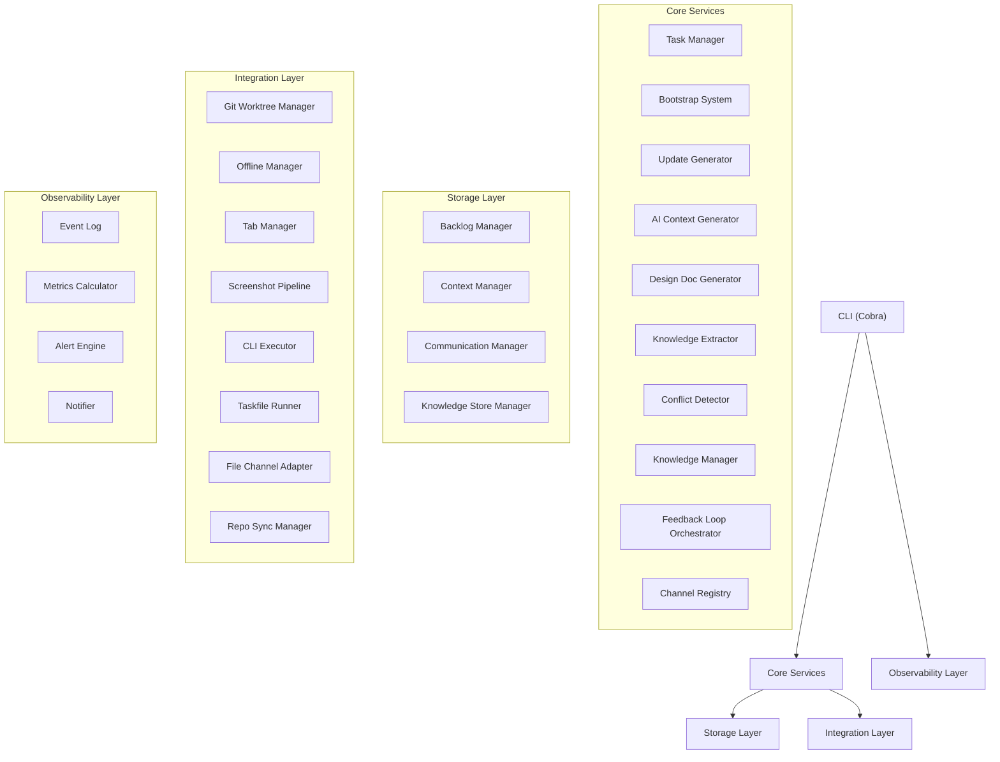
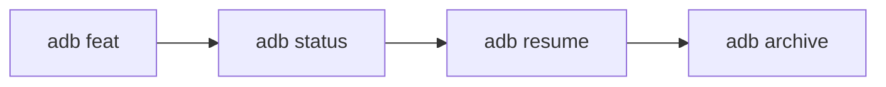

# AI Dev Brain (adb)

A developer productivity system that wraps AI coding assistants with persistent context management, task lifecycle automation, and knowledge accumulation. Instead of losing context between sessions, `adb` maintains a structured record of tasks, decisions, communications, and learnings that both you and your AI assistants can reference.

## Architecture



## Features

- **Task lifecycle management** -- create, resume, archive, and unarchive tasks with automatic ID generation (`TASK-00001`, `TASK-00002`, ...)
- **Four task types** -- `feat`, `bug`, `spike`, `refactor`, each bootstrapping the appropriate folder structure and git worktree
- **Persistent context** -- every task carries its own context files, communications log, session summaries, and design documents across sessions
- **Knowledge store** -- accumulate decisions, learnings, patterns, and gotchas across tasks with search, topic exploration, and timeline views
- **Feedback loop** -- fetch items from input channels, classify and route them, deliver outputs, and record knowledge automatically
- **Channel adapters** -- pluggable input/output channels (file-based adapter included) for integrating external communication sources
- **AI context synchronization** -- regenerate `CLAUDE.md` and `kiro.md` files so AI assistants stay current with project state
- **Stakeholder update generation** -- draft communication updates based on task progress without sending anything automatically
- **Observability** -- structured event logging, on-demand metrics, and threshold-based alerting for blocked tasks, stale work, and backlog size
- **Interactive dashboard** -- TUI dashboard showing task status, metrics, and alerts in a live-updating terminal view
- **MCP server** -- expose adb functionality as MCP tools that AI coding assistants can call directly
- **Priority reordering** -- reprioritize multiple tasks in a single command
- **External tool integration** -- run CLI tools and Taskfile tasks with automatic task-context environment injection (`ADB_TASK_ID`, `ADB_BRANCH`, etc.)
- **Repository synchronization** -- fetch, prune, and clean all tracked repositories in one command
- **Shell completions** -- tab completions for bash, zsh, fish, and PowerShell
- **Configurable** -- global settings via `.taskconfig`, per-repo overrides via `.taskrc`, custom CLI aliases

## Installation

### Linux

Download the binary for your architecture from the releases page, then:

```bash
chmod +x adb-linux-amd64
sudo mv adb-linux-amd64 /usr/local/bin/adb
```

Or install to your user directory:

```bash
chmod +x adb-linux-amd64
mv adb-linux-amd64 ~/.local/bin/adb
```

### macOS

```bash
# For Apple Silicon (M1/M2/M3/M4):
chmod +x adb-darwin-arm64
sudo mv adb-darwin-arm64 /usr/local/bin/adb

# For Intel Macs:
chmod +x adb-darwin-amd64
sudo mv adb-darwin-amd64 /usr/local/bin/adb
```

If macOS blocks the binary, remove the quarantine attribute:

```bash
xattr -d com.apple.quarantine /usr/local/bin/adb
```

### Windows

1. Download `adb-windows-amd64.exe` from the releases page.
2. Rename it to `adb.exe` and place it in a directory of your choice (e.g. `C:\Tools\`).
3. Add that directory to your PATH:

```powershell
# PowerShell (current user)
[Environment]::SetEnvironmentVariable("PATH", "$env:PATH;C:\Tools", "User")
```

Or add it through **System Properties > Environment Variables > Path > Edit**.

### Build from source

Requires [Go](https://go.dev/dl/) 1.26 or later.

```bash
go install github.com/drapaimern/ai-dev-brain/cmd/adb@latest
```

Or clone and build locally:

```bash
git clone https://github.com/valter-silva-au/ai-dev-brain.git
cd ai-dev-brain
go build -o adb ./cmd/adb
```

## Quick start



### 1. Create a task

```bash
adb feat add-login --repo github.com/myorg/myapp --priority P1
```

This creates a `TASK-00001` with a bootstrapped ticket folder, git worktree, and context files ready for your AI assistant.

### 2. Check your backlog

```bash
adb status
```

```
== IN_PROGRESS (1) ==
  ID           PRI  TYPE       BRANCH
  ----         ---  ----       ------
  TASK-00001   P1   feat       add-login
```

Use `--filter` to narrow results: `adb status --filter blocked`.

### 3. Resume a task

```bash
adb resume TASK-00001
```

Loads the task context and promotes it to `in_progress` if it was in the backlog.

### 4. Archive when done

```bash
adb archive TASK-00001
```

Generates a handoff document capturing completed work, open items, and learnings for future reference.

### Other useful commands

```bash
# Create other task types
adb bug fix-null-pointer
adb spike evaluate-caching
adb refactor extract-auth-module

# Reprioritize tasks
adb priority TASK-00003 TASK-00001 TASK-00005

# Generate stakeholder updates (does not send anything)
adb update TASK-00001

# Regenerate AI context files
adb sync-context

# Run external tools with task context injected
adb exec gh pr create
adb run test

# Knowledge management
adb knowledge query "authentication"
adb knowledge add "Use RS256 for JWT signing" --type decision --topic auth
adb knowledge topics
adb knowledge timeline --since 7d

# Channel and feedback loop
adb channel list
adb channel inbox
adb loop
adb loop --dry-run

# Observability
adb metrics --since 30d
adb alerts
adb dashboard
adb session save TASK-00001
adb session ingest TASK-00001

# Project and repository management
adb init
adb sync-repos
adb cleanup TASK-00001

# MCP server (for AI assistant integration)
adb mcp serve

# Shell completions
adb completion bash --install
```

## Configuration

`adb` looks for a `.taskconfig` file by walking up the directory tree from the current working directory. You can also set the `ADB_HOME` environment variable to point to a specific data directory.

Example `.taskconfig`:

```yaml
defaults:
  ai: kiro
  priority: P2
  owner: "@yourname"
task_id:
  prefix: TASK
cli_aliases:
  - name: gh
    command: gh
    default_args: []
```

Per-repository settings go in `.taskrc`:

```yaml
build_command: "go build ./..."
test_command: "go test ./..."
default_reviewers:
  - "@teammate"
conventions:
  - "Use conventional commits"
```

## Documentation

See the [docs/](docs/) directory for detailed guides:

- [Getting Started](docs/getting-started.md) -- setup and your first task
- [Commands Reference](docs/commands.md) -- complete CLI reference
- [Usage Scenarios](docs/usage-scenarios.md) -- real-world workflows
- [Architecture](docs/architecture.md) -- system design and internals

