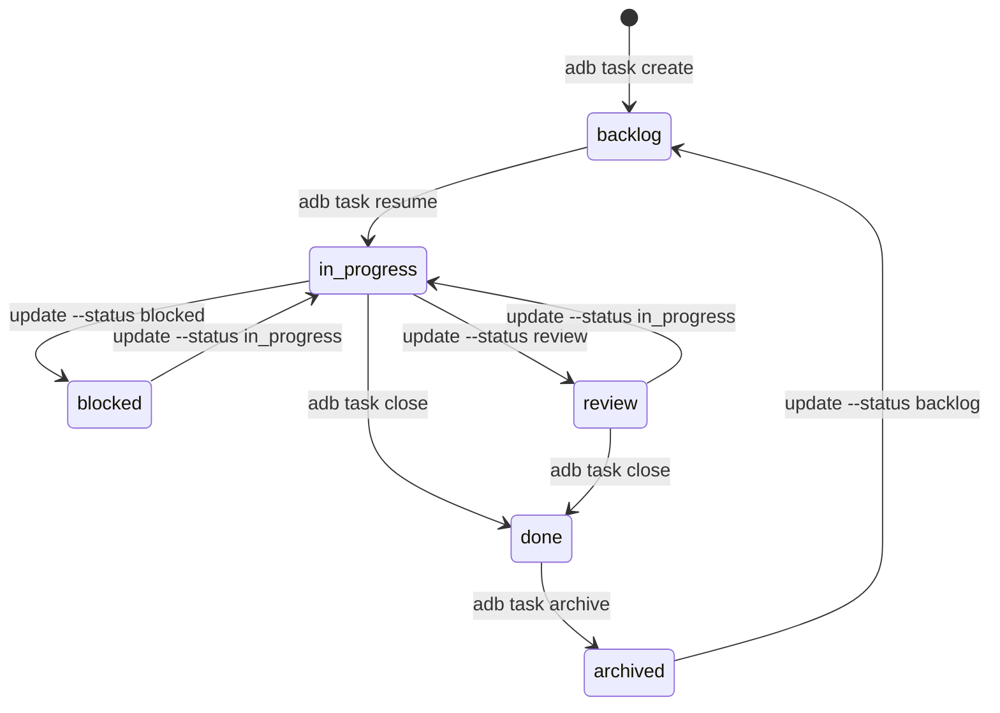

# AI Dev Brain (`adb`)

**A Go CLI that gives your AI coding agent a memory and a process.**

An AI coding session starts from nothing. It does not know which ticket you are on, what
you decided last week, why the previous attempt was abandoned, or which branch this work
belongs on. So you re-explain your own project every morning.

`adb` fixes that by writing the context down where both you and your agent can find it:

- a **task lifecycle** (`backlog → in_progress → review → done → archived`) in one
  `backlog.yaml`;
- a **git worktree** per repo-backed task, so parallel work cannot collide;
- a **ticket directory** for the context, notes, design, and decisions that outlive a
  session;
- a **generated instruction file** your agent reads on startup;
- an **append-only event log** of everything that happened, queryable;
- an **MCP server**, so any MCP-capable agent can drive the same lifecycle as tools.

On top of that sits a second layer for people running a business, not just a repo: a
**founder-playbook OS** (`Org → Initiative → Stage`, with `Idea → MVP → Launch → Scale`
gates that block until the evidence and numbers actually pass) and **document programs**
(phase-ordered packs of artifact templates — PRD, design doc, readiness review, postmortem —
with a dependency graph that tells you what is ready to draft next).

**Who it is for:** someone driving a lot of parallel work across many repos with an AI
agent, who is tired of losing context between sessions. Single-developer scale: file-backed,
no server, no database, no account.

**What it is not:** it does not call a model for you, host anything, or provision cloud
infrastructure.

---

## Contents

- [Why write context down](#why-write-context-down)
- [Install](#install)
- [Quickstart](#quickstart)
- [Choosing your coding agent](#choosing-your-coding-agent)
- [Core concepts](#core-concepts)
- [The commands you will actually use](#the-commands-you-will-actually-use)
- [Configuration and state](#configuration-and-state)
- [Where to go next](#where-to-go-next)
- [Contributing](#contributing)

---

## Why write context down

Regenerating an instruction file sounds like bookkeeping. It is not — it is the mechanism
that makes everything downstream cheaper.

**It compounds.** A decision recorded in a ticket's `knowledge/decisions.yaml` is still
there in six months, in the file your agent reads first. Nothing about it depends on a
conversation still being open. Knowledge accumulates instead of evaporating at the end of
each session.

**It grounds the agent.** An agent that starts with the ticket, the branch, the acceptance
criteria, and the decisions already made does not guess at them. That is the difference
between a plausible patch and a correct one — and between a vague PR description and one
that cites the requirement it satisfies.

**It only shows what changed.** Each sync hashes every section and diffs against the last
one, so the next session gets *"here is what moved since you last looked"* rather than the
whole project again.

**It travels to other tools.** The same written-down context is what a reviewer works from
— you, a teammate, or a review agent like GitHub Copilot. Context in a chat log helps one
session; context in a file helps every reader after it.

**It stays readable by humans.** Plain Markdown and YAML in a git repo. You can read it,
diff it, review it in a PR, and grep it without the tool that wrote it.

---

## Install

**Requirement:** Go **1.25.5** or newer. Nothing else is mandatory. Optional, per feature:
`git` (worktrees), your agent's CLI (session launch), `gh`/`glab` (issue sync),
`gitleaks` + an S3 bucket (cloud archive), `tmux` (durable terminals).

```bash
git clone https://github.com/valter-silva-au/ai-dev-brain
cd ai-dev-brain
make install-local
export PATH="$HOME/.local/bin:$PATH"   # add to ~/.zshrc or ~/.bashrc
adb version
```

`make install-local` builds with version ldflags and installs to `~/.local/bin/adb`.

> On macOS Apple Silicon it re-signs the installed copy. This is not cosmetic: `cp`
> invalidates the Go linker's ad-hoc signature and the copy is `SIGKILL`'d on exec — exit
> 137, no message. If you install by hand, `go build -o <final-path>` rather than building
> then copying.

---

## Quickstart

Pick a real directory you intend to keep. Everything below lives inside it, and it is
where your tickets and knowledge accumulate.

> Do **not** use `/tmp` — macOS and Linux both reap it, and on macOS `/tmp` is a symlink to
> `/private/tmp`, which confuses path resolution. Use a durable path like `~/adb`.

```bash
export ADB_HOME="$HOME/adb"
mkdir -p "$ADB_HOME"
adb init workspace "$ADB_HOME"
```

That scaffolds `backlog.yaml`, `tickets/`, `work/`, `sessions/`, `.adb/`, and a `.taskrc`.

> `adb init` covers two different things, and both are now named:
> `adb init workspace <path>` creates the **task** workspace (above), while
> `adb init boundary <path>` creates the portable `.aidb/` boundary described in
> [Configuration and state](#configuration-and-state). Neither replaces the other — to
> start using tasks you want `init workspace`. The bare `adb init <path>` form still runs
> `boundary` so existing scripts keep working, but it is deprecated: it was impossible to
> tell from `adb init --help` that a bare path meant a different concept from its named
> sibling.

**Clone a repo where `adb` expects it.** A repo-backed task cuts its worktree from a clone
under `<workspace>/repos/<platform>/<org>/<repo>`:

```bash
git clone https://github.com/demo/widget \
  "$ADB_HOME/repos/github.com/demo/widget"
```

**Create a task.** `--no-launch` keeps it non-interactive:

```bash
adb task create "Add retry to the uploader" \
  --type feat --repo github.com/demo/widget --priority P1 --no-launch
```

You get a ticket at `tickets/github.com/demo/widget/TASK-00001-add-retry-to-the-uploader/`,
a worktree at the mirrored path under `work/`, and the branch
`feat/add-retry-to-the-uploader`.

**Work it, then close it out:**

```bash
adb task list                            # the table
adb task show TASK-00001                 # one task in detail
adb task resume TASK-00001               # → in_progress, launches your agent in the worktree
adb task update TASK-00001 --status review
adb task close TASK-00001                # → done (status only; reversible)
adb task archive TASK-00001              # ticket → _archived/, worktree removed
```

**See what happened, and refresh the agent's context:**

```bash
adb events tail --follow                 # live event stream
adb metrics                              # throughput, cycle time, WIP
adb context build                         # regenerate the workspace instruction file
```

A full worked walkthrough, with output, is in
[L100 — Fundamentals](docs/learning/L100-fundamentals.md); the day-to-day loop is
[L200 — Daily Workflows](docs/learning/L200-daily-workflows.md).

---

## Choosing your coding agent

`adb` is designed to be **agent-agnostic**: it manages tickets, worktrees, and written-down
context, and leaves the model, the harness rules, the hooks, and the session store to
whichever agent you use.

Select yours by flag, environment, or config — most specific wins:

```bash
adb task resume TASK-00001 --agent pi     # per-invocation
export ADB_AGENT=pi                      # per-shell
```

```yaml
# ~/.taskconfig (global), orgs/<id>/config.yaml (org), or .taskrc (per-repo)
custom_settings:
  launch_agent: pi
```

### Honest status

The design is agnostic and several seams already are. The shipped integrations are not
uniformly there yet:

| Seam | State |
|---|---|
| Instruction file | **Agnostic.** The generated context goes to [`AGENTS.md`](https://agents.md); each configured harness gets a thin pointer beside it. |
| Ticket + document templates | **Agnostic.** `templates/` renders nothing agent-specific; the Claude Code harness is isolated under `harnesses/claude/`. |
| Tool access | **Agnostic.** `adb mcp serve` speaks MCP over stdio, so any MCP client drives the same lifecycle. |
| Lifecycle hooks | **Partly.** `adb hook process --event <name>` is a neutral entrypoint. `adb hook install` still installs Claude Code wrappers. |
| Session launch | **Four agents.** `claude` (default), `pi`, `codex`, `amazon-q`. They are a data registry (`internal/cli/agents.go`), so adding one is a single descriptor — see [L400](docs/learning/L400-architecture-and-extending.md). `amazon-q` is wired from documentation rather than verified against the CLI; the other three were driven. |
| Session continuation | **Per-agent, but pluggable now.** Each agent's prior-session probe is a field on its registry descriptor (`HasPriorSession`), because every agent stores transcripts differently — Claude Code keys them by munged project path, Codex partitions by date and records the `cwd` inside each rollout. |

Still Claude Code-specific by name: `adb harness install`, `adb init claude`,
`adb harness build`, session-transcript parsing, and `adb mcp check`'s config discovery.

The **worktree** is no longer on that list. Each worktree gets an agent-agnostic
`.adb/task-context.md` plus a pointer per harness (`.claude/rules/task-context.md`,
`AGENTS.md`), so an agent that is not Claude Code started in a worktree gets the ticket's
context too — see [L100 §5](docs/learning/L100-fundamentals.md).

### Why `AGENTS.md` is the target

[`AGENTS.md`](https://agents.md) is an open, vendor-neutral convention — stewarded by the
Agentic AI Foundation under the Linux Foundation, originating from collaboration across
OpenAI Codex, Amp, Jules, Cursor, and Factory, and read by Codex, Cursor, Aider, Gemini
CLI, Zed, Warp, Devin, Junie, Windsurf, GitHub Copilot's coding agent, and others. Agents
read the nearest file up the directory tree, so the closest one wins.

Not every agent reads it — Claude Code reads `CLAUDE.md`. So `adb context build` writes one
canonical `AGENTS.md` and keeps a thin pointer file per harness beside it:

```text
AGENTS.md              ← canonical: the whole generated context
├── CLAUDE.md          → @AGENTS.md
└── CODEX.md           → @AGENTS.md      (opt in via config)
```

Choose the pointers with the `instruction_pointers` custom setting — comma-separated, or
`none` to write only `AGENTS.md`:

```yaml
custom_settings:
  instruction_pointers: CLAUDE.md,CODEX.md
```

One body, many doorways: switching coding agent never regenerates your context into a
different shape, and two agents can never read two versions of it.

> **Your hand-written files are safe.** An instruction file that exists and was not
> generated by `adb` is left byte-for-byte alone and reported as skipped — pass `--force` to
> overwrite it. (Before this, `sync context` overwrote the workspace `CLAUDE.md`
> unconditionally.)

---

## Core concepts

Enough to be productive. [L100 — Fundamentals](docs/learning/L100-fundamentals.md) is the
worked version.

### The task is the atom

One record in `backlog.yaml` — the sole authoritative store — plus a ticket directory. Four
fields carry the weight: an immutable **ID** (`TASK-00001`), a **type** (which picks the
branch prefix), a **status**, and a **priority** (`P0`–`P3`, default `P2`).

### Status lifecycle


```mermaid
stateDiagram-v2
    [*] --> backlog: adb task create
    backlog --> in_progress: adb task resume
    in_progress --> blocked: update --status blocked
    blocked --> in_progress: update --status in_progress
    in_progress --> review: update --status review
    review --> in_progress: update --status in_progress
    in_progress --> done: adb task close
    review --> done: adb task close
    done --> archived: adb task archive
    archived --> backlog: update --status backlog
```

`adb task update --status` sets five of the six directly; `adb task close` is shorthand for
`--status done`. The sixth, `archived`, is **not** settable that way — `update --status
archived` is rejected, naming `adb task archive`, because archiving also moves the ticket
directory and removes the worktree. Writing the field alone left a workspace claiming a task
was archived while its worktree and ticket dir were still live. Symmetrically, `update
--status backlog` on an *archived* task un-archives it properly: the ticket directory comes
back out of `_archived/`, rather than being relabelled in place.

Closing only flips the status — it does not archive the ticket or remove the worktree, so
`adb task update <id> --status in_progress` reverses it.

### Types, and how a type becomes a branch

Ten types: the eight [Conventional Commits](https://www.conventionalcommits.org) code types
plus two non-code ones.

| `--type` | For | Branch prefix |
|---|---|---|
| `feat` | a new capability (**default**) | `feat/` |
| `fix` | a bug fix | `fix/` |
| `refactor` | restructuring, no behaviour change | `refactor/` |
| `docs` | documentation only | `docs/` |
| `chore` | tooling, deps, housekeeping | `chore/` |
| `test` | tests only | `test/` |
| `perf` | a performance improvement | `perf/` |
| `spike` | time-boxed investigation | **`chore/`** |
| `work` | a non-code deliverable — a doc, a decision, research | **none** — no branch, no worktree |
| `prototype` | a non-code, time-boxed experiment (code-shaped) | **`chore/`** |

The branch is `<conventional-type>/<slug>`, never `task/<id>`. A `spike` titled *"Insurability
probe G0"* becomes `chore/insurability-probe-g0`.

> `bug` is retired — `--type bug` is rejected with a pointer to `fix`, and
> A legacy `bug` row still maps to a `fix/` branch; retyping it is a manual
> `backlog.yaml` edit. `work` never gets a worktree or
> branch even with `--repo`, so it is exempt from code gates by construction.

### The path is the correlation

Platform, org, repo, task, and what it does — readable without opening `backlog.yaml`:

```text
tickets/github.com/demo/widget/TASK-00001-add-retry-to-the-uploader/
├── status.yaml       # machine-readable status / phase / progress
├── context.md        # description, requirements, acceptance criteria
├── notes.md          # running scratchpad
├── design.md         # design notes
└── knowledge/
    └── decisions.yaml

work/github.com/demo/widget/TASK-00001-add-retry-to-the-uploader/   # the git worktree
```

The worktree path mirrors the ticket path, and each worktree gets a generated task-context
file so an agent started there picks up the ticket automatically. A repo-less task lands in
`tickets/_local/` with no worktree.

### Context generation

`adb context build` regenerates the workspace instruction files from live workspace data: the
backlog, conventions, glossary, decisions, recent sessions, and stakeholders. It hashes each
section against the previous run so the next session is told what changed rather than handed
everything again. `adb context task <id>` does the same for one worktree.

The generated body lands in `AGENTS.md`, with a pointer per harness — see
[Choosing your coding agent](#choosing-your-coding-agent).

---

## The commands you will actually use

There are 38 top-level commands. These are the ones that carry a normal day:

| Command | What it does |
|---|---|
| `adb task create` | Create a ticket, its worktree, and its branch |
| `adb task resume` | Promote to `in_progress` and launch your agent in the worktree |
| `adb task list` | List and filter tasks (`--json` for machines, `--git` to join live worktree state — branch, dirty, ahead/behind) |
| `adb task show` | One task in detail (`--json` is a single object, same field set as a `list` row) |
| `adb task update` | Change status, priority, owner, or initiative |
| `adb task archive` | Retire a ticket and remove its worktree |
| `adb task worktree` | The worktrees behind your tasks: `list`, `switch`, `remove`, `prune`, `reconcile` |
| `adb context build` | Regenerate the workspace instruction file |
| `adb issues sync` | Reconcile tickets with GitHub/GitLab issues |
| `adb events` | Query or tail the append-only event log |
| `adb metrics` / `adb alerts` | Throughput and cycle time; blocked/stale/long-review warnings, on per-workspace thresholds |
| `adb mcp serve` | Expose the lifecycle to any MCP client |
| `adb doctor` | Read-only diagnosis of a workspace, with typed findings |

The rest cover the founder-playbook layer (`org`, `initiative`, `stage`, `pmf`, `graph`,
`catalog`, `governance`), governance registries (`adr`, `debt`, `slo`, `audit`,
`compliance`, `crm`, `gtm`), authoring (`program`, `templates`, `harness`), publishing
(`wiki`, `archive`), and plumbing (`config`, `hook`, `context`, `scheduler`, `schedule`,
`ingest`, `repo`, `comm`, `conformance`).

> **`adb sync` is retired** (TASK-00039). It was a namespace named after a *verb*, so it
> collected four unrelated jobs and left each one's real noun unnamed. They now live under
> the thing they act on — `adb context build`, `adb context task`, `adb context repos`,
> `adb wiki publish`, `adb issues sync`, `adb archive push|pull|status|destroy`,
> `adb harness install`. `adb memory` moved to `adb context memory` (keeping `index` and
> `search`), `adb plugin` became `adb harness`, and `adb repos` folded into `adb repo pull`
> / `adb repo inventory`. **Every old spelling still works** as a hidden alias that tells
> you where it went, so nothing you have scripted breaks.

> **The `adb task` verbs were renamed too** (TASK-00039), on the same principle: a verb
> should say what it does to a task, and nothing that belongs to a task should be a
> top-level noun.
>
> | Was | Now |
> |---|---|
> | `adb task status` | `adb task list` |
> | `adb status` | `adb task list --git` |
> | `adb task delete` | `adb task remove` |
> | `adb task priority <ids> --priority P1` | `adb task update <id> --priority P1` |
> | `adb task unarchive <id>` | `adb task update <id> --status backlog` |
> | `adb task cleanup <id>` | `adb task worktree remove <id>` |
> | `adb work list\|switch\|prune\|reconcile` | `adb task worktree …` |
>
> New in the pass: `adb task show <id>`, `adb task close <id>`, and
> `adb task timeline <id>` (that ticket's slice of the event log). Old spellings survive as
> hidden aliases — but **two behaviours changed, so an alias is not a promise of identical
> output**: `adb status --json` / `adb task status --git --json` used to emit
> `{"tickets": …, "orphaned_worktrees": …}` and now emit the plain array that
> `adb task list --json` always emits (orphans moved to `adb task worktree list --json`),
> and bare `adb work prune` used to remove worktrees where it now previews until you pass
> `--apply`.

> **Removed in TASK-00039:** `dashboard`, `chat`, `exec`, `run`, `team`, `agents`,
> `task start-all`, `task close-all`, and the one-shot `task migrate-types` /
> `normalize-titles` / `normalize`. adb is terminal-native and MCP-first, so a TUI, an
> LLM adapter, and two generic process runners were outside the product; `team`/`agents`
> only ever wrote a plan file. Bulk task verbs are a shell loop, which has the advantage
> of telling you *which* tickets moved.

Run `adb <cmd> --help` for flags. The per-subcommand reference, maintained alongside the
code, is [`docs/claude/subsystems.md`](docs/claude/subsystems.md).

> There is no `adb serve`, no web UI, and no editor integration. The only `serve` verb is
> `adb mcp serve` (MCP over stdio).

### `start` vs `resume`

Both promote the task and launch your agent in its worktree. The difference is memory:

| | Session |
|---|---|
| `adb task start` | always a **new** conversation |
| `adb task resume` | **continues** the last one for that directory, and starts fresh when there is none — saying which it did |

So `start` when you want the agent to come in cold, `resume` when you want it to remember.
Both take `--agent` and `--no-launch` (promote only — what scripts and CI want, also via
`ADB_NO_LAUNCH=1`).

Sessions are hosted in tmux when it's available, so they survive the terminal that started
them; `ADB_TMUX=0` opts out. adb is terminal-native — there is no editor integration.

---

## Configuration and state

### Three config tiers

Most specific wins: **`.taskrc`** (per-repo) → **`orgs/<id>/config.yaml`** (per-org) →
**`.taskconfig`** (global, in `$HOME`) → defaults. The org tier is optional and selected by
`ADB_ORG` or the `org:` field in `.taskrc`.

```bash
adb config show              # the merged view, with each value's source
adb config get <key> --source
```

The workspace root resolves as `ADB_HOME` → else walk up from the cwd for `.taskconfig` or
`.taskrc` → else the cwd. Setting `ADB_HOME` explicitly is the unambiguous option.

### Two state directories

| Directory | Holds |
|---|---|
| `.aidb/` | The portable workspace boundary: a manifest, config, a rebuildable `state.sqlite` projection, a durable operation journal, and a cache. Manifests on disk are the truth; the database is an index you can delete and rebuild. |
| `.adb/` | Per-workspace subsystem state: `events.jsonl`, `governance.jsonl`, counters, scheduler state, vector memory. Machine-local, not portable. |

Everything under `.adb/` is gitignored and excluded from cloud archive. State files from
older layouts are migrated into `.adb/` automatically on first run — move-if-absent, so
nothing is overwritten.

Details are in [L300 — Integrations](docs/learning/L300-integrations.md) (issue sync, cloud
archive, MCP) and [L400 — Architecture](docs/learning/L400-architecture-and-extending.md)
(the event schema and pipeline). `adb alerts`' four thresholds are `custom_settings` keys
(`alert_task_stale: 7d`, `alert_backlog_too_large: 40`, …) and follow the same three tiers — see
[L200 — Daily Workflows](docs/learning/L200-daily-workflows.md#alerts-and-their-thresholds).

---

## Where to go next

| Guide | Read it for |
|---|---|
| [**L100 — Fundamentals**](docs/learning/L100-fundamentals.md) | The task model, statuses, types, branch naming, the ticket layout, and a full worked lifecycle. |
| [**L200 — Daily Workflows**](docs/learning/L200-daily-workflows.md) | The daily loop, running many tickets in parallel, durable tmux-hosted sessions, backlog maintenance. |
| [**L300 — Integrations**](docs/learning/L300-integrations.md) | Issue sync, the S3 cloud archive, the MCP server, and `adb mcp check` — each with its honest prerequisites. |
| [**L400 — Architecture & Extending**](docs/learning/L400-architecture-and-extending.md) | The layered spine, interfaces and adapters, the event pipeline, and how to add a command, event type, agent launcher, or sync provider. |
| [**L500 — The Founder-Playbook OS**](docs/learning/L500-founder-playbook-os.md) | `Org → Initiative → Stage`, the four gates and their thresholds, the typed graph, the rule engine, ingestion, governance. |
| [**L600 — Document Programs**](docs/learning/L600-document-programs.md) | The `program.yaml` manifest, the readiness gate, the shipped packs, and authoring your own. |

[`docs/claude/subsystems.md`](docs/claude/subsystems.md) is the per-command and per-package
reference. [`CLAUDE.md`](CLAUDE.md) is the short version an agent reads first.

---

## Contributing

Work test-driven: red → green → refactor. Before opening a PR:

```bash
make all      # fmt, vet, lint, test, build
```

House conventions: wrap errors with `fmt.Errorf("context: %w", err)` and lowercase
messages; define interfaces where they are consumed; `time.Now().UTC()` for timestamps;
`yaml` tags on persisted fields. Keep command handlers thin and put the logic in
`internal/core`. New top-level command → register it in the CLI root. New event type →
declare it, add it to the known set, and cover it in the schema test (a drift guard fails
the build otherwise).

The three levels of Go test, and which to reach for, are described in
[L400](docs/learning/L400-architecture-and-extending.md#8-testing-two-planes). Two rules the
end-to-end level exists to enforce: pin `ADB_HOME` *and* `HOME` for any child `adb`
process, and never copy the built binary on macOS Apple Silicon.

```bash
go test ./... -race -count=1          # full suite with the race detector
make build                            # ./cmd/adb with version ldflags
make install-local                    # build + install to ~/.local/bin
make docker-build                     # multi-stage image
make security                         # govulncheck
```

Release builds are configured in `.goreleaser.yml`.
