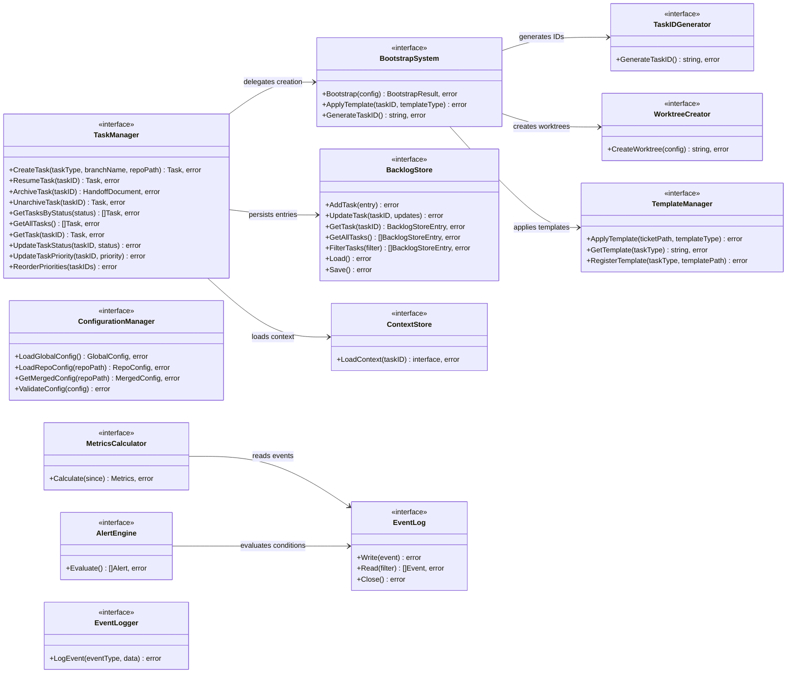

# Architecture

This document describes the internal architecture of AI Dev Brain (`adb`), covering the layered package structure, interface contracts, data flow, storage design, dependency injection, and extension points.

---

## System Overview

AI Dev Brain is organized into five layers, each with a clear responsibility boundary. The CLI layer accepts user commands. The core layer contains all business logic. The integration layer communicates with external systems (git, OS tools, Taskfile). The storage layer persists data to the local filesystem. The observability layer provides event logging, metrics derivation, and alerting. A shared `pkg/models` package defines the data structures used across layers.


---

## Component and Interface Relationships

Every major component is defined by a Go interface in its owning package. Concrete implementations are unexported (lowercase struct names), and all construction goes through `New*` factory functions. The `App` struct in `internal/app.go` is the composition root that wires everything together.



---

## Adapter Pattern and Dependency Injection

The core layer defines narrow "store" interfaces (`BacklogStore`, `ContextStore`, `WorktreeCreator`, `EventLogger`) that mirror subsets of the storage, integration, and observability interfaces. This keeps the core package free of import dependencies on those packages. The `App` struct bridges the gap using adapter structs.


The `NewApp` function in `internal/app.go` performs all wiring in a fixed order:

1. **Configuration** -- `ConfigurationManager` loads `.taskconfig` with Viper.
2. **Storage** -- `BacklogManager`, `ContextManager`, `CommunicationManager` are created with the base path.
3. **Integration** -- `GitWorktreeManager`, `OfflineManager`, `TabManager`, `ScreenshotPipeline`, `CLIExecutor`, `TaskfileRunner` are created.
4. **Observability** -- `EventLog` (JSONL-backed) is opened at `.adb_events.jsonl`. `AlertEngine` and `MetricsCalculator` are created with the event log and configurable thresholds. If the event log cannot be created, observability is disabled gracefully (non-fatal).
5. **Core** -- Core services receive their dependencies through constructors, using adapter structs where cross-layer communication is needed. The `eventLogAdapter` bridges `observability.EventLog` to `core.EventLogger`.
6. **CLI wiring** -- Package-level variables in `internal/cli` are set to the core, integration, and observability service instances (`EventLog`, `AlertEngine`, `MetricsCalc`).

---

## Task Creation Flow

The following sequence diagram shows what happens when a user runs `adb feat my-feature --repo github.com/org/repo`:


### What each step produces on disk

| Step | File / Directory |
|------|-----------------|
| GenerateTaskID | `.task_counter` (incremented) |
| MkdirAll | `tickets/TASK-00042/`, `tickets/TASK-00042/communications/`, `tickets/TASK-00042/sessions/`, `tickets/TASK-00042/knowledge/` |
| ApplyTemplate | `tickets/TASK-00042/notes.md`, `tickets/TASK-00042/design.md` |
| Write context.md | `tickets/TASK-00042/context.md` |
| Write status.yaml | `tickets/TASK-00042/status.yaml` |
| CreateWorktree | `repos/{platform}/{org}/{repo}/work/TASK-00042/` |
| generateTaskContext | `work/TASK-00042/.claude/rules/task-context.md` (non-fatal if fails) |
| BacklogStore.Save | `backlog.yaml` (updated) |

---

## Knowledge Extraction Flow

When a task is archived, the `KnowledgeExtractor` gathers learnings, decisions, and gotchas from the task's files and communications, then feeds them into organizational knowledge stores (wiki, ADRs, runbooks).


---

## AI Context Generation Flow

The `AIContextGenerator` assembles project-wide context from multiple sources into a single markdown file (e.g., `CLAUDE.md` or `kiro.md`) that AI coding assistants read for project awareness.


### Section data sources

| Section | Data Source |
|---------|-----------|
| Project Overview | Hardcoded summary |
| Directory Structure | Hardcoded tree description |
| Conventions | `docs/wiki/*convention*.md` files, else defaults |
| Glossary | `docs/glossary.md`, else defaults |
| Decisions Summary | `docs/decisions/*.md` (accepted ADRs only) |
| Active Tasks | `backlog.yaml` filtered by active statuses |
| Critical Decisions | `tickets/*/knowledge/decisions.yaml` for active tasks |
| Recent Sessions | Latest `.md` file from `tickets/*/sessions/` for active tasks (first 20 lines) |
| Stakeholders/Contacts | `docs/stakeholders.md`, `docs/contacts.md` |

---

## Configuration Loading Flow

Configuration follows a three-level precedence chain: per-repo `.taskrc` overrides global `.taskconfig`, which overrides built-in defaults. The `ConfigurationManager` uses Viper for YAML parsing.


### Key configuration fields

| Source | Fields |
|--------|--------|
| `.taskconfig` (global) | `defaults.ai`, `defaults.priority`, `defaults.owner`, `task_id.prefix`, `task_id.counter`, `screenshot.hotkey`, `offline_mode`, `cli_aliases[]` |
| `.taskrc` (per-repo) | `build_command`, `test_command`, `default_reviewers[]`, `conventions[]`, `templates{}` |
| Built-in defaults | `ai=kiro`, `priority=P2`, `prefix=TASK`, `hotkey=ctrl+shift+s` |

---

## Observability Architecture

The observability layer (`internal/observability/`) provides structured event logging, on-demand metrics derivation, and threshold-based alerting. It operates on an append-only JSONL event log and requires no external services. The core package accesses the event log through a narrow `EventLogger` interface, following the same local interface pattern used for storage and integration decoupling.


### Event structure

Every event is a JSON object with a fixed schema, written as a single line in the JSONL file:

```json
{
  "time": "2025-01-15T10:30:00Z",
  "level": "INFO",
  "type": "task.created",
  "msg": "task.created",
  "data": {
    "task_id": "TASK-00042",
    "type": "feat",
    "branch": "add-user-auth"
  }
}
```

| Field | Type | Description |
|-------|------|-------------|
| `time` | RFC 3339 timestamp | When the event occurred (UTC) |
| `level` | string | Severity: `INFO`, `WARN`, `ERROR` |
| `type` | string | Dot-namespaced event type (e.g., `task.created`, `task.status_changed`, `agent.session_started`, `knowledge.extracted`) |
| `msg` | string | Human-readable message |
| `data` | object | Arbitrary key-value payload (event-type-specific) |

### Event types

| Event Type | Trigger | Data Fields |
|------------|---------|-------------|
| `task.created` | New task bootstrapped | `task_id`, `type`, `branch` |
| `task.completed` | Task status set to `done` | `task_id` |
| `task.status_changed` | Any status transition | `task_id`, `old_status`, `new_status` |
| `agent.session_started` | AI agent begins a session | `task_id`, `agent` |
| `knowledge.extracted` | Knowledge extracted on archive | `task_id`, `learnings_count`, `decisions_count` |

### Metrics calculation

The `MetricsCalculator` reads all events since a given time and produces an aggregated `Metrics` struct:

| Metric | Derivation |
|--------|------------|
| `TasksCreated` | Count of `task.created` events |
| `TasksCompleted` | Count of `task.completed` events |
| `TasksByStatus` | Count of `task.status_changed` events grouped by `new_status` |
| `TasksByType` | Count of `task.created` events grouped by `type` |
| `AgentSessions` | Count of `agent.session_started` events |
| `KnowledgeExtracted` | Count of `knowledge.extracted` events |
| `EventCount` | Total events in the time range |
| `OldestEvent` / `NewestEvent` | Timestamp boundaries |

### Alert evaluation

The `AlertEngine` reads events, reconstructs current task state, and evaluates four threshold-based conditions:

| Alert Condition | Severity | Default Threshold | Description |
|----------------|----------|-------------------|-------------|
| `task_blocked_too_long` | high | 24 hours | A task has been in `blocked` status longer than the threshold |
| `task_stale` | medium | 3 days | An `in_progress` task has had no activity beyond the threshold |
| `review_too_long` | medium | 5 days | A task has been in `review` status beyond the threshold |
| `backlog_too_large` | low | 10 tasks | More tasks in `backlog` status than the configured maximum |

Thresholds are configurable via `.taskconfig`:

```yaml
notifications:
  alerts:
    blocked_threshold_hours: 24
    stale_threshold_days: 3
    review_threshold_days: 5
    max_backlog_size: 10
```

### Graceful degradation

If the JSONL event log file cannot be opened during `NewApp`, observability is disabled entirely (non-fatal). The `EventLog`, `AlertEngine`, and `MetricsCalculator` fields on `App` are set to `nil`, and the CLI skips observability operations when these are absent. This ensures that a permissions error or full disk never prevents normal task management.

---

## Storage and Directory Structure

All data is persisted as human-readable files (YAML, Markdown, and JSONL) under a single base directory. There is no database. This design is intentional: files are git-friendly, diff-able, and require no runtime dependencies.


### File format reference

**backlog.yaml** -- Central task registry:

```yaml
version: "1.0"
tasks:
  TASK-00001:
    id: TASK-00001
    title: Add authentication
    status: in_progress
    priority: P1
    owner: alice
    repo: github.com/org/repo
    branch: feat/TASK-00001-auth
    created: "2025-01-15T10:00:00Z"
    tags: [security, backend]
    blocked_by: []
    related: [TASK-00002]
```

**status.yaml** -- Per-task metadata:

```yaml
id: TASK-00001
title: Add authentication
type: feat
status: in_progress
priority: P1
owner: alice
repo: github.com/org/repo
branch: feat/TASK-00001-auth
worktree: /home/user/.adb/repos/github.com/org/repo/work/TASK-00001
ticket_path: /home/user/.adb/tickets/TASK-00001
created: 2025-01-15T10:00:00Z
updated: 2025-01-15T14:30:00Z
```

**context.md** -- AI-maintained task context:

```markdown
# Task Context: TASK-00001

## Summary
## Current Focus
## Recent Progress
## Open Questions
## Decisions Made
## Blockers
## Next Steps
## Related Resources
```

**Communication files** -- Chronological markdown in `communications/`:

```markdown
# 2025-01-15-slack-alice-api-design.md

**Date:** 2025-01-15
**Source:** slack
**Contact:** alice
**Topic:** API design

## Content
Discussed REST vs GraphQL approach...

## Tags
- decision
- requirement
```

**.adb_events.jsonl** -- Append-only observability event log:

```jsonl
{"time":"2025-01-15T10:00:00Z","level":"INFO","type":"task.created","msg":"task.created","data":{"task_id":"TASK-00001","type":"feat","branch":"add-auth"}}
{"time":"2025-01-15T10:05:00Z","level":"INFO","type":"task.status_changed","msg":"task.status_changed","data":{"task_id":"TASK-00001","old_status":"backlog","new_status":"in_progress"}}
{"time":"2025-01-15T14:30:00Z","level":"INFO","type":"agent.session_started","msg":"agent.session_started","data":{"task_id":"TASK-00001","agent":"claude"}}
```

Each line is an independent JSON object. The file is opened in append-only mode and writes are mutex-protected. Reads scan line-by-line and skip malformed entries, making the log resilient to partial writes.

**Session summaries** -- Markdown files in `tickets/TASK-XXXXX/sessions/`:

```markdown
# Session: 2025-01-15

## What was accomplished
- Implemented authentication middleware
- Added JWT token validation

## Decisions made
- Use RS256 for token signing

## Open questions
- How to handle token refresh for mobile clients?

## Next steps
- Add refresh token endpoint
```

Session files are named with timestamps (e.g., `2025-01-15-session.md`) and sorted lexicographically. The AI context generator reads the latest session file per active task to provide continuity across AI assistant sessions.

**Knowledge decisions** -- YAML in `tickets/TASK-XXXXX/knowledge/decisions.yaml`:

```yaml
- decision: Use RS256 for JWT token signing
  rationale: Asymmetric keys allow verification without sharing the signing key
  date: 2025-01-15
  status: accepted
```

These per-task decisions are surfaced in the "Critical Decisions" section of the generated AI context files and may be promoted to ADRs during knowledge extraction on archive.

**Per-worktree task context** -- `work/TASK-XXXXX/.claude/rules/task-context.md`:

Generated automatically during bootstrap, this file gives AI assistants immediate awareness of the task they are working on, including task ID, type, branch, and pointers to key files (`context.md`, `notes.md`, `design.md`, `sessions/`, `knowledge/`).

---

## Design Decisions

### File-based storage with no database

All state is stored in YAML and Markdown files. This was chosen because:

- **Git-friendly**: Every change to task state, communications, and context is visible in `git diff` and can be committed alongside code.
- **Human-readable**: Developers can inspect and manually edit any file with a text editor.
- **Zero runtime dependencies**: No database server, no migrations, no connection strings.
- **Portable**: Copy the directory to move the entire workspace.

The tradeoff is that concurrent writes are not safe (single-user assumption) and query performance is O(n) over files rather than indexed.

### Single binary distribution

The `adb` CLI compiles to a single Go binary with no external runtime dependencies. The only external tools it shells out to are `git` (for worktrees) and OS-specific screenshot utilities. This minimizes installation friction: download the binary, place it on `PATH`, done.

### Interface-based design for testability

Every component is defined by a Go interface. Concrete implementations are unexported. This enables:

- **Unit testing with fakes**: Any dependency can be replaced with an in-memory implementation.
- **Adapter pattern**: The core layer does not import the storage or integration packages. Adapters in `internal/app.go` bridge the gap, keeping the dependency graph acyclic.
- **Open/closed principle**: New storage backends or integration targets can be added by implementing an existing interface.

### Property-based testing

The project uses `pgregory.net/rapid` for property-based testing alongside standard unit tests. Property tests verify invariants that must hold for all possible inputs:

- **Property 26 (CLI Argument Passthrough)**: For any alias and argument list, the resolved command preserves argument order with default args prepended.
- **Property 27 (Task Context Environment Injection)**: For any `TaskEnvContext`, `BuildEnv` injects exactly four `ADB_*` variables; with nil context, none appear.
- **Property 29 (CLI Alias Resolution)**: Known aliases resolve to their configured command; unknown aliases pass through unchanged.
- **Property 30 (CLI Failure Propagation)**: Non-zero exit codes are captured and logged to the task's context when a task is active.

Property testing catches edge cases that example-based tests miss, particularly around string handling, argument ordering, and environment variable construction.

### Local interface definitions to avoid import cycles

The core package defines narrow local interfaces (`BacklogStore`, `ContextStore`, `WorktreeCreator`, `EventLogger`) that mirror subsets of the storage, integration, and observability interfaces. This pattern is idiomatic Go: define the interface where it is consumed, not where it is implemented. It keeps the core package's `import` list free of storage, integration, and observability packages, preventing circular dependencies.

### JSONL for event logging

The observability event log uses JSON Lines (JSONL) -- one JSON object per line, appended to a single file. This was chosen because:

- **Append-only**: Writes never modify existing data, making the log safe against partial writes and corruption. Malformed lines are silently skipped on read.
- **Human-inspectable**: Events can be read with standard tools (`cat`, `jq`, `grep`).
- **No external dependencies**: No need for a time-series database or log aggregation service.
- **Git-friendly**: While the file grows over time, it can be `.gitignored` for repos that do not want to track operational data.

The tradeoff is that reads scan the entire file (O(n)), which is acceptable for the single-user, local-first design of `adb`. For workspaces with very large event logs, time-based filtering (`EventFilter.Since`) limits the scan window.

### Per-worktree task context files

When a new task is bootstrapped, `generateTaskContext` writes a `.claude/rules/task-context.md` file inside the git worktree. This gives AI coding assistants immediate awareness of the task context without requiring the AI to search for the ticket directory. This is non-fatal: if the write fails (e.g., the worktree is read-only), bootstrap continues normally. The file contains the task ID, type, branch, and pointers to key files.

### Per-task sessions and knowledge directories

Each task ticket now includes `sessions/` and `knowledge/` directories alongside the existing `communications/` directory:

- **sessions/**: Stores markdown session summaries, allowing AI assistants to save progress between sessions and resume with continuity. The AI context generator reads the latest session file to include in generated context.
- **knowledge/**: Stores structured knowledge artifacts like `decisions.yaml`, which are surfaced in the "Critical Decisions" section of AI context files and fed into the knowledge extraction pipeline on archive.

These directories are created during bootstrap and provide a structured way to accumulate per-task intelligence that was previously only captured informally in `context.md`.

---

## Extension Points

### Custom templates via .taskrc

Per-repository template overrides can be configured in `.taskrc`:

```yaml
templates:
  feat: path/to/custom-feature-template.md
  bug: path/to/custom-bug-template.md
```

When `TemplateManager.ApplyTemplate` runs, it checks for a registered custom template before falling back to the built-in defaults. Custom templates are plain Markdown files optionally containing Go `text/template` placeholders (e.g., `{{.TaskID}}`).

The four built-in task types each have their own notes and design templates:
- `feat` -- Requirements, acceptance criteria, implementation notes
- `bug` -- Steps to reproduce, root cause analysis, fix notes
- `spike` -- Research questions, findings, recommendations, time-box
- `refactor` -- Motivation, current state, target state, rollback plan

### CLI aliases

Aliases defined in `.taskconfig` allow short names for frequently used external commands:

```yaml
cli_aliases:
  - name: lint
    command: golangci-lint
    default_args: ["run", "--fix"]
  - name: test
    command: go
    default_args: ["test", "./..."]
```

Running `adb exec lint` resolves to `golangci-lint run --fix`. The `CLIExecutor` handles alias resolution, argument merging, and task context injection (`ADB_TASK_ID`, `ADB_BRANCH`, `ADB_WORKTREE_PATH`, `ADB_TICKET_PATH` environment variables).

### Taskfile.yaml integration

The `TaskfileRunner` discovers and executes tasks from a `Taskfile.yaml` in the current directory. Each task is a list of shell commands executed sequentially through the `CLIExecutor`, inheriting the task context environment:

```yaml
version: "3"
tasks:
  build:
    desc: Build the project
    cmds:
      - go build ./...
  check:
    desc: Run all checks
    cmds:
      - go vet ./...
      - go test ./...
```

Running `adb run build` discovers the Taskfile, finds the `build` task, and executes its commands in order.

### AI context files

The `AIContextGenerator` produces root-level context files (`CLAUDE.md`, `kiro.md`) that AI coding assistants can read for project awareness. Running `adb sync-context` regenerates these files by assembling sections from:

- The project overview
- The directory structure
- Coding conventions from `docs/wiki/`
- The glossary from `docs/glossary.md`
- Active ADR summaries from `docs/decisions/`
- Currently active tasks from `backlog.yaml`
- Stakeholder and contact information from `docs/`

Individual sections can be regenerated with `RegenerateSection(section)` without rebuilding the entire file.

### Knowledge feedback loop

The `KnowledgeExtractor` creates a feedback loop from completed tasks back into organizational documentation:

1. **Wiki updates** -- Learnings tagged with `## Wiki Updates` in notes.md are written to `docs/wiki/`.
2. **ADR creation** -- Decisions tagged in communications are promoted to Architecture Decision Records in `docs/decisions/`.
3. **Runbook updates** -- Items tagged with `## Runbook Updates` feed into operational runbooks.
4. **Handoff documents** -- On archive, a `handoff.md` captures summary, completed work, open items, learnings, and decisions for the next person who picks up the work.

### Conflict detection

The `ConflictDetector` scans existing ADRs (`docs/decisions/`), previous task decisions (`tickets/*/design.md`), and stakeholder requirements (`docs/wiki/`) before proposed changes are applied. It uses keyword overlap analysis to flag potential conflicts, categorized by type (`adr_violation`, `previous_decision`, `stakeholder_requirement`) and severity (`high`, `medium`, `low`).

### Observability and alerting

The observability layer is designed for extensibility:

- **Custom event types**: Any component can write events with arbitrary `type` and `data` fields. The `MetricsCalculator` and `AlertEngine` only process known event types; unrecognized types are preserved in the log but do not affect metrics or alerts.
- **Configurable alert thresholds**: All alert thresholds (`blocked_threshold_hours`, `stale_threshold_days`, `review_threshold_days`, `max_backlog_size`) are configurable in `.taskconfig` under `notifications.alerts`. The `AlertEngine` applies these thresholds at evaluation time.
- **Notification webhooks**: The alert evaluation results (`[]Alert`) are returned to the CLI layer, which can integrate with external notification systems (Slack webhooks, email, etc.) without changes to the observability package.
- **Dashboard integration**: The `MetricsCalculator` returns a structured `Metrics` object that can be serialized to JSON and consumed by external dashboards or monitoring tools.

### MCP server configuration

The `.mcp.json` file at the project root configures Model Context Protocol (MCP) servers that AI coding assistants can connect to for enhanced capabilities:

```json
{
  "mcpServers": {
    "aws-knowledge": {
      "type": "http",
      "url": "https://knowledge-mcp.global.api.aws"
    },
    "context7": {
      "type": "http",
      "url": "https://mcp.context7.com/mcp"
    }
  }
}
```

This is a static configuration file read by AI assistants (e.g., Claude Code). It is not consumed by the `adb` binary itself. Adding new MCP servers is a matter of adding entries to this file.

---

## Package Reference

| Package | Responsibility | Key Interfaces |
|---------|---------------|----------------|
| `cmd/adb` | Binary entrypoint | -- |
| `internal` | Composition root, adapters | `App` struct, `eventLogAdapter`, `backlogStoreAdapter`, `contextStoreAdapter`, `worktreeAdapter` |
| `internal/cli` | Cobra command definitions | -- |
| `internal/core` | Business logic | `TaskManager`, `BootstrapSystem`, `ConfigurationManager`, `KnowledgeExtractor`, `ConflictDetector`, `AIContextGenerator`, `UpdateGenerator`, `TaskDesignDocGenerator`, `TaskIDGenerator`, `TemplateManager`, `EventLogger` |
| `internal/observability` | Event logging, metrics, alerting | `EventLog`, `MetricsCalculator`, `AlertEngine` |
| `internal/storage` | File-based persistence | `BacklogManager`, `ContextManager`, `CommunicationManager` |
| `internal/integration` | External system interaction | `GitWorktreeManager`, `OfflineManager`, `TabManager`, `ScreenshotPipeline`, `CLIExecutor`, `TaskfileRunner` |
| `pkg/models` | Shared data types | `Task`, `GlobalConfig`, `RepoConfig`, `MergedConfig`, `Communication`, `ExtractedKnowledge`, `HandoffDocument`, `Decision` |
