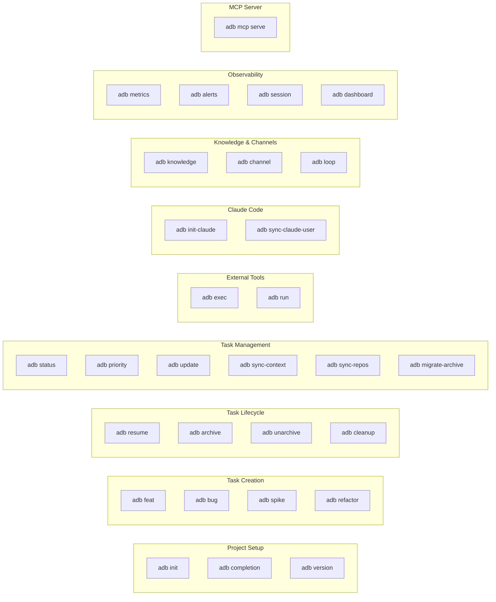

# CLI Command Reference

Complete reference for all `adb` commands. Each command includes its synopsis,
description, arguments, flags, and usage examples.

## Command Overview



---

## Global Usage

```
adb [command] [flags]
```

AI Dev Brain (adb) is a developer productivity system that wraps AI coding
assistants with persistent context management, task lifecycle automation,
and knowledge accumulation.

It provides CLI commands for managing tasks, bootstrapping worktrees,
tracking communications, and maintaining organizational knowledge.

### Global Flags

| Flag | Description |
|------|-------------|
| `--help`, `-h` | Show help for any command |

---

## Task Creation Commands

The four task creation commands -- `feat`, `bug`, `spike`, and `refactor` --
share identical flags and behavior. They differ only in the task type assigned
to the created task.

### adb feat

Create a new feature task.

**Synopsis**

```
adb feat <branch-name> [flags]
```

**Description**

Create a new `feat` task with the given branch name. This bootstraps a ticket
folder, creates a git worktree, initializes context files, and registers the
task in the backlog. The new task starts in `backlog` status with the default
priority from configuration (P2 unless overridden).

**Arguments**

| Argument | Required | Description |
|----------|----------|-------------|
| `branch-name` | Yes | The git branch name for this task. Also used as the task title. |

**Flags**

| Flag | Type | Default | Description |
|------|------|---------|-------------|
| `--repo` | string | `""` | Repository path (e.g. `github.com/org/repo`) |
| `--priority` | string | `""` | Task priority: `P0`, `P1`, `P2`, or `P3` |
| `--owner` | string | `""` | Task owner (e.g. `@username`) |
| `--tags` | string | `nil` | Comma-separated tags for the task |
| `--prefix` | string | `""` | Custom prefix for organizing task folders (e.g. `finance`) |

**Output**

On success, prints the created task details including ID, type, branch,
repository (if specified), worktree path, and ticket path.

**Examples**

```bash
# Create a feature task with default settings
adb feat add-user-authentication

# Create a feature task in a specific repo with priority
adb feat api-rate-limiting --repo github.com/acme/backend --priority P1

# Create a tagged feature task with an owner
adb feat dark-mode-support --owner @alice --tags ui,frontend,theme

# Create a feature task with a custom folder prefix
adb feat quarterly-report --prefix finance
```

---

### adb bug

Create a new bug fix task.

**Synopsis**

```
adb bug <branch-name> [flags]
```

**Description**

Create a new `bug` task with the given branch name. Identical in behavior to
`adb feat` except the task type is set to `bug`. This bootstraps a ticket
folder, creates a git worktree, initializes context files, and registers the
task in the backlog.

**Arguments**

| Argument | Required | Description |
|----------|----------|-------------|
| `branch-name` | Yes | The git branch name for this task. |

**Flags**

Same flags as [`adb feat`](#adb-feat): `--repo`, `--priority`, `--owner`, `--tags`, `--prefix`.

**Examples**

```bash
# Create a bug task
adb bug fix-login-timeout

# Create a high-priority bug with repo
adb bug null-pointer-in-parser --repo github.com/acme/compiler --priority P0

# Create a tagged bug task
adb bug memory-leak-ws-handler --tags backend,performance
```

---

### adb spike

Create a new spike (research/investigation) task.

**Synopsis**

```
adb spike <branch-name> [flags]
```

**Description**

Create a new `spike` task with the given branch name. Use this for
time-boxed research or prototyping work. Identical in behavior to
`adb feat` except the task type is set to `spike`.

**Arguments**

| Argument | Required | Description |
|----------|----------|-------------|
| `branch-name` | Yes | The git branch name for this task. |

**Flags**

Same flags as [`adb feat`](#adb-feat): `--repo`, `--priority`, `--owner`, `--tags`, `--prefix`.

**Examples**

```bash
# Research a new database option
adb spike evaluate-cockroachdb

# Prototype with tags
adb spike grpc-vs-rest-perf --tags architecture,api --priority P2

# Spike in a specific repo
adb spike redis-caching-strategy --repo github.com/acme/platform
```

---

### adb refactor

Create a new refactoring task.

**Synopsis**

```
adb refactor <branch-name> [flags]
```

**Description**

Create a new `refactor` task with the given branch name. Use this for
code restructuring, cleanup, or technical debt work. Identical in behavior
to `adb feat` except the task type is set to `refactor`.

**Arguments**

| Argument | Required | Description |
|----------|----------|-------------|
| `branch-name` | Yes | The git branch name for this task. |

**Flags**

Same flags as [`adb feat`](#adb-feat): `--repo`, `--priority`, `--owner`, `--tags`, `--prefix`.

**Examples**

```bash
# Refactor a module
adb refactor extract-auth-middleware

# Refactor with priority and owner
adb refactor normalize-error-handling --priority P1 --owner @bob

# Refactor with tags
adb refactor migrate-to-slog --tags logging,stdlib
```

---

## Task Lifecycle Commands

### adb resume

Resume working on an existing task.

**Synopsis**

```
adb resume <task-id>
```

**Description**

Resume working on a previously created task. This loads the task's context,
restores the working environment, and promotes the task to `in_progress`
status if it was in `backlog`. Tasks in any other status retain their current
status.

After restoring task state, `adb resume` launches Claude Code in the
task's worktree directory with `--dangerously-skip-permissions --resume`.
The `--resume` flag makes Claude Code continue from the most recent
conversation in that directory, preserving context from prior sessions.

This differs from task creation commands (`adb feat`, `adb bug`,
`adb spike`, `adb refactor`), which launch Claude Code **without**
`--resume` since there is no prior conversation to continue.

After Claude Code exits, the user is dropped into an interactive shell
in the worktree directory with `ADB_*` environment variables set, so
they can continue working without manually navigating to the worktree.

**Arguments**

| Argument | Required | Description |
|----------|----------|-------------|
| `task-id` | Yes | The task identifier (e.g. `TASK-00042`) |

**Flags**

None.

**Output**

Prints the resumed task details: ID, type, status, branch, worktree path
(if present), and ticket path. Then launches Claude Code with `--resume`
in the worktree directory (if a worktree exists).

#### Post-resume Workflow

When the task has a worktree, the following workflow executes automatically
after the task is resumed:

1. **Terminal tab renamed** to `{task-id} ({branch})` (e.g.,
   `TASK-00042 (add-user-auth)`) using ANSI OSC 0 escape sequences.
2. **Claude Code launched** in `work/TASK-XXXXX/` with
   `--dangerously-skip-permissions --resume`. The `--resume` flag
   continues the most recent Claude conversation in that directory.
3. **After Claude exits**, the user is dropped into an interactive shell
   in the worktree directory. The shell has `ADB_TASK_ID`, `ADB_BRANCH`,
   and `ADB_WORKTREE_PATH` environment variables set. The terminal title
   is maintained across prompts via `PROMPT_COMMAND` (bash) or a `precmd`
   hook (zsh). Type `exit` to return to the original directory.
4. **If the `claude` binary is not found**, no subprocess is launched.
   Instead, a manual command is printed for the user to run:
   ```
   cd /path/to/worktree
   claude --dangerously-skip-permissions --resume
   ```

The same workflow runs for task creation commands (`adb feat`, `adb bug`,
`adb spike`, `adb refactor`), except Claude Code is launched **without**
`--resume` (since no prior conversation exists).

**Examples**

```bash
# Resume a task by ID
adb resume TASK-00042

# Resume a backlog task (promotes to in_progress)
adb resume TASK-00003

# Resume an already in-progress task (no status change)
adb resume TASK-00015
```

---

### adb archive

Archive a completed task.

**Synopsis**

```
adb archive <task-id> [flags]
```

**Description**

Archive a task, generating a handoff document that captures learnings,
decisions, and open items for future reference. The handoff document is
written to the task's ticket folder and the task status changes to
`archived`.

On archive, the ticket folder is moved from `tickets/<task-id>/` to
`tickets/_archived/<task-id>/` to keep the VS Code file explorer clean.
The `_archived/` directory groups all archived tasks together, separate
from active work.

By default, the task's git worktree is also removed. Use `--keep-worktree`
to preserve it.

By default, archiving fails for tasks in active statuses (`in_progress` or
`blocked`). Use `--force` to override this safety check.

The pre-archive status is saved so that `adb unarchive` can restore the
task to its previous state.

**Arguments**

| Argument | Required | Description |
|----------|----------|-------------|
| `task-id` | Yes | The task identifier (e.g. `TASK-00042`) |

**Flags**

| Flag | Type | Default | Description |
|------|------|---------|-------------|
| `--force` | bool | `false` | Force archive a task that is still in active status (`in_progress`, `blocked`) |
| `--keep-worktree` | bool | `false` | Do not remove the git worktree when archiving |

**Output**

Prints the archive summary including task ID, summary text, completed work
items, open items, and learnings extracted from the task's notes and context
files.

**Errors**

- Archiving a task that is already archived returns an error.
- Archiving an `in_progress` or `blocked` task without `--force` returns an error.

**Examples**

```bash
# Archive a completed task (worktree is removed automatically)
adb archive TASK-00042

# Force-archive a task that is still in progress
adb archive TASK-00015 --force

# Archive but keep the worktree on disk
adb archive TASK-00031 --keep-worktree
```

---

### adb unarchive

Restore an archived task to a resumable state.

**Synopsis**

```
adb unarchive <task-id>
```

**Description**

Restore a previously archived task. The task is returned to its pre-archive
status (the status it had before `adb archive` was called), allowing work
to continue where it left off. If the pre-archive status cannot be
determined, the task defaults to `backlog`.

If the ticket folder was moved to `tickets/_archived/`, it is moved back
to `tickets/` as part of the unarchive operation.

**Arguments**

| Argument | Required | Description |
|----------|----------|-------------|
| `task-id` | Yes | The task identifier (e.g. `TASK-00042`) |

**Flags**

None.

**Output**

Prints the restored task details: ID, type, status (restored), branch,
worktree path (if present), and ticket path.

**Errors**

- Unarchiving a task that is not archived returns an error.

**Examples**

```bash
# Restore an archived task
adb unarchive TASK-00042

# After unarchive, resume the task to continue working
adb unarchive TASK-00015
adb resume TASK-00015
```

---

### adb cleanup

Remove the git worktree for a task.

**Synopsis**

```
adb cleanup <task-id>
```

**Description**

Remove the git worktree associated with a task and clear the worktree
path from the task's status.yaml. The task itself is not archived or
deleted.

Use this to reclaim disk space when you no longer need the worktree for
a task that is still active or completed. This is also useful when a
worktree has become stale.

Note: `adb archive` removes worktrees automatically by default. Use
`adb cleanup` only when you want to remove the worktree without archiving.

**Arguments**

| Argument | Required | Description |
|----------|----------|-------------|
| `task-id` | Yes | The task identifier (e.g. `TASK-00042`) |

**Flags**

None.

**Output**

Prints the worktree path being removed and a confirmation message.
If the task has no worktree, prints an informational message.

**Examples**

```bash
# Remove the worktree for a task
adb cleanup TASK-00042

# Task with no worktree (no-op)
adb cleanup TASK-00001
```

---

## Task Management Commands

### adb status

Display tasks grouped by status.

**Synopsis**

```
adb status [flags]
```

**Description**

Display all tasks organized by their lifecycle status. Tasks are grouped
in lifecycle order: `in_progress`, `blocked`, `review`, `backlog`, `done`,
`archived`. Each group shows a table with columns: ID, Priority, Type,
and Branch.

Optionally filter to a single status using `--filter`.

**Arguments**

None (takes no positional arguments).

**Flags**

| Flag | Type | Default | Description |
|------|------|---------|-------------|
| `--filter` | string | `""` | Filter by a single status. Valid values: `backlog`, `in_progress`, `blocked`, `review`, `done`, `archived` |

**Output**

A table per status group, formatted as:

```
== IN_PROGRESS (2) ==
  ID           PRI  TYPE       BRANCH
  ----         ---  ----       ------
  TASK-00042   P0   feat       add-user-auth
  TASK-00015   P1   bug        fix-login-timeout
```

If no tasks are found, prints "No tasks found."

**Examples**

```bash
# Show all tasks grouped by status
adb status

# Show only in-progress tasks
adb status --filter in_progress

# Show only backlog tasks
adb status --filter backlog
```

---

### adb priority

Reorder task priorities.

**Synopsis**

```
adb priority <task-id> [task-id...]
```

**Description**

Reorder task priorities by specifying task IDs in priority order. The first
task gets `P0` (highest priority), the second `P1`, the third `P2`, and all
subsequent tasks get `P3`. This is a convenient way to reprioritize multiple
tasks at once.

**Arguments**

| Argument | Required | Description |
|----------|----------|-------------|
| `task-id` | Yes (at least one) | One or more task IDs in desired priority order |

**Priority Assignment**

| Position | Priority |
|----------|----------|
| 1st | P0 (critical) |
| 2nd | P1 (high) |
| 3rd | P2 (medium) |
| 4th+ | P3 (low) |

**Flags**

None.

**Output**

Prints each task ID with its newly assigned priority.

**Examples**

```bash
# Set a single task as top priority
adb priority TASK-00003

# Reorder three tasks
adb priority TASK-00003 TASK-00001 TASK-00005
# TASK-00003 -> P0, TASK-00001 -> P1, TASK-00005 -> P2

# Reorder five tasks (4th and 5th both get P3)
adb priority TASK-00010 TASK-00007 TASK-00003 TASK-00001 TASK-00008
```

---

### adb update

Generate stakeholder communication updates for a task.

**Synopsis**

```
adb update <task-id>
```

**Description**

Generate a plan of stakeholder communication updates based on the task's
current context, recent progress, blockers, and communication history.

This command **does not send any messages**. It only generates content for
your review. You decide what to send and when.

The generated plan may include:

- **Planned Messages**: Suggested updates to send, including recipient,
  channel, priority, subject, reason, and body text.
- **Information Needed**: Questions to ask stakeholders, flagged as blocking
  or non-blocking.

**Arguments**

| Argument | Required | Description |
|----------|----------|-------------|
| `task-id` | Yes | The task identifier (e.g. `TASK-00042`) |

**Flags**

None.

**Output**

If updates are needed, prints:

```
Update plan for TASK-00042 (generated 2025-01-15 10:30)

== Planned Messages (2) ==

[1] To: @pm-jane via slack [high]
    Subject: Sprint blocker on auth migration
    Reason: Task blocked for 2 days, PM should be aware
    ---
    The auth migration is blocked waiting on...

== Information Needed (1) ==

[1] From: @backend-team [BLOCKING]
    Question: Which OAuth provider should we use?
    Context: Need to finalize provider before...
```

If no updates are needed, prints "No updates needed for TASK-00042."

**Examples**

```bash
# Generate updates for a task
adb update TASK-00042

# Generate updates for a blocked task
adb update TASK-00015
```

---

### adb sync-context

Regenerate AI context files.

**Synopsis**

```
adb sync-context
```

**Description**

Regenerate the root-level AI context files (such as `CLAUDE.md` and
`kiro.md`) by assembling current state from wiki content, ADRs, active
tasks, glossary, and contacts.

This ensures AI assistants have up-to-date project context when they read
the context files at the start of a session.

**Arguments**

None.

**Flags**

None.

**Output**

On success, prints "AI context files regenerated successfully."

**Examples**

```bash
# Regenerate all AI context files
adb sync-context

# Typically run after making wiki or ADR changes
adb sync-context
```

---

### adb migrate-archive

Move archived task folders into `tickets/_archived/`.

**Synopsis**

```
adb migrate-archive [flags]
```

**Description**

Scan the backlog for archived tasks whose ticket folders are still in
`tickets/` and move them to `tickets/_archived/`. This is a one-time
migration command for transitioning to the new directory structure where
archived tasks are separated from active tasks.

Use `--dry-run` to preview which tasks would be moved without making
any changes.

Tasks that are already in `tickets/_archived/` are skipped.

**Arguments**

None.

**Flags**

| Flag | Type | Default | Description |
|------|------|---------|-------------|
| `--dry-run` | bool | `false` | Preview changes without moving any files |

**Output**

Lists each task being moved (or that would be moved in dry-run mode)
and prints a summary count.

**Examples**

```bash
# Preview which tasks would be moved
adb migrate-archive --dry-run

# Move all archived tasks to tickets/_archived/
adb migrate-archive
```

---

## External Tool Commands

### adb exec

Execute an external CLI tool with alias resolution and task context.

**Synopsis**

```
adb exec [cli] [args...]
```

**Description**

Execute an external CLI tool, resolving configured aliases and injecting
task environment variables when a task is active.

With no arguments, lists all configured CLI aliases.

**How it works:**

1. **Alias resolution** -- The CLI name is checked against aliases defined
   in `.taskconfig` under `cli_aliases`. If a match is found, the alias
   expands to the configured command with any default arguments prepended.
2. **Environment injection** -- If a task is currently active, the
   following environment variables are injected into the subprocess:
   `ADB_TASK_ID`, `ADB_BRANCH`, `ADB_WORKTREE_PATH`, `ADB_TICKET_PATH`.
3. **Pipe support** -- If any argument is the pipe character (`|`), the
   entire command is delegated to the system shell (`sh -c` on Linux/Mac,
   `cmd /c` on Windows).
4. **Failure logging** -- If the command exits with a non-zero code and a
   task is active, the failure is logged to the task's `context.md` file.

**Arguments**

| Argument | Required | Description |
|----------|----------|-------------|
| `cli` | No | The CLI tool name or alias to execute. If omitted, lists aliases. |
| `args...` | No | Arguments to pass to the CLI tool. |

**Flags**

Flag parsing is disabled for this command. All arguments after `exec` are
passed through to the external tool. Use `--help` or `-h` as the first
argument to see the command help.

**Alias Configuration**

Aliases are defined in `.taskconfig`:

```yaml
cli_aliases:
  - name: cc
    command: claude
    default_args: ["--verbose"]
  - name: k
    command: kiro
```

**Output**

- With no arguments: lists configured aliases in the format
  `alias -> command [default_args]`.
- With arguments: streams stdout and stderr from the executed tool.

**Examples**

```bash
# List all configured CLI aliases
adb exec

# Run an aliased command (e.g., "cc" expands to "claude --verbose")
adb exec cc chat "explain this function"

# Run a non-aliased tool with task context injected
adb exec gh pr create --title "Add auth" --body "Implements TASK-00042"

# Use a pipe (delegates to system shell)
adb exec grep -r "TODO" src | wc -l
```

**Related commands:** [`adb run`](#adb-run)

---

### adb run

Execute a task from Taskfile.yaml.

**Synopsis**

```
adb run [task] [args...]
```

**Description**

Execute a named task from `Taskfile.yaml` in the current directory,
injecting task environment variables when a task is active.

Use `--list` to display all available Taskfile tasks without executing
anything.

The Taskfile runner discovers `Taskfile.yaml` in the current working
directory, finds the named task, and executes its commands sequentially.
Each command in the task definition is run through the `CLIExecutor` with
alias resolution, environment injection, and task context propagation
(`ADB_TASK_ID`, `ADB_BRANCH`, `ADB_WORKTREE_PATH`, `ADB_TICKET_PATH`).

If any command in the task exits with a non-zero code, execution stops
and the exit code is propagated.

**Arguments**

| Argument | Required | Description |
|----------|----------|-------------|
| `task` | Yes (unless `--list`) | The name of the task to run from Taskfile.yaml |
| `args...` | No | Arguments to pass to the task's commands |

**Flags**

Flag parsing is disabled for this command. The following flags are handled
manually:

| Flag | Description |
|------|-------------|
| `--list`, `-l` | List all available tasks from Taskfile.yaml |
| `--help`, `-h` | Show command help |

**Taskfile Format**

```yaml
version: "3"
tasks:
  test:
    desc: Run the test suite
    cmds:
      - go test ./...
  lint:
    desc: Run linters
    cmds:
      - golangci-lint run
    deps:
      - test
  build:
    cmds:
      - go build -o bin/adb ./cmd/adb
```

**Output**

- With `--list`: lists tasks with descriptions in the format
  `name                 description`.
- With a task name: streams stdout and stderr from each command.

**Errors**

- If no task name is provided and `--list` is not used: prints
  "task name required; use --list to see available tasks".
- If `Taskfile.yaml` is not found: suggests creating one.
- If the named task does not exist: lists available tasks.

**Examples**

```bash
# List all available Taskfile tasks
adb run --list

# Run a specific task
adb run test

# Run a task with arguments
adb run build --race

# Run a task (environment variables are injected if a task is active)
adb run deploy
```

**Related commands:** [`adb exec`](#adb-exec)

---

## Observability Commands

### adb metrics

Display task and agent metrics.

**Synopsis**

```
adb metrics [flags]
```

**Description**

Display aggregated metrics derived from the event log (`.adb_events.jsonl`).
Metrics include task creation and completion counts, tasks grouped by status
and type, agent session counts, and knowledge extraction counts.

By default, metrics cover the last 7 days. Use `--since` to change the time
window. Use `--json` to output structured JSON instead of the default table
format.

**Arguments**

None (takes no positional arguments).

**Flags**

| Flag | Type | Default | Description |
|------|------|---------|-------------|
| `--json` | bool | `false` | Output metrics as JSON |
| `--since` | string | `"7d"` | Time window for metrics. Accepts day (`7d`, `30d`) or hour (`24h`) suffixes. |

**Output**

In table format (default):

```
Metrics (since 2025-01-08)

  Events recorded:         42
  Tasks created:           5
  Tasks completed:         3
  Agent sessions:          12
  Knowledge extracted:     2

  Tasks by type:
    feat:                3
    bug:                 2

  Status transitions:
    in_progress:         8
    done:                3

  Oldest event:          2025-01-08T09:15:00Z
  Newest event:          2025-01-15T14:22:00Z
```

In JSON format (`--json`):

```json
{
  "tasks_created": 5,
  "tasks_completed": 3,
  "tasks_by_status": {
    "in_progress": 8,
    "done": 3
  },
  "tasks_by_type": {
    "feat": 3,
    "bug": 2
  },
  "agent_sessions": 12,
  "knowledge_extracted": 2,
  "event_count": 42,
  "oldest_event": "2025-01-08T09:15:00Z",
  "newest_event": "2025-01-15T14:22:00Z"
}
```

**Errors**

- If the observability subsystem is not initialized, returns
  "metrics calculator not initialized (observability may be disabled)".
- If the `--since` value uses an unsupported format, returns a parse error
  with usage guidance.

**Examples**

```bash
# Show metrics for the last 7 days (default)
adb metrics

# Show metrics for the last 30 days
adb metrics --since 30d

# Show metrics for the last 24 hours
adb metrics --since 24h

# Output metrics as JSON (useful for scripting or dashboards)
adb metrics --json

# Combine JSON output with a custom time window
adb metrics --json --since 30d
```

---

### adb alerts

Show active alerts and warnings.

**Synopsis**

```
adb alerts
```

**Description**

Evaluate alert conditions against the event log and display any triggered
alerts. Alerts check for common workflow issues such as blocked tasks,
stale tasks, long-running reviews, and backlog size.

Each alert includes a severity level (`HIGH`, `MEDIUM`, or `LOW`) and a
human-readable message describing the condition that triggered it.

**Arguments**

None.

**Flags**

| Flag | Type | Default | Description |
|------|------|---------|-------------|
| `--notify` | bool | `false` | Send alerts to configured notification channels (e.g. Slack) |

**Output**

If alerts are active:

```
3 active alert(s):

  [HIGH] Task TASK-00042 has been blocked for 72 hours
         triggered at 2025-01-15 10:30 UTC

  [MEDIUM] Task TASK-00015 has been in review for 5 days
         triggered at 2025-01-15 10:30 UTC

  [LOW] Backlog contains 15 tasks
         triggered at 2025-01-15 10:30 UTC
```

If no alerts are active, prints "No active alerts."

**Errors**

- If the observability subsystem is not initialized, returns
  "alert engine not initialized (observability may be disabled)".

**Examples**

```bash
# Check for active alerts
adb alerts
```

---

### adb session

Manage session summaries for tasks.

**Synopsis**

```
adb session <subcommand>
```

**Description**

Parent command for session-related operations. Provides subcommands
for saving session summaries and ingesting knowledge from them.

**Subcommands**

| Subcommand | Description |
|------------|-------------|
| `save` | Save a session summary for a task |
| `ingest` | Ingest knowledge from the latest session file |

---

### adb session save

Save a session summary for the current task.

**Synopsis**

```
adb session save [task-id]
```

**Description**

Save a structured session summary to the task's `sessions/` directory.
The session file is timestamped and contains sections for accomplished
work, decisions, blockers, and next steps. If the task has a `context.md`
file, its contents are appended as a context snapshot.

If no `task-id` is provided as an argument, the `ADB_TASK_ID` environment
variable is used. This makes the command convenient to run from within
an `adb exec` or `adb run` context where the environment variable is
automatically set.

The generated file is a template intended to be edited by the developer
after creation.

**Arguments**

| Argument | Required | Description |
|----------|----------|-------------|
| `task-id` | No | The task identifier (e.g. `TASK-00042`). Falls back to `ADB_TASK_ID` environment variable if omitted. |

**Flags**

None.

**Output**

On success, prints the path to the created session file and a reminder
to edit it:

```
Session saved: /home/user/.adb/tickets/TASK-00042/sessions/2025-01-15T14-30-00Z.md
Edit the file to fill in session details.
```

The generated session file contains:

```markdown
# Session: 2025-01-15T14:30:00Z

**Task:** TASK-00042
**Date:** 2025-01-15

## Accomplished

- (describe what was completed this session)

## Decisions

- (record any decisions made)

## Blockers

- (note any blockers encountered)

## Next Steps

- (list what should happen next)

## Context Snapshot

(contents of context.md, if present)
```

**Errors**

- If no task ID is provided and `ADB_TASK_ID` is not set, returns
  "task ID required: provide as argument or set ADB_TASK_ID".
- If the task ticket directory does not exist, returns a not-found error.

**Examples**

```bash
# Save a session summary for a specific task
adb session save TASK-00042

# Save a session summary using ADB_TASK_ID (set by adb exec/run)
adb session save

# Typical workflow: save session before ending work
adb session save TASK-00015
# Then edit the generated file to fill in details
```

---

### adb session ingest

Ingest knowledge from the latest session file.

**Synopsis**

```
adb session ingest [task-id]
```

**Description**

Read the latest session file for a task and ingest any decisions and
learnings into the knowledge store.

Entries under the `## Decisions` heading are ingested as decision-type
knowledge entries. Entries under `## Accomplished` are ingested as
learning-type entries. Template placeholder items (lines starting with
parenthetical text like "(describe..." or "(record...") are ignored.

If no `task-id` is provided, the `ADB_TASK_ID` environment variable is
used.

**Arguments**

| Argument | Required | Description |
|----------|----------|-------------|
| `task-id` | No | The task identifier (e.g. `TASK-00042`). Falls back to `ADB_TASK_ID` environment variable if omitted. |

**Flags**

None.

**Output**

On success, prints the number of knowledge entries ingested:

```
Ingested 3 knowledge entry(s) from 2025-01-15T14-30-00Z.md (1 decision(s), 2 learning(s)).
```

If no actionable entries are found in the session file, prints:

```
No knowledge entries found in session file.
Edit <path> and add items under ## Decisions or ## Accomplished, then run ingest again.
```

**Errors**

- If no task ID is provided and `ADB_TASK_ID` is not set, returns
  "task ID required: provide as argument or set ADB_TASK_ID".
- If the task ticket directory does not exist, returns a not-found error.
- If no session files exist, returns "no session files found".

**Examples**

```bash
# Ingest from the latest session for a specific task
adb session ingest TASK-00042

# Ingest using ADB_TASK_ID from the environment
adb session ingest
```

---

## Environment Variables

When a task is active, `adb exec` and `adb run` inject the following
environment variables into subprocesses:

| Variable | Description | Example |
|----------|-------------|---------|
| `ADB_TASK_ID` | The active task's identifier | `TASK-00042` |
| `ADB_BRANCH` | The git branch associated with the task | `add-user-auth` |
| `ADB_WORKTREE_PATH` | Absolute path to the task's git worktree | `/home/user/.adb/worktrees/TASK-00042` |
| `ADB_TICKET_PATH` | Absolute path to the task's ticket directory | `/home/user/.adb/tickets/TASK-00042` |

Additionally, the `ADB_HOME` environment variable can be set to override
the default base directory where `adb` stores its data (tickets, backlog,
wiki, etc.). When resolving the base path, `adb` checks `ADB_HOME` first.
If it is not set, `adb` walks up the directory tree from the current
working directory looking for a `.taskconfig` file. If neither is found,
it falls back to the current working directory.

| Variable | Description | Default |
|----------|-------------|---------|
| `ADB_HOME` | Root directory for all adb data (checked first, before directory walk-up) | Unset; falls back to `.taskconfig` directory walk-up, then cwd |

### Event Log

The observability commands (`adb metrics`, `adb alerts`) read from the
event log file `.adb_events.jsonl` located in the adb base directory.
This file is a newline-delimited JSON log that records task lifecycle
events, agent sessions, and knowledge extraction events. It is written
automatically by the observability subsystem and should not be edited
manually.

---

## Knowledge Commands

### adb knowledge

Parent command for querying and managing accumulated project knowledge.

**Subcommands**

| Subcommand | Description |
|------------|-------------|
| `query` | Search accumulated knowledge |
| `add` | Manually add a knowledge entry |
| `topics` | List knowledge topics and their relationships |
| `timeline` | Show chronological knowledge trail |

---

### adb knowledge query

Search across all knowledge entries by keyword, topic, entity, or tag.

**Synopsis**

```
adb knowledge query <search-term> [flags]
```

**Arguments**

| Argument | Required | Description |
|----------|----------|-------------|
| `search-term` | Yes | The term to search for |

**Flags**

| Flag | Type | Default | Description |
|------|------|---------|-------------|
| `--type` | string | `""` | Query type: `topic`, `entity`, `tag`, or empty for keyword search |

**Examples**

```bash
# Keyword search across all knowledge
adb knowledge query "authentication"

# Search by topic
adb knowledge query "auth" --type topic

# Search by entity (person, system)
adb knowledge query "gmail-api" --type entity

# Search by tag
adb knowledge query "security" --type tag
```

---

### adb knowledge add

Manually add a knowledge entry to the long-term store.

**Synopsis**

```
adb knowledge add <summary> [flags]
```

**Arguments**

| Argument | Required | Description |
|----------|----------|-------------|
| `summary` | Yes | Brief summary of the knowledge entry |

**Flags**

| Flag | Type | Default | Description |
|------|------|---------|-------------|
| `--type` | string | `"learning"` | Entry type: `decision`, `learning`, `pattern`, `gotcha`, `relationship` |
| `--topic` | string | `""` | Topic/theme for this entry |
| `--detail` | string | `""` | Detailed description |
| `--tags` | string | `""` | Comma-separated tags |
| `--entities` | string | `""` | Comma-separated entities (people, systems) |
| `--task` | string | `""` | Source task ID |

**Examples**

```bash
# Add a simple learning
adb knowledge add "Gmail API requires exponential backoff for rate limits"

# Add a decision with topic and tags
adb knowledge add "Use RS256 for JWT signing" \
  --type decision --topic authentication --tags "security,backend"

# Add with entities and task reference
adb knowledge add "Redis caching reduces API latency by 80%" \
  --type pattern --entities "redis,api-gateway" --task TASK-00042
```

---

### adb knowledge topics

List all knowledge topics and their relationships.

**Synopsis**

```
adb knowledge topics
```

**Output**

```
3 topic(s):

  TOPIC                     DESCRIPTION                              ENTRIES  TASKS
  -----                     -----------                              -------  -----
  authentication            All auth-related decisions and...        5        TASK-00001, TASK-00015
  email-processing          Email sync, classification, di...        3        TASK-00021
  observability             Event logging, metrics, and al...        2        TASK-00024
```

---

### adb knowledge timeline

Show a chronological trail of knowledge accumulation.

**Synopsis**

```
adb knowledge timeline [flags]
```

**Flags**

| Flag | Type | Default | Description |
|------|------|---------|-------------|
| `--since` | string | `"30d"` | Time window: `7d`, `30d`, `24h` |

**Examples**

```bash
# Show last 30 days (default)
adb knowledge timeline

# Show last 7 days
adb knowledge timeline --since 7d
```

---

## Channel Commands

### adb channel

Parent command for managing input/output channels.

**Subcommands**

| Subcommand | Description |
|------------|-------------|
| `list` | List registered channel adapters |
| `inbox` | Show pending items from a channel or all channels |
| `send` | Send an output item to a channel |

---

### adb channel list

List all registered channel adapters.

**Synopsis**

```
adb channel list
```

**Output**

```
NAME                 TYPE
--------------------  ----------
file-inbox           file
```

---

### adb channel inbox

Show pending items from one or all channel adapters.

**Synopsis**

```
adb channel inbox [adapter-name]
```

**Arguments**

| Argument | Required | Description |
|----------|----------|-------------|
| `adapter-name` | No | Specific adapter to fetch from. If omitted, fetches from all adapters. |

**Output**

```
ID                   CHANNEL    PRIORITY   FROM                 SUBJECT
--------------------  ---------- ---------- -------------------- ------------------------------
msg-001              file       medium     alice@example.com    Review API design for TASK-00042
msg-002              file       high       bob@example.com      Urgent: deploy blocker
```

---

### adb channel send

Send an output item to a channel adapter.

**Synopsis**

```
adb channel send <adapter-name> <destination> <subject> <content>
```

**Arguments**

| Argument | Required | Description |
|----------|----------|-------------|
| `adapter-name` | Yes | The channel adapter to send through |
| `destination` | Yes | Recipient (email, channel name, etc.) |
| `subject` | Yes | Subject line |
| `content` | Yes | Message body content |

**Examples**

```bash
# Send a message via the file channel
adb channel send file-inbox alice@example.com "Update on TASK-00042" "Auth migration is complete."
```

---

## Feedback Loop Commands

### adb loop

Execute a full feedback loop cycle: fetch items from channels, classify and
route each item, deliver outputs, and record knowledge.

**Synopsis**

```
adb loop [flags]
```

**Flags**

| Flag | Type | Default | Description |
|------|------|---------|-------------|
| `--dry-run` | bool | `false` | Show what would happen without processing or delivering |
| `--channel` | string | `""` | Only process items from a specific channel adapter |

**Output**

```
Feedback loop completed:
  Items fetched:      5
  Items processed:    3
  Outputs delivered:  2
  Knowledge added:    3
  Skipped:            2
```

**Examples**

```bash
# Run the full feedback loop
adb loop

# Preview what would happen
adb loop --dry-run

# Process only file channel items
adb loop --channel file-inbox
```

---

## Project Setup Commands

### adb init

Initialize a new adb project workspace.

**Synopsis**

```
adb init [path] [flags]
```

**Description**

Initialize a new or existing directory with the full recommended adb
workspace structure including task configuration, backlog registry,
ticket directories, documentation templates, and tool directories.

Safe to run on existing projects -- files and directories that already
exist are skipped and not overwritten.

**Arguments**

| Argument | Required | Description |
|----------|----------|-------------|
| `path` | No | Directory to initialize. Defaults to the current directory (`.`). |

**Flags**

| Flag | Type | Default | Description |
|------|------|---------|-------------|
| `--name` | string | `""` | Project name (defaults to the directory basename) |
| `--ai` | string | `"claude"` | Default AI assistant type |
| `--prefix` | string | `"TASK"` | Task ID prefix |

**Output**

Lists files and directories that were created and those that were skipped
(already existing), then prints a confirmation:

```
Created:
  .taskconfig
  backlog.yaml
  tickets/
  docs/
  ...
Skipped (already exist):
  docs/glossary.md

Project "my-project" initialized at /home/user/my-project
```

**Examples**

```bash
# Initialize the current directory
adb init

# Initialize a specific directory with a project name
adb init ~/projects/my-project --name "My Project"

# Initialize with custom AI assistant and prefix
adb init . --ai kiro --prefix PROJ
```

---

### adb completion

Set up shell tab-completions for adb commands, flags, and arguments.

**Synopsis**

```
adb completion <shell> [flags]
```

**Description**

Generate or install shell completion scripts for adb. Supports bash,
zsh, fish, and powershell.

Use `--install` to automatically add completions to your shell profile.
Without `--install`, the completion script is printed to stdout for
manual setup.

**Arguments**

| Argument | Required | Description |
|----------|----------|-------------|
| `shell` | No | The target shell: `bash`, `zsh`, `fish`, or `powershell`. If omitted, shows help. |

**Flags**

| Flag | Type | Default | Description |
|------|------|---------|-------------|
| `--install` | bool | `false` | Install completions into your shell profile |

**Output**

With `--install`: prints the installation path and instructions.
Without `--install`: prints the completion script to stdout.

**Examples**

```bash
# Install bash completions
adb completion bash --install

# Install zsh completions
adb completion zsh --install

# Print completion script to stdout (for manual setup)
adb completion bash

# Load completions in the current session
eval "$(adb completion bash)"
```

---

### adb version

Print version information.

**Synopsis**

```
adb version
```

**Description**

Print the adb version, git commit hash, and build date. Version
information is injected at build time via Go ldflags.

**Arguments**

None.

**Flags**

None.

**Output**

```
adb v1.6.0
commit: 79f7c70
built:  2025-01-15T10:00:00Z
```

**Examples**

```bash
adb version
```

---

### adb dashboard

Interactive TUI dashboard for task metrics and alerts.

**Synopsis**

```
adb dashboard
```

**Description**

Launch an interactive terminal dashboard showing task status, metrics,
and alerts in a live-updating view. The dashboard uses Bubble Tea for
the TUI and displays three panels:

- **Tasks**: Task counts grouped by status (in lifecycle order).
- **Metrics**: Event count, tasks created/completed, agent sessions,
  and knowledge extracted (last 7 days).
- **Alerts**: Active alerts sorted by severity.

**Arguments**

None.

**Flags**

None.

**Keyboard Controls**

| Key | Action |
|-----|--------|
| `Tab` | Switch to next panel |
| `Shift+Tab` | Switch to previous panel |
| `r` | Refresh data |
| `q`, `Esc`, `Ctrl+C` | Quit |

**Errors**

- If the observability subsystem is not initialized, returns
  "metrics calculator not initialized (observability may be disabled)".

**Examples**

```bash
# Launch the interactive dashboard
adb dashboard
```

---

### adb sync-repos

Fetch, prune, and clean all tracked repositories.

**Synopsis**

```
adb sync-repos
```

**Description**

Synchronize all git repositories under the `repos/` directory. For each
discovered repository this command:

- Fetches all remotes and prunes stale remote-tracking branches
- Fast-forwards the default branch if behind origin
- Deletes local branches that have been merged into the default branch

Branches associated with active backlog tasks (any status except `done`
or `archived`) are never deleted.

**Arguments**

None.

**Flags**

None.

**Output**

Prints results per repository with a summary at the end:

```
== github.com/org/repo ==
  Fetched: yes
  Default branch: main
  Deleted branches: old-feature, stale-fix
  Skipped (active tasks): add-auth, fix-login

Synced 3 repos, deleted 5 branches, skipped 2 (active), 0 errors
```

**Errors**

- If the repo sync manager is not initialized, returns an error.
- Individual repository errors are printed inline without stopping
  the sync of other repositories.

**Examples**

```bash
# Sync all tracked repositories
adb sync-repos
```

---

## MCP Server Commands

### adb mcp

Parent command for MCP (Model Context Protocol) server operations.

**Subcommands**

| Subcommand | Description |
|------------|-------------|
| `serve` | Start the adb MCP server on stdio |

---

### adb mcp serve

Start the adb MCP server on stdio transport.

**Synopsis**

```
adb mcp serve
```

**Description**

Start the adb MCP server using stdio transport. The server exposes adb
functionality as MCP tools that AI coding assistants can call:

- `get_task` -- Retrieve a task by ID
- `list_tasks` -- List tasks with optional status filter
- `update_task_status` -- Change a task's status
- `get_metrics` -- Retrieve aggregated metrics
- `get_alerts` -- Evaluate and return active alerts

The server runs until interrupted (Ctrl+C) or the stdin stream closes.

**Arguments**

None.

**Flags**

None.

**Examples**

```bash
# Start the MCP server (typically called by an AI assistant, not manually)
adb mcp serve
```

---

## Claude Code Commands

### adb init-claude

Bootstrap Claude Code configuration for a repository.

**Synopsis**

```
adb init-claude [path]
```

**Description**

Bootstrap a `.claude/` directory for a repository using adb's canonical
templates. Creates:

- `.claudeignore` with sensible defaults for the project type
- `.claude/settings.json` with safe permission defaults
- `.claude/rules/workspace.md` with project conventions

Safe to run on existing projects -- files that already exist are skipped
and not overwritten. Templates are sourced from the adb installation's
`templates/claude/` directory.

**Arguments**

| Argument | Required | Description |
|----------|----------|-------------|
| `path` | No | Target directory (defaults to current directory) |

**Output**

Lists created and skipped files, then confirms initialization.

**Examples**

```bash
# Bootstrap Claude Code config in the current directory
adb init-claude

# Bootstrap for a specific repo
adb init-claude ~/Code/my-project
```

---

### adb sync-claude-user

Sync universal Claude Code skills, agents, and MCP servers to user config.

**Synopsis**

```
adb sync-claude-user [flags]
```

**Description**

Sync universal (language-agnostic) Claude Code configuration from adb's
canonical templates to the user-level `~/.claude/` directory.

By default, syncs skills and agents. Use `--mcp` to also merge MCP server
definitions into `~/.claude.json` so they are available in every project.

This ensures git workflow skills (commit, pr, push, review, sync, changelog),
the generic code-reviewer agent, and shared MCP servers are available on any
machine after a single command.

Skills and agents are overwritten if they already exist (templates are the
source of truth). MCP servers are merged -- existing servers are updated,
new servers are added, and servers not in the template are left untouched.

Run this after installing adb on a new machine, or after upgrading adb
to pick up template changes.

**Synced items:**

| Type | Name | Description |
|------|------|-------------|
| Skill | `commit` | Conventional commit creation |
| Skill | `pr` | Pull request creation |
| Skill | `push` | Branch push with upstream tracking |
| Skill | `review` | Self-review before committing |
| Skill | `sync` | Branch sync via fetch and rebase |
| Skill | `changelog` | Changelog generation from commits |
| Agent | `code-reviewer` | Generic code review agent |

With `--mcp`:

| Type | Name | Description |
|------|------|-------------|
| MCP | `aws-docs` | AWS documentation search (stdio/uvx) |
| MCP | `aws-knowledge` | AWS knowledge base (HTTP) |
| MCP | `context7` | Library documentation and code examples (HTTP) |

**Flags**

| Flag | Type | Default | Description |
|------|------|---------|-------------|
| `--dry-run` | bool | `false` | Preview what would be synced without writing files |
| `--mcp` | bool | `false` | Also sync MCP server definitions to `~/.claude.json` |

**Output**

Lists each synced item and a final count. After syncing, checks for
required environment variables and prints warnings if any are missing.

**Environment variables checked:**

| Variable | Purpose |
|----------|---------|
| `CONTEXT7_API_KEY` | API key for Context7 library documentation service |

**Examples**

```bash
# Sync skills and agents only
adb sync-claude-user

# Full setup on a new machine: skills + agents + MCP servers
adb sync-claude-user --mcp

# Preview everything that would be synced
adb sync-claude-user --mcp --dry-run
```

---

## Enumerations

### Task Types

| Value | Description | Command |
|-------|-------------|---------|
| `feat` | New feature work | `adb feat` |
| `bug` | Bug fix | `adb bug` |
| `spike` | Research or investigation | `adb spike` |
| `refactor` | Code restructuring or cleanup | `adb refactor` |

### Task Statuses

Statuses are displayed in this lifecycle order by `adb status`:

| Value | Description |
|-------|-------------|
| `in_progress` | Actively being worked on |
| `blocked` | Waiting on an external dependency |
| `review` | In code review |
| `backlog` | Queued for future work |
| `done` | Completed |
| `archived` | Archived with handoff document |

### Priorities

| Value | Level |
|-------|-------|
| `P0` | Critical -- must be addressed immediately |
| `P1` | High -- address in current sprint |
| `P2` | Medium -- default priority |
| `P3` | Low -- address when convenient |

---

## Exit Codes

| Code | Meaning |
|------|---------|
| `0` | Command completed successfully |
| `1` | General error (invalid arguments, missing resources, operation failed) |
| Non-zero (from `exec`/`run`) | Propagated from the external tool's exit code |

When `adb exec` or `adb run` invokes an external tool that exits with a
non-zero code, `adb` propagates that exit code directly. This allows
scripts and CI pipelines to detect failures from the underlying tools.
