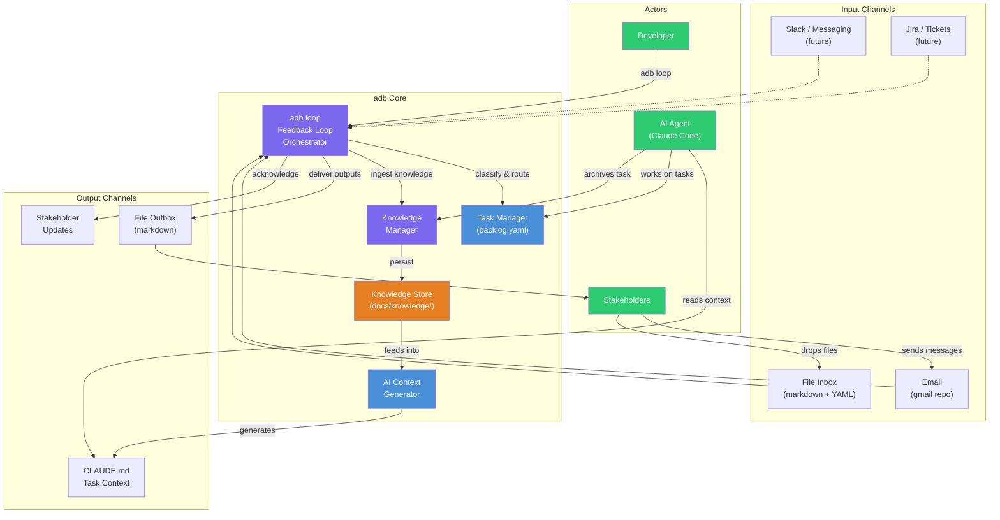
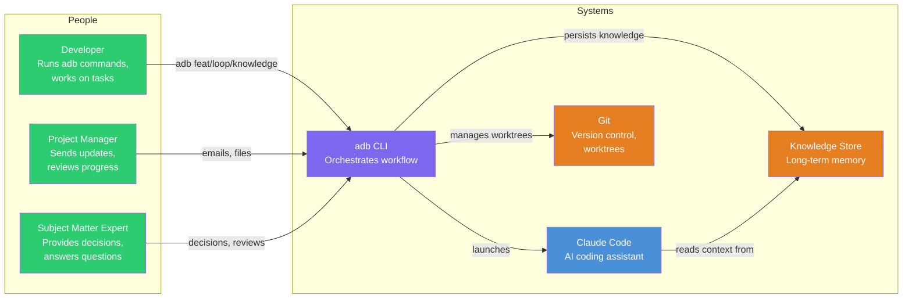
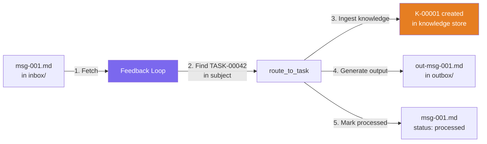
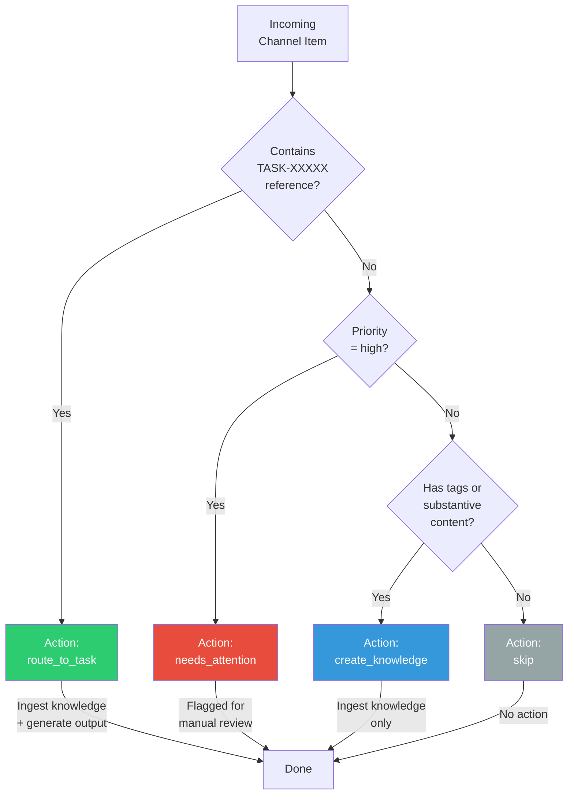
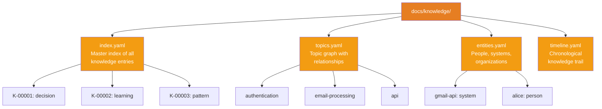
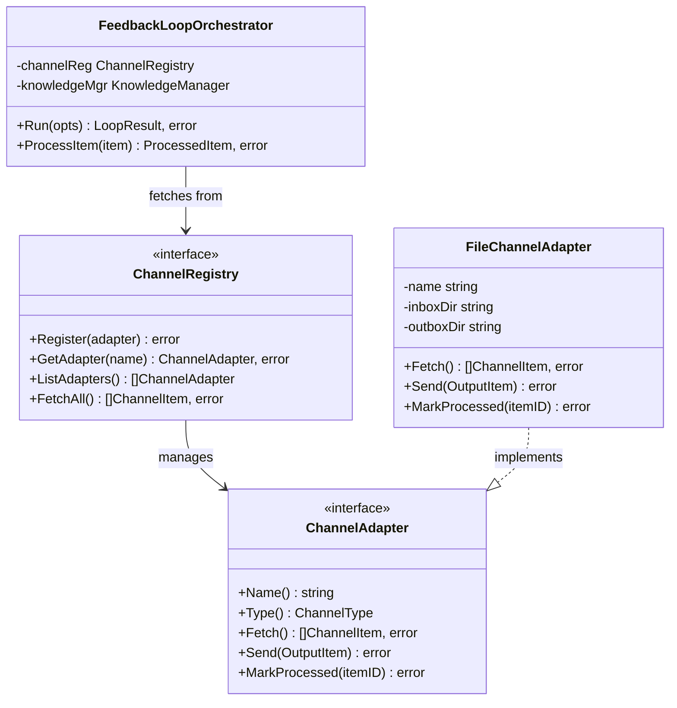
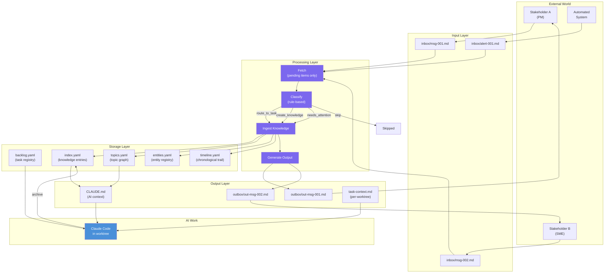
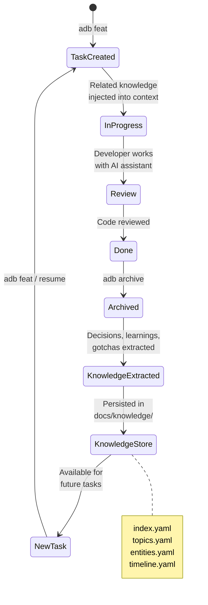
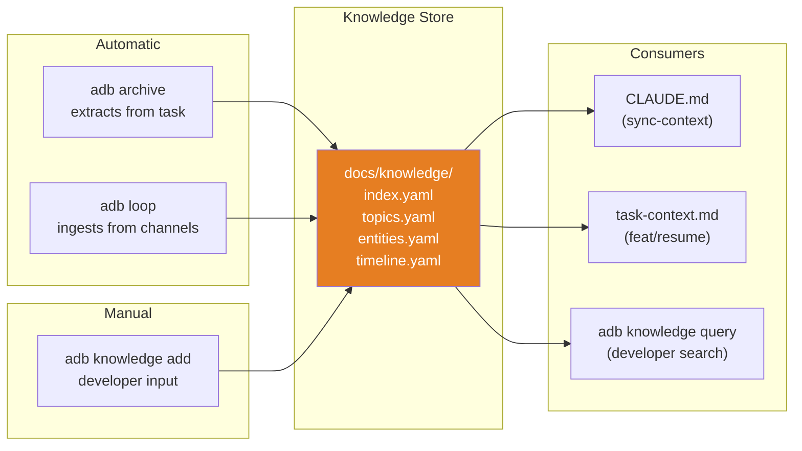

# Feedback Loop & Knowledge System Guide

Complete end-to-end guide for using the AI Dev Brain feedback loop, channel
adapters, and long-term knowledge persistence system.

---

## System Overview

The feedback loop connects external input sources (email, files, tickets)
to AI-assisted task work and routes outputs back to those same channels,
while accumulating knowledge across all task lifecycles.



---

## End-to-End Workflow

### The Full Cycle

Every piece of information flows through a closed loop:

```mermaid
sequenceDiagram
    actor Stakeholder
    participant Channel as Channel Adapter
    participant Loop as adb loop
    participant Classify as Classifier
    participant KM as Knowledge Manager
    participant KS as Knowledge Store
    participant TM as Task Manager
    participant AI as AI Agent

    Note over Stakeholder,AI: Phase 1: Input

    Stakeholder->>Channel: Sends message / drops file
    Channel-->>Loop: Fetch pending items

    Note over Stakeholder,AI: Phase 2: Classification

    Loop->>Classify: Classify each item
    Classify-->>Loop: Action: route_to_task / create_knowledge / needs_attention / skip

    Note over Stakeholder,AI: Phase 3: Knowledge Ingestion

    Loop->>KM: Ingest knowledge from item
    KM->>KS: Store entry + update topic graph + timeline

    Note over Stakeholder,AI: Phase 4: Task Routing

    Loop->>TM: Route to related task (if TASK-XXXXX found)

    Note over Stakeholder,AI: Phase 5: Output

    Loop->>Channel: Deliver acknowledgment output
    Channel-->>Stakeholder: Response / confirmation

    Note over Stakeholder,AI: Phase 6: AI Work

    AI->>KS: Query related knowledge
    AI->>TM: Work on task with full context

    Note over Stakeholder,AI: Phase 7: Archive & Learn

    AI->>KM: Archive task -> extract learnings
    KM->>KS: Persist decisions, patterns, gotchas
    KS-->>AI: Knowledge available for future tasks
```

---

## Actors and Roles



| Actor | Role | Interacts Via |
|-------|------|---------------|
| Developer | Runs CLI commands, manages tasks, reviews outputs | `adb` commands |
| Project Manager | Sends updates, requests status, reviews progress | Email, file drops, `adb update` |
| Subject Matter Expert | Provides technical decisions, answers questions | Email, file drops, direct knowledge entry |
| AI Agent (Claude Code) | Codes, reviews, extracts knowledge | Reads CLAUDE.md, works in worktrees |
| Channel Adapter | Normalizes input/output from external sources | File inbox/outbox, future: email, Slack |
| Knowledge Store | Persists decisions, learnings, patterns | `docs/knowledge/` YAML files |

---

## Step-by-Step Usage Guide

### 1. Set Up a File Channel

The file-based channel adapter is registered automatically when `adb`
initializes. It reads from `docs/channels/file-inbox/inbox/` and writes
to `docs/channels/file-inbox/outbox/`.

Verify it is registered:

```bash
adb channel list
```

Expected output:

```
NAME                 TYPE
--------------------  ----------
file-inbox           file
```

### 2. Add Input Items

Create markdown files with YAML frontmatter in the inbox directory:

```bash
cat > docs/channels/file-inbox/inbox/msg-001.md << 'EOF'
---
id: msg-001
from: alice@example.com
subject: "API rate limiting decision for TASK-00042"
date: "2025-02-15"
priority: high
status: pending
tags:
  - api
  - security
related_task: TASK-00042
---

We should implement token bucket rate limiting at the API gateway level.
This avoids per-service rate limiting complexity and gives us centralized
control. The recommended limits are 100 req/s for authenticated users
and 10 req/s for anonymous.
EOF
```

**Frontmatter fields:**

| Field | Required | Description |
|-------|----------|-------------|
| `id` | No | Unique identifier (filename used if empty) |
| `from` | No | Sender identifier |
| `subject` | Yes | Subject line |
| `date` | Yes | ISO date |
| `priority` | No | `high`, `medium`, `low` (default: medium) |
| `status` | Yes | Must be `pending` to be fetched |
| `tags` | No | List of tags for classification |
| `related_task` | No | Direct task reference (e.g., `TASK-00042`) |
| `metadata` | No | Arbitrary key-value pairs |

### 3. Check the Inbox

```bash
adb channel inbox
```

```
ID                   CHANNEL    PRIORITY   FROM                 SUBJECT
--------------------  ---------- ---------- -------------------- ------------------------------
msg-001              file       high       alice@example.com    API rate limiting decision for TASK-00042
```

### 4. Run the Feedback Loop

#### Preview First (Dry Run)

```bash
adb loop --dry-run
```

```
Feedback loop dry run completed:
  Items fetched:      1
  Items processed:    1
  Outputs delivered:  1
  Knowledge added:    1
  Skipped:            0
```

#### Execute for Real

```bash
adb loop
```

```
Feedback loop completed:
  Items fetched:      1
  Items processed:    1
  Outputs delivered:  1
  Knowledge added:    1
  Skipped:            0
```

**What happened:**



### 5. Check the Results

#### Knowledge Created

```bash
adb knowledge query "rate limiting"
```

```
1 result(s) for "rate limiting":

  K-00001 [learning] API rate limiting decision for TASK-00042
    source: TASK-00042 (channel)
    tags: api, security
```

#### Output Generated

The outbox now contains `out-msg-001.md`:

```yaml
---
id: out-msg-001
to: alice@example.com
subject: "Re: API rate limiting decision for TASK-00042"
date: "2025-02-15"
status: sent
metadata:
  in_reply_to: msg-001
  source_task: TASK-00042
---

Received and routed to TASK-00042.
```

#### Topic Graph Updated

```bash
adb knowledge topics
```

```
1 topic(s):

  TOPIC                     DESCRIPTION                              ENTRIES  TASKS
  -----                     -----------                              -------  -----
  api                                                                1        TASK-00042
```

#### Timeline Updated

```bash
adb knowledge timeline --since 7d
```

```
Knowledge timeline (1 events since 2025-02-08):

  2025-02-15  learning: API rate limiting decision for TASK-00042 [TASK-00042]
```

### 6. Knowledge Flows into AI Context

When you create or resume a task, accumulated knowledge is injected into
the AI context:

```bash
adb feat add-caching
# or
adb resume TASK-00042
```

The generated `.claude/rules/task-context.md` and `CLAUDE.md` now include:

```markdown
## Accumulated Project Knowledge

### Knowledge Topics

| Topic | Description | Tasks | Entries |
|-------|-------------|-------|---------|
| api   |             | TASK-00042 | 1 |

### Recent Knowledge (last 30 days)

- **2025-02-15**: learning: API rate limiting decision for TASK-00042 (TASK-00042)
```

### 7. Archive and Extract

When a task is archived, knowledge is extracted and persisted:

```bash
adb archive TASK-00042
```

Decisions, learnings, and gotchas from the task's `notes.md`,
`context.md`, `design.md`, and `communications/` are fed into the
knowledge store for future tasks.

---

## Classification Logic

The feedback loop classifies each incoming item using rule-based logic:



**Task reference detection** scans three locations:

1. `related_task` frontmatter field (highest priority)
2. Subject line (regex: `TASK-\d{5}`)
3. Content body (regex: `TASK-\d{5}`)

**Substantive content** is defined as content with 50 or more characters
after whitespace trimming.

---

## Knowledge Store Structure

All knowledge is persisted as git-friendly YAML under `docs/knowledge/`:



### Entry Types

| Type | Description | Example |
|------|-------------|---------|
| `decision` | A technical or process decision | "Use RS256 for JWT signing" |
| `learning` | Something learned during a task | "Gmail API requires exponential backoff" |
| `pattern` | A reusable pattern identified | "Redis caching reduces latency by 80%" |
| `gotcha` | A pitfall or unexpected behavior | "YAML marshaling drops nil slices" |
| `relationship` | A link between concepts or systems | "Auth service depends on Redis for sessions" |

### Source Types

| Source | Description |
|--------|-------------|
| `task_archive` | Extracted when a task is archived |
| `communication` | From stakeholder communications |
| `email` | From email channel |
| `channel` | From any channel via feedback loop |
| `manual` | Manually added via `adb knowledge add` |
| `session` | From a saved session summary |
| `ticket` | From ticket/issue tracking |

---

## Channel Adapter Architecture



### Adding a New Channel Adapter

To add a new channel type (e.g., Slack, Jira):

1. Create `internal/integration/slackchannel.go` implementing `core.ChannelAdapter`
2. Register it in `internal/app.go` alongside the file adapter
3. The feedback loop automatically picks it up via the channel registry

---

## Data Flow Diagram



---

## Common Workflows

### Workflow 1: Stakeholder Sends a Decision

```mermaid
sequenceDiagram
    actor PM as Project Manager
    participant Inbox as File Inbox
    participant Loop as adb loop
    participant KS as Knowledge Store
    participant Context as CLAUDE.md
    participant AI as Claude Code

    PM->>Inbox: Drops decision-auth.md<br/>(related_task: TASK-00001)
    Note over Inbox: status: pending

    Loop->>Inbox: Fetch pending items
    Inbox-->>Loop: decision-auth.md

    Loop->>Loop: Classify: route_to_task<br/>(found TASK-00001)

    Loop->>KS: Ingest as "learning"<br/>topic: from tags

    Loop->>Inbox: Mark as processed
    Note over Inbox: status: processed

    Loop-->>PM: Output: "Received and<br/>routed to TASK-00001"

    Note over Context: Next sync-context or resume...
    KS-->>Context: Knowledge summary updated
    AI->>Context: Reads updated context
    AI->>AI: Works on TASK-00001<br/>with new knowledge
```

### Workflow 2: Manual Knowledge Capture

```bash
# Developer learns something during a code review
adb knowledge add "Go interfaces should be defined where consumed, not implemented" \
  --type pattern \
  --topic go-conventions \
  --tags "golang,architecture" \
  --task TASK-00034

# Verify it was stored
adb knowledge query "interfaces"

# Check the topic graph
adb knowledge topics

# This knowledge is now available to all future AI sessions
adb sync-context
```

### Workflow 3: Batch Processing Multiple Channels

```bash
# Process all channels
adb loop

# Process only the file channel
adb loop --channel file-inbox

# Preview before executing
adb loop --dry-run

# Check what was captured
adb knowledge timeline --since 1d
```

### Workflow 4: Task Lifecycle with Knowledge



---

## CLI Command Reference Summary

| Command | Purpose |
|---------|---------|
| `adb loop` | Run the full feedback loop cycle |
| `adb loop --dry-run` | Preview without processing or delivering |
| `adb loop --channel <name>` | Process a specific channel only |
| `adb channel list` | List registered channel adapters |
| `adb channel inbox` | Show pending items from all channels |
| `adb channel inbox <name>` | Show pending items from a specific channel |
| `adb channel send <adapter> <to> <subject> <content>` | Send output to a channel |
| `adb knowledge query <term>` | Search accumulated knowledge |
| `adb knowledge query <term> --type topic` | Search by topic |
| `adb knowledge query <term> --type entity` | Search by entity |
| `adb knowledge query <term> --type tag` | Search by tag |
| `adb knowledge add <summary>` | Manually add a knowledge entry |
| `adb knowledge topics` | List knowledge topics |
| `adb knowledge timeline` | Show chronological knowledge trail |
| `adb knowledge timeline --since 7d` | Show recent knowledge events |

---

## Integration Points

### How Knowledge Enters the System



### How Knowledge is Consumed

1. **AI Context Generation** (`adb sync-context`): The `AIContextGenerator`
   queries the knowledge store and includes a "Knowledge Topics" and
   "Recent Knowledge" section in `CLAUDE.md`.

2. **Task Bootstrap** (`adb feat`, `adb resume`): When creating or resuming
   a task, related knowledge is queried by task tags, branch keywords, and
   related task IDs, then injected into `.claude/rules/task-context.md`.

3. **Developer Search** (`adb knowledge query`): Developers can search
   across all accumulated knowledge by keyword, topic, entity, or tag.

4. **Timeline Review** (`adb knowledge timeline`): Chronological view of
   all knowledge events for audit and review.

---

## File Format Reference

### Channel Item (Inbox File)

```yaml
---
id: msg-001
from: alice@example.com
subject: "Decision on API design"
date: "2025-02-15"
priority: high
status: pending
tags:
  - api
  - architecture
related_task: TASK-00042
metadata:
  source_system: email
---

The actual message content goes here as markdown body.
Multiple paragraphs are supported.
```

### Output Item (Outbox File)

```yaml
---
id: out-msg-001
to: alice@example.com
subject: "Re: Decision on API design"
date: "2025-02-15"
status: sent
metadata:
  in_reply_to: msg-001
  source_task: TASK-00042
---

Received and routed to TASK-00042.
```

### Knowledge Entry (index.yaml)

```yaml
version: "1.0"
entries:
  - id: K-00001
    type: decision
    topic: api
    summary: "Use token bucket rate limiting at API gateway"
    detail: "Centralized rate limiting avoids per-service complexity..."
    source_task: TASK-00042
    source_type: channel
    date: "2025-02-15"
    entities:
      - api-gateway
    tags:
      - api
      - security
```

---

## Troubleshooting

| Issue | Cause | Fix |
|-------|-------|-----|
| `channel registry not initialized` | adb failed to create channel registry on startup | Check file permissions on `docs/channels/` |
| `feedback loop not initialized` | Channel registry or knowledge manager failed | Check `adb channel list` works first |
| `knowledge manager not initialized` | Knowledge store directory inaccessible | Verify `docs/knowledge/` exists and is writable |
| Items not appearing in inbox | Status is not `pending` | Check frontmatter `status: pending` |
| Items skipped by loop | Content too short or no tags/task reference | Add `tags` or `related_task` to frontmatter, or ensure content is 50+ characters |
| Knowledge not in CLAUDE.md | Context not regenerated | Run `adb sync-context` after adding knowledge |
