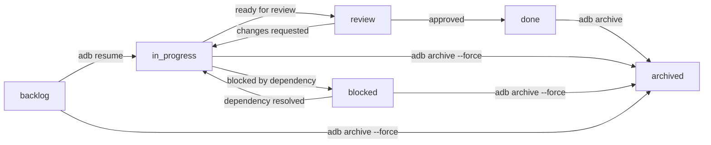

# Getting Started with AI Dev Brain

This guide walks you through installing AI Dev Brain (`adb`), configuring it for your environment, and creating your first task.

## Prerequisites

Before installing `adb`, make sure you have the following tools available:

| Tool | Minimum Version | Purpose |
|------|-----------------|---------|
| Go   | 1.26+           | Required to build from source |
| Git  | 2.20+           | Required for worktree support (`git worktree` was stabilized in 2.20) |

Verify your versions:

```bash
go version
# go version go1.26.0 linux/amd64

git --version
# git version 2.43.0
```

---

## Installation

### Linux

#### Ubuntu / Debian

```bash
# Install Go (if not already installed)
sudo apt update
sudo apt install -y golang-go git

# Verify Go version is 1.26+
go version

# Install adb from source
go install github.com/drapaimern/ai-dev-brain/cmd/adb@latest

# Ensure $GOPATH/bin is in your PATH
echo 'export PATH="$PATH:$(go env GOPATH)/bin"' >> ~/.bashrc
source ~/.bashrc

# Verify installation
adb --help
```

If the version of Go provided by `apt` is too old, install a newer version from the [official Go downloads](https://go.dev/dl/):

```bash
# Example: install Go 1.24.9 manually
wget https://go.dev/dl/go1.24.9.linux-amd64.tar.gz
sudo rm -rf /usr/local/go
sudo tar -C /usr/local -xzf go1.24.9.linux-amd64.tar.gz
echo 'export PATH="/usr/local/go/bin:$PATH"' >> ~/.bashrc
source ~/.bashrc
```

#### Fedora / RHEL

```bash
# Install Go and Git
sudo dnf install -y golang git

# Install adb from source
go install github.com/drapaimern/ai-dev-brain/cmd/adb@latest

# Ensure $GOPATH/bin is in your PATH
echo 'export PATH="$PATH:$(go env GOPATH)/bin"' >> ~/.bashrc
source ~/.bashrc

adb --help
```

#### Arch Linux

```bash
# Install Go and Git
sudo pacman -S go git

# Install adb from source
go install github.com/drapaimern/ai-dev-brain/cmd/adb@latest

# Ensure $GOPATH/bin is in your PATH
echo 'export PATH="$PATH:$(go env GOPATH)/bin"' >> ~/.bashrc
source ~/.bashrc

adb --help
```

### macOS

#### Using Homebrew (recommended)

```bash
# Install Go and Git (if not already installed)
brew install go git

# Install adb from source
go install github.com/drapaimern/ai-dev-brain/cmd/adb@latest

# Ensure $GOPATH/bin is in your PATH
echo 'export PATH="$PATH:$(go env GOPATH)/bin"' >> ~/.zshrc
source ~/.zshrc

adb --help
```

#### Manual binary install

```bash
# Download and install Go from https://go.dev/dl/
# Then:
go install github.com/drapaimern/ai-dev-brain/cmd/adb@latest

# Add to PATH in ~/.zshrc or ~/.bash_profile
echo 'export PATH="$PATH:$(go env GOPATH)/bin"' >> ~/.zshrc
source ~/.zshrc
```

### Windows

#### Using `go install`

Open PowerShell or Command Prompt:

```powershell
# Install Go from https://go.dev/dl/ (use the .msi installer)
# Install Git from https://git-scm.com/download/win

# Install adb
go install github.com/drapaimern/ai-dev-brain/cmd/adb@latest

# The binary is placed in %USERPROFILE%\go\bin\adb.exe
# Verify installation
adb --help
```

The `go install` command places the binary in `%USERPROFILE%\go\bin` by default. Ensure this directory is in your system `PATH`. The Go installer for Windows typically adds it automatically.

#### Using Scoop

```powershell
# Install Go and Git via Scoop
scoop install go git

# Install adb
go install github.com/drapaimern/ai-dev-brain/cmd/adb@latest

adb --help
```

#### Using winget

```powershell
# Install Go and Git via winget
winget install GoLang.Go
winget install Git.Git

# Restart your terminal, then:
go install github.com/drapaimern/ai-dev-brain/cmd/adb@latest

adb --help
```

### Building from Source

If you want to build from a cloned repository (useful for development or running a specific commit):

```bash
git clone https://github.com/drapaimern/ai-dev-brain.git
cd ai-dev-brain

# Build the binary
go build -o adb ./cmd/adb

# Move it somewhere in your PATH
# Linux/macOS:
sudo mv adb /usr/local/bin/

# Or run it directly:
./adb --help
```

On Windows, the build produces `adb.exe`:

```powershell
git clone https://github.com/drapaimern/ai-dev-brain.git
cd ai-dev-brain

go build -o adb.exe ./cmd/adb

# Run directly or move to a directory in your PATH
.\adb.exe --help
```

---

## Initial Setup

### Create a workspace directory

`adb` operates from a base directory that holds your configuration, tickets, and knowledge files. Create one and initialize it:

```bash
mkdir ~/adb-workspace
cd ~/adb-workspace
```

### Create a `.taskconfig` file

The `.taskconfig` file is the global configuration file. It lives in your workspace root and controls system-wide defaults.

Create `~/adb-workspace/.taskconfig` with the following content:

```yaml
# ─── Defaults ───────────────────────────────────────────────────
defaults:
  # AI assistant to use for context generation.
  # Examples: "kiro", "claude", "copilot"
  ai: "kiro"

  # Default priority for new tasks.
  # Valid values: P0 (critical), P1 (high), P2 (medium), P3 (low)
  priority: "P2"

  # Default owner assigned to new tasks.
  # Leave empty to leave tasks unassigned.
  owner: ""

# ─── Task ID ────────────────────────────────────────────────────
task_id:
  # Prefix for generated task IDs (e.g., TASK-00001).
  prefix: "TASK"

  # Starting counter value. Incremented with each new task.
  # Set this higher if you are migrating from another system.
  counter: 0

# ─── Screenshot ─────────────────────────────────────────────────
screenshot:
  # Keyboard shortcut for capturing screenshots into task context.
  hotkey: "ctrl+shift+s"

# ─── Offline Mode ───────────────────────────────────────────────
# When true, disables all network calls (AI APIs, remote lookups).
offline_mode: false

# ─── CLI Aliases ────────────────────────────────────────────────
# Define custom shorthand commands.
cli_aliases:
  - name: "f"
    command: "feat"
    default_args: []
  - name: "b"
    command: "bug"
    default_args: []
```

Every field is optional. If the file is missing or a field is omitted, the following defaults apply:

| Field | Default |
|-------|---------|
| `defaults.ai` | `"kiro"` |
| `defaults.priority` | `"P2"` |
| `defaults.owner` | `""` (unassigned) |
| `task_id.prefix` | `"TASK"` |
| `task_id.counter` | `0` |
| `screenshot.hotkey` | `"ctrl+shift+s"` |
| `offline_mode` | `false` |
| `cli_aliases` | `[]` (none) |

### Create a `.taskrc` file (per-repository)

The `.taskrc` file contains repository-specific settings. Place it in the root of any Git repository where you use `adb`.

Create `.taskrc` in your repository root:

```yaml
# ─── Build & Test ───────────────────────────────────────────────
# Shell command to build the project.
build_command: "go build ./..."

# Shell command to run the test suite.
test_command: "go test ./..."

# ─── Code Review ────────────────────────────────────────────────
# GitHub usernames automatically added as reviewers on PRs.
default_reviewers:
  - "@alice"
  - "@bob"

# ─── Conventions ────────────────────────────────────────────────
# Project conventions that AI assistants should follow.
conventions:
  - "Use table-driven tests"
  - "All exported functions must have doc comments"
  - "Error messages start with lowercase"

# ─── Custom Templates ──────────────────────────────────────────
# Override the built-in notes.md template for specific task types.
# Values are file paths relative to the repository root.
# Valid keys: feat, bug, spike, refactor
templates:
  feat: ".adb-templates/feat-notes.md"
  bug: ".adb-templates/bug-notes.md"
```

All `.taskrc` fields are optional. If the file does not exist, no repo-specific overrides are applied.

| Field | Type | Description |
|-------|------|-------------|
| `build_command` | string | Shell command to build the project |
| `test_command` | string | Shell command to run tests |
| `default_reviewers` | list of strings | Reviewers auto-added to PRs |
| `conventions` | list of strings | Coding conventions for AI context |
| `templates` | map (task type to path) | Custom notes.md template overrides |

---

## Configuration Precedence

When `adb` loads configuration, it merges values from multiple sources. Settings from more specific sources override less specific ones:

```
.taskrc (per-repo)  >  .taskconfig (global)  >  built-in defaults
```

For example, if your `.taskconfig` sets `defaults.priority: "P2"` but the task creation command passes `--priority P0`, the flag wins. The `.taskrc` repo-level settings overlay the global config, and the global config overlays the built-in defaults.

The merging works as follows:

1. **Built-in defaults** are loaded first (the values shown in the defaults table above).
2. **`.taskconfig`** is read from the workspace root. Any field present overwrites the default.
3. **`.taskrc`** is read from the current repository path. Repo-specific fields are attached to the merged config and take precedence for repo-scoped operations.

---

## Your First Task

This walkthrough creates a feature task, inspects it, works on it, and archives it when done.

### Step 1: Create a feature task

```bash
adb feat add-user-auth --repo github.com/myorg/myapp
```

Output:

```
Created task TASK-00001
  Type:     feat
  Branch:   add-user-auth
  Repo:     github.com/myorg/myapp
  Worktree: /home/you/adb-workspace/worktrees/TASK-00001
  Ticket:   /home/you/adb-workspace/tickets/TASK-00001
```

This command does the following:

- Generates a unique task ID (`TASK-00001`) using the configured prefix and auto-incrementing counter.
- Creates a ticket directory at `tickets/TASK-00001/` with template files.
- Creates a Git worktree branched from the default branch.
- Sets the initial status to `backlog`.

### Step 2: Explore the created structure

```
tickets/TASK-00001/
  communications/     # Slack threads, email summaries, meeting notes
  sessions/           # Session summaries (timestamped markdown files)
  knowledge/          # Extracted decisions and facts (decisions.yaml)
  context.md          # Running context for AI assistants
  design.md           # Technical design document
  notes.md            # Requirements, acceptance criteria, implementation notes
  status.yaml         # Machine-readable task metadata
```

**`status.yaml`** contains the task metadata:

```yaml
id: TASK-00001
title: add-user-auth
type: feat
status: backlog
priority: P2
owner: ""
repo: github.com/myorg/myapp
branch: add-user-auth
worktree: /home/you/adb-workspace/worktrees/TASK-00001
ticket_path: /home/you/adb-workspace/tickets/TASK-00001
created: 2026-02-11T10:30:00Z
updated: 2026-02-11T10:30:00Z
tags: []
blocked_by: []
related: []
```

**`notes.md`** is pre-populated with the feature template:

```markdown
# Feature Notes

## Requirements
- [ ] Requirement 1
- [ ] Requirement 2

## Acceptance Criteria
- [ ] Criterion 1
- [ ] Criterion 2

## Implementation Notes

## Open Questions
```

**`context.md`** provides a running scratch-pad for AI assistants:

```markdown
# Task Context: TASK-00001

## Summary

## Current Focus

## Recent Progress

## Open Questions

## Decisions Made

## Blockers

## Next Steps

## Related Resources
```

### Step 3: Check task status

```bash
adb status
```

Output:

```
== BACKLOG (1) ==
  ID           PRI  TYPE       BRANCH
  ----         ---  ----       ------
  TASK-00001   P2   feat       add-user-auth
```

You can filter by status:

```bash
adb status --filter in_progress
```

### Step 4: Edit your task files

Open `notes.md` and fill in the real requirements:

```markdown
# Feature Notes

## Requirements
- [ ] Add /login endpoint with email/password
- [ ] Issue JWT tokens on successful authentication
- [ ] Add /me endpoint returning the authenticated user

## Acceptance Criteria
- [ ] POST /login returns 200 with a valid JWT
- [ ] POST /login returns 401 for invalid credentials
- [ ] GET /me returns 401 without a token

## Implementation Notes
Using golang-jwt/jwt/v5 for token signing.

## Open Questions
- Token expiry duration: 1 hour? 24 hours?
```

Update `context.md` as you work to keep your AI assistant in sync:

```markdown
# Task Context: TASK-00001

## Summary
Implementing JWT-based user authentication for the myapp API.

## Current Focus
Setting up the /login endpoint and JWT signing.

## Recent Progress
- Scaffolded handler in internal/auth/handler.go
- Added JWT dependency to go.mod

## Decisions Made
- Using HS256 signing algorithm for simplicity
```

### Step 5: Resume a task

When you return to a task later (next day, after a context switch), use `resume` to reload its context:

```bash
adb resume TASK-00001
```

Output:

```
Resumed task TASK-00001
  Type:     feat
  Status:   in_progress
  Branch:   add-user-auth
  Worktree: /home/you/adb-workspace/worktrees/TASK-00001
  Ticket:   /home/you/adb-workspace/tickets/TASK-00001
```

The `resume` command promotes the task from `backlog` to `in_progress` if it was not already active.

### Step 6: Archive the task

When the work is complete and merged, archive the task to generate a handoff document:

```bash
adb archive TASK-00001
```

If the task is still in `in_progress` or `blocked` status, you need to use `--force`:

```bash
adb archive TASK-00001 --force
```

Output:

```
Archived task TASK-00001
  Summary: Implemented JWT-based user authentication
  Completed:
    - POST /login endpoint with JWT issuance
    - GET /me endpoint with token validation
    - Unit tests for auth handler
  Open items:
    - Token refresh endpoint (deferred to TASK-00015)
  Learnings:
    - HS256 is sufficient for internal services; switch to RS256 for public APIs
```

The archive generates a handoff document that captures what was done, what remains open, and lessons learned -- preserving institutional knowledge for future reference.

---

## Task Lifecycle

Every task in `adb` moves through a defined set of statuses. The following diagram shows all valid transitions:



### Status descriptions

| Status | Meaning |
|--------|---------|
| `backlog` | Task is created but work has not started. This is the initial status. |
| `in_progress` | Active development is underway. Set automatically by `adb resume`. |
| `blocked` | Work is paused due to an external dependency or blocker. |
| `review` | Implementation is complete and awaiting code review. |
| `done` | Review is approved and the work is merged. |
| `archived` | Task is archived with a handoff document. Terminal state. |

---

## Task Types

`adb` supports four task types, each with its own notes and design templates:

| Type | Command | Use Case |
|------|---------|----------|
| `feat` | `adb feat <branch>` | New feature development |
| `bug` | `adb bug <branch>` | Bug investigation and fix |
| `spike` | `adb spike <branch>` | Time-boxed research or proof of concept |
| `refactor` | `adb refactor <branch>` | Code restructuring without behavior change |

Each type generates appropriate template content in `notes.md` and `design.md`. For example, `bug` tasks include sections for steps to reproduce and root cause analysis, while `spike` tasks include research questions and a time-box section.

---

## Common Flags

All task creation commands (`feat`, `bug`, `spike`, `refactor`) accept these flags:

| Flag | Description | Example |
|------|-------------|---------|
| `--repo` | Repository path | `--repo github.com/org/repo` |
| `--priority` | Task priority (P0-P3) | `--priority P1` |
| `--owner` | Task owner | `--owner @alice` |
| `--tags` | Comma-separated tags | `--tags auth,backend` |

---

## Observability

`adb` includes built-in observability through an append-only event log (`.adb_events.jsonl`) that records task lifecycle events, agent sessions, and knowledge extraction. Three commands expose this data:

| Command | Description |
|---------|-------------|
| `adb metrics [--json] [--since 7d]` | Aggregated metrics: tasks created/completed, by status/type, agent sessions |
| `adb alerts` | Active alerts for blocked tasks, stale tasks, long reviews, backlog size |
| `adb session save [task-id]` | Save a timestamped session summary to the task's `sessions/` directory |

Observability is non-fatal -- if the event log cannot be created, all core task management commands continue to work normally. See [Commands Reference](commands.md) for full details on each command.

---

## Next Steps

- See [Commands Reference](commands.md) for the full CLI reference.
- See [Usage Scenarios](usage-scenarios.md) for real-world workflow examples.
- See [Architecture](architecture.md) for system design details.
