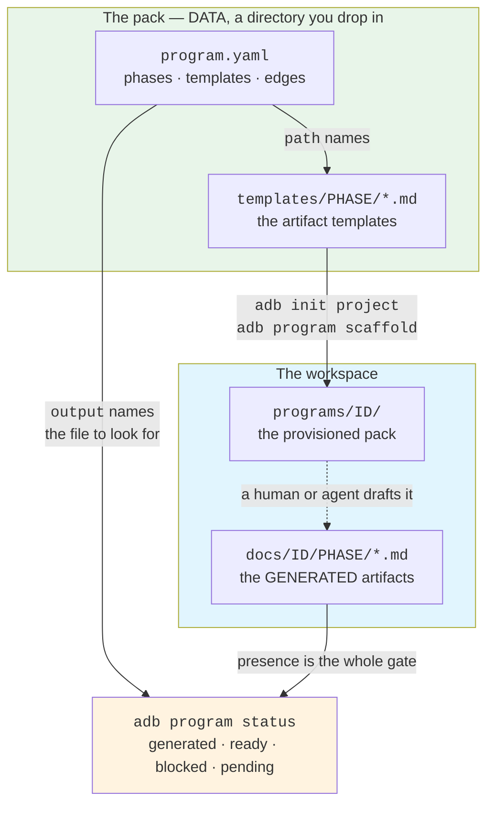
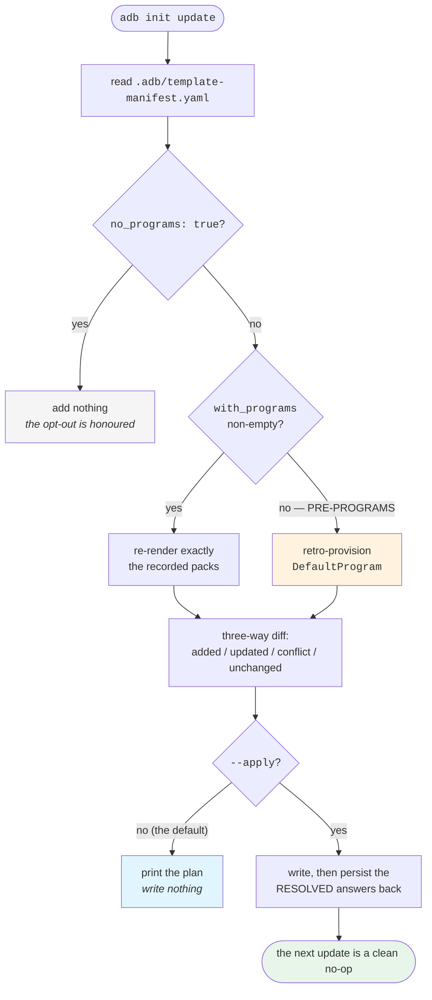
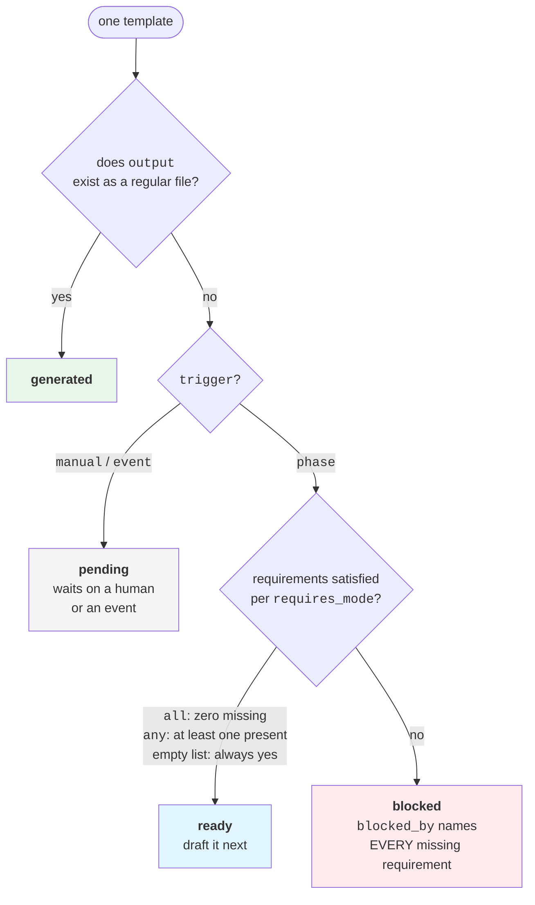
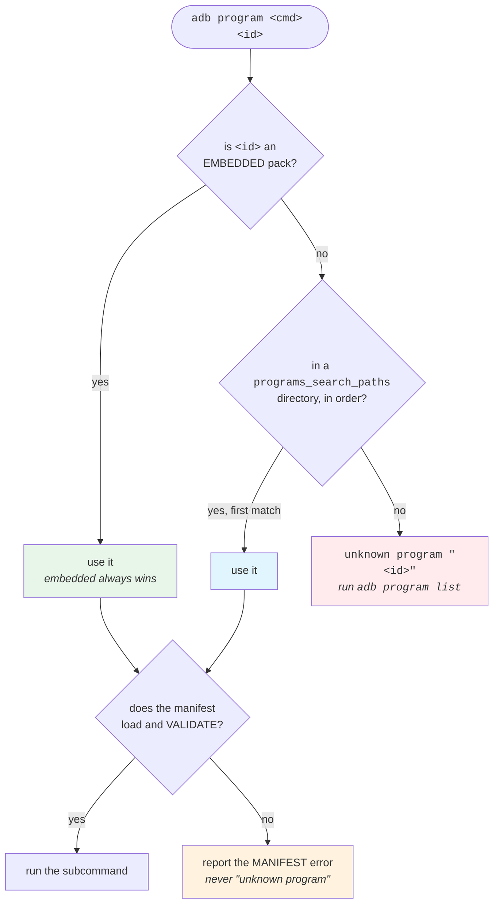

# L600 — Document Programs

> **Tier:** L600 (the delivery-artifact layer) · **Goal after this page:** *"I can drive
> a project's documents through a phase-ordered program, and author a pack of my own."*
>
> **Prereqs:** [L100 — Fundamentals](./L100-fundamentals.md) (the ticket atom these
> artifacts hang off), and ideally
> [L500 — The Founder-Playbook OS](./L500-founder-playbook-os.md) — a program borrows the
> same two ideas L500 is built on: **evidence is a file that exists**, and **a pack is
> data you drop in, not a Go change**.
>
> L500 governs how a *business* progresses (Idea→MVP→Launch→Scale). This tier governs the
> **documents a project produces** on the way: the PRD, the design doc, the readiness
> review, the postmortem. Every field, state, command and path below is checked against
> `pkg/models/program.go`, `internal/core/program.go`, `internal/core/provenance_test.go`,
> and the shipped `templates/programs/*/program.yaml`.

---

## Table of contents

- [1. The mental model](#1-the-mental-model)
- [2. Why it exists](#2-why-it-exists)
- [3. The command surface](#3-the-command-surface)
- [4. The manifest schema](#4-the-manifest-schema)
- [5. The gate: four states, presence-based](#5-the-gate-four-states-presence-based)
- [6. Triggers: phase, manual, event](#6-triggers-phase-manual-event)
- [7. `human_review`: the agent drafts, the human validates](#7-human_review-the-agent-drafts-the-human-validates)
- [8. Source traceability](#8-source-traceability)
- [9. The five shipped packs](#9-the-five-shipped-packs)
- [10. Authoring your own pack](#10-authoring-your-own-pack)
- [11. External packs](#11-external-packs)
- [12. The provenance boundary](#12-the-provenance-boundary)
- [13. What programs deliberately do not own](#13-what-programs-deliberately-do-not-own)
- [14. How this is verified](#14-how-this-is-verified)
- [Honest limits](#honest-limits)

---

## 1. The mental model

A **program** is a *phase-ordered pack of artifact templates plus the dependency edges
between them*.

Three parts, and nothing else:

1. **Phases** — ordered stages of document work (`requirements → design → detail`).
   Phase order is **manifest order** (`Program.PhaseIndex`).
2. **Templates** — one artifact each: where the template lives in the pack (`path`) and
   where the generated artifact lands in the workspace (`output`).
3. **Edges** — each template's `requires`, naming the **template ids** it depends on.



Note what the arrows do **not** say: scaffolding a pack never creates an artifact. It
installs templates. The gate keys on the `output` file, which only appears when someone
actually drafts the document.

The load-bearing property: **a program is DATA.** It is a `program.yaml` manifest at the
root of a template pack, parsed by `core.LoadProgram`. Adding a program is a pack you
drop under `programs/` — never a Go change. That is the same property the compliance
(#133) and GTM (#135) packs have, and it is literally the same scaffolder underneath:
`ScaffoldProgram` reuses `internal/core/packs.go` (`scaffoldPackTree`, the recursive
sibling of the flat `scaffoldPack` those two packs use).

The engine is small on purpose (`internal/core/program.go`):

| Function | What it does |
|---|---|
| `LoadProgram(fsys, root)` | reads + parses `<root>/program.yaml`, fills trigger/requires-mode defaults, then validates |
| `ListPrograms(fsys, root, searchPaths)` | sorted, deduplicated program ids: embedded packs + external search paths |
| `ValidateProgram(p)` | every manifest invariant, including the dependency **cycle** check |
| `ScaffoldProgram(...)` | installs a pack (manifest + template tree) into a workspace |
| `ProgramStatus(p, workspaceRoot)` | classifies every template: generated / ready / blocked / pending |
| `NextTemplates(p, workspaceRoot)` | the `ready` subset, same order |
| `TraceArtifact(p, workspaceRoot, id)` | which inputs a generated artifact cites |

`core.ProgramsRoot` (`"programs"`) is the exported name of the pack directory, so the CLI
and project init pass the same root instead of each hard-coding the string.

## 2. Why it exists

Before this, a fresh adb workspace had **no delivery artifact templates at all**. The
ticket templates (`context.md`, `notes.md`, `design.md`, `handoff.md`) cover *the work*;
the validation pack covers *Idea/MVP evidence*; compliance and GTM cover *control
checklists* and *positioning*. Nothing covered the ordinary documents a delivery project
actually produces — a PRD, a high-level design, a threat model, a production-readiness
review, a rollback plan, a blameless postmortem.

So every one of those started from a blank page, in whatever shape the author last
remembered, with no record of what informed it and no signal about what should be written
next. A program replaces the blank page with a phase-ordered pack and a gate that can
answer *"what is ready to draft right now?"*.

## 3. The command surface

```bash
adb program list                       # available programs (embedded + external)
adb program show <program>             # phases, templates, edges, human-review notes
adb program scaffold <program>         # install the pack into the workspace
adb program status <program>           # every template: generated | ready | blocked | pending
adb program next <program>             # just the ready ones — draft these
adb program trace <program> <template> # which inputs the generated artifact cites
```

Every subcommand takes `--json`. `scaffold` additionally takes `--dry-run` (plan, write
nothing) and `--force` (overwrite a destination that exists but differs). The install
semantics come straight from the shared pack installer
(`internal/core/harness_install.go`), so they are the same ones `adb compliance scaffold`
and `adb gtm scaffold` have:

- destination matches the embedded content → **unchanged**
- destination exists and **differs** → **skipped**, so your edits are never silently
  clobbered; re-run with `--force` to overwrite
- `--dry-run` → the plan only, nothing written

All six `--json` shapes use **one naming convention, snake_case** — `scaffold` included,
whose rows are `{name, dest, action, dry_run}`. The `dry_run` boolean is what lets a
scripted consumer tell a plan from a write: a `--dry-run` row reports
`action: "installed"` exactly like a real install does, and only the human view says
"Would scaffold".

`next` additionally prints each ready template's `from:` — where to open the *template*, as
opposed to `write:`, which is where the artifact goes. That path is **resolved, not
assumed** (§11): the provisioned copy under `programs/<id>/` when it is on disk, else an
external pack's absolute search-path location, else the provisioned path it *would* have
plus the `adb program scaffold` command that puts it there.

`ScaffoldProgram` loads and **validates** the manifest before writing anything, so a
malformed pack can never get half-installed into a workspace.

**Provisioning at project-init time.** `adb init project` provisions the
`technical-design` pack by default:

```bash
adb init project ./my-service                          # technical-design, by default
adb init project ./my-service --with-program operations # provision a different pack
adb init project ./my-service --no-programs            # opt out entirely
```

Because provisioning goes through `adb init project`, the files land in that project's
`.adb/template-manifest.yaml` provenance manifest (version + answers + per-file content
hashes) — which means `adb init update` re-syncs them like any other scaffolded file
(three-way diff → added/updated/conflict/unchanged, dry-run by default, `--apply` /
`--force`). The manifest records the **resolved** pack list rather than the raw flag, so a
later change to the default pack cannot silently swap an existing project's program.

### Legacy workspaces are retro-provisioned

A workspace scaffolded **before** document programs existed picks up the default pack on
`adb init update`. Its 9 files appear in the plan as `added`, so the dry-run shows them
before anything is written and `--apply` is your explicit consent:

```console
$ adb init update .
Plan template update 1 → 2
  added (9):
    programs/technical-design/program.yaml
    programs/technical-design/templates/requirements/business-requirements.md
    …
Run with --apply to write (add --force to overwrite conflicts).
```

This required separating two cases that used to be indistinguishable. Both a deliberate
`--no-programs` opt-out and a pre-programs workspace recorded an **absent**
`with_programs`, so keying off "the list is empty" could only ever do one of two wrong
things: never retro-provision, or override real opt-outs.

The manifest therefore records the opt-out explicitly, as `no_programs: true`
(`TemplateAnswers.NoPrograms`). The update path reads it rather than inferring from
missing data:

| Manifest records | `adb init update` behaviour |
|---|---|
| `with_programs: [a, b]` | re-renders exactly `a` and `b`; diffs their files like any other scaffolded artifact |
| `no_programs: true` | adds nothing — the opt-out is honoured |
| **neither** (pre-programs) | retro-provisions `DefaultProgram`, surfaced as `added` |



That write-back is load-bearing, not bookkeeping: a retro-provisioned workspace must
*record* the pack it just received, or the manifest keeps claiming it has no packs while
their files sit on disk with baseline hashes — and the same 9 files get offered as `added`
on every subsequent update, forever.

`ApplyUpdate` then persists the resolved answers, so a retro-provisioned workspace records
the pack it received and the next update is a clean no-op. Without that write-back the
manifest would keep claiming it has no packs while their files sat on disk with baseline
hashes — reintroducing the exact ambiguity `no_programs` exists to remove.

To adopt a *different* pack in an existing workspace, ask for it directly rather than
waiting for an update:

```bash
adb program scaffold operations --dry-run   # then without --dry-run
```

That is idempotent and clobber-safe on re-run, exactly like `adb compliance scaffold`.

> **Scaffolding a pack is not generating an artifact.** `scaffold` installs *templates*.
> The gate in §5 keys on each template's `output` file, which only appears when someone
> (you, or an agent) actually drafts the artifact.

## 4. The manifest schema

`program.yaml` has exactly three top-level blocks (`pkg/models/program.go` — `Program`).

### `program:` — identity and provenance (`ProgramMeta`)

| Field | Required | Meaning |
|---|---|---|
| `id` | **yes** | the program's id; must equal its directory name for a shipped pack (asserted by `TestProvenance_ManifestsDeclareLineage`) |
| `name` | **yes** | human name |
| `version` | no | an integer the manifest declares for its own bookkeeping; the engine reads it but enforces nothing |
| `lineage` | **yes, non-empty** | the **public** sources the program's structure derives from, as free-form citation strings (see §12) |
| `description` | no | one-liner for `adb program list` |

### `phases:` — the order (`ProgramPhase`)

| Field | Required | Meaning |
|---|---|---|
| `id` | **yes** | referenced by each template's `phase`; must be unique |
| `name` | **yes** | human name |
| `description` | no | what this phase establishes |

**Phase order is manifest order.** There is no `order:` field to keep in sync — moving a
phase up the file moves it up the program.

### `templates:` — one artifact each (`ProgramTemplate`)

| Field | Required | Meaning |
|---|---|---|
| `id` | **yes** | unique; this is what `requires` names |
| `name` | **yes** | human name |
| `phase` | **yes** | must be a declared phase id |
| `path` | **yes** | the template file, relative to the pack root, forward-slash |
| `output` | **yes** | the generated artifact, relative to the **workspace** root; unique across the program |
| `requires` | no | **template ids** this artifact depends on (never file paths) |
| `requires_mode` | no | `all` (default) or `any` |
| `reads` | no | glob **hints** naming context an agent should read before drafting |
| `trigger` | no | `phase` (default), `manual`, or `event` |
| `human_review` | **yes** | the `{required, note, risk}` block (§7) |

Two of these encode a design choice worth understanding.

#### (a) `requires` names template IDs, not file paths

A dependency could have been expressed as "wait for `docs/.../prd.md` to exist" — the gate
is presence-based anyway (§5), so paths would have worked. Ids are used instead because
**ids can be validated structurally**:

- `ValidateProgram` rejects a `requires` entry that names an unknown template id, so a
  typo is a load error rather than a template that silently never fires;
- it walks the id graph and rejects any **cycle**, reporting it as a path
  (`a -> b -> a`) so the author sees the loop, not a bare "there is a cycle"
  (`findProgramCycle`);
- renaming an artifact's `output` cannot silently break a dependency — the edge is
  attached to the template, not to the filename.

The engine still resolves ids *to* paths when it needs to talk to a human: a blocked
template reports each unsatisfied requirement as `<template-id> (<output>)`, so you learn
both which template to run and which file it is waiting for.

#### (b) `requires_mode: any | all`

`all` (the default) needs every listed template generated. `any` needs **at least one** —
for an artifact that can legitimately be informed by any one of several upstream inputs.
The shipped example is `product-discovery`'s RAID log, which requires `pitch` **or**
`stakeholder-map`:

```yaml
  - id: raid-log
    requires: [pitch, stakeholder-map]
    requires_mode: any
```

Under `any`, `ProgramStatus` still reports **every** missing requirement in `blocked_by`,
so a CLI can offer you the choice of which upstream artifact to produce
(`missingRequirements`). An empty `requires` list is always satisfied
(`requirementsSatisfied`).

### A complete worked example

A minimal two-phase program, valid against `ValidateProgram`:

```yaml
program:
  id: incident-review
  name: Incident Review
  version: 1
  description: >-
    A worked example: record what happened, then decide what changes because of it.
  lineage:
    - "Google SRE book — blameless postmortem culture (sre.google/sre-book)"

phases:
  - id: record
    name: Record
    description: >-
      Capture what happened while memory is fresh, with no analysis yet.
  - id: decide
    name: Decide
    description: >-
      Turn the record into owned, dated changes.

templates:
  - id: timeline
    name: Incident Timeline
    phase: record
    path: templates/record/timeline.md
    output: docs/incident-review/record/timeline.md
    requires: []
    requires_mode: all
    reads:
      - "docs/**"
    trigger: event
    human_review:
      required: true
      note: "A second responder confirms the detection and escalation times."
      risk: >-
        A timeline rebuilt from recollection misplaces exactly the timestamps used
        later to argue that monitoring was adequate.

  - id: review
    name: Incident Review
    phase: decide
    path: templates/decide/review.md
    output: docs/incident-review/decide/review.md
    requires: [timeline]
    requires_mode: all
    reads:
      - "docs/incident-review/record/timeline.md"
    trigger: event
    human_review:
      required: true
      note: "Each action item has a named owner and a date before this is closed."
      risk: >-
        Unowned action items read as remediation and are cited as such, while the
        same failure mode stays live.
```

Loading that gives you: two phases in that order; `timeline` with no requirements;
`review` blocked until `docs/incident-review/record/timeline.md` exists — and, because
both are `event`-triggered, neither is ever auto-surfaced as *ready* (§6).

## 5. The gate: four states, presence-based

`ProgramStatus` classifies every template against a workspace root, in **phase order and
then manifest order within a phase** (a stable sort on the phase index):

| State | Meaning |
|---|---|
| `generated` | the template's `output` file **exists** |
| `ready` | not generated, `trigger: phase`, requirements satisfied per `requires_mode` — draft it next |
| `blocked` | not generated, `trigger: phase`, requirements **not** satisfied (`blocked_by` names each one as `<id> (<output>)`) |
| `pending` | `trigger` is `manual` or `event` — it waits on a human or an external event, not on the graph |

The classification is a single ordered decision, and the order is the interesting part —
**presence is checked first**, so an artifact that exists reports `generated` even for a
template that would otherwise wait forever on a `manual` or `event` trigger:



Two consequences worth naming, because both are deliberate:

- **`generated` beats the trigger.** A drafted postmortem reports `generated`, not
  `pending`, even though nothing could ever have made it `ready`.
- **`blocked_by` reports every missing requirement, including under `requires_mode: any`**,
  where satisfying one would do. That is so a CLI can offer the *choice* of which upstream
  artifact to produce rather than picking one for you.

**Gating is presence-based.** An artifact counts as generated when its `output` file
exists as a regular file — one `os.Stat`, nothing more (`artifactExists`). Requirements
are resolved from a single presence pass computed up front, so the classification itself
is pure.

This deliberately matches how `internal/core/stagegate.go` treats **file evidence**.
adb already has one answer to "is this artifact done?", and a second, richer completion
state machine would eventually disagree with the first — at which point the interesting
question becomes "which of my two systems is lying?" rather than "what should I write
next?". One notion of done, applied twice.

> **Known limitation, stated plainly: a scaffolded-but-empty artifact counts as done.**
> Presence is a weak signal. A file created from a template and never filled in reports
> `generated`, and every downstream template unblocks off it. This is a real trade-off,
> accepted for now because the alternative buys a second source of truth. If it proves too
> loose in practice, the upgrade is small and additive: one frontmatter field on the
> generated artifact (a `status:` or `complete:` marker) that the gate reads in addition to
> presence. The parser already tolerates unknown frontmatter keys
> (`artifactFrontmatter` reads only `sources:`), so nothing has to be re-shaped to add it.

`adb program next` is exactly the `ready` subset of `status`, in the same order — the
artifacts that can be drafted right now.

## 6. Triggers: phase, manual, event

`trigger` says what makes a template *actionable* (`models.ProgramTrigger`; empty defaults
to `phase` at load time, so callers never branch on `""`):

| Trigger | Behaviour | Use it for |
|---|---|---|
| `phase` | offered as `ready` as soon as its requirements are satisfied | the normal, phase-ordered flow |
| `manual` | never auto-surfaced as ready; reported `pending` | an artifact you write only when you decide it is warranted |
| `event` | never auto-surfaced as ready; reported `pending` | an artifact an **external event** calls for |

`event` exists because some artifacts have no phase at which they become due. **A
postmortem fires on an incident, never on a phase.** Putting it in the phase flow would
mean either a permanently-blocked template nagging from the status output, or a
permanently-"ready" one inviting somebody to write the postmortem for an incident that has
not happened. The `operations` pack uses `event` for exactly this: `incident-timeline` and
`postmortem` are event-triggered; the standing operational artifacts (`slo-error-budget`,
`weekly-ops-review`, `adoption-kpis`) are `manual`.

`manual` covers the "only if warranted" case. `technical-design` marks `design-doc-mini`
and `rfc` manual: the mini design doc is for an incremental change, and an RFC is a heavy
instrument — both are choices a human makes, not steps a graph should push you into.

Being `pending` does **not** exempt a template from the dependency graph. When the event
does fire, `postmortem` still requires `incident-timeline`, and the manifest still says so.

## 7. `human_review`: the agent drafts, the human validates

`human_review` is **mandatory on every template** — `ValidateProgram` rejects a manifest
whose template omits it, so a pack cannot ship without one:

```yaml
    human_review:
      required: true
      note: "Check that every FR/NFR is testable and that the non-goals list is real."
      risk: "Untestable or missing requirements become silent scope disputes during implementation."
```

| Field | What it carries |
|---|---|
| `required` | whether a human must review the drafted artifact |
| `note` | **what** to look at — the specific thing that is worth a human's attention |
| `risk` | **what it costs** to skip that review |

This is the contract that makes generated documents safe to use: the agent drafts, the
human validates, and the manifest says exactly where the human's judgement is
load-bearing. The `risk` field is what turns skipping into a *considered* choice rather
than an invisible one — `adb program status` surfaces these alongside each template, so
the cost is in front of you at the moment you would skip it.

For the shipped packs it is stricter than the schema: `TestProvenance_ShippedPacksAreValid`
fails the build on an empty `note` **or** an empty `risk`. A note without a risk is just a
reminder.

## 8. Source traceability

A generated artifact records what informed it in a `sources:` block in its YAML
frontmatter. The shipped templates ship the block pre-seeded and empty, so the record is
the default rather than an afterthought:

```markdown
---
title: High-Level Design
owner:
date:
sources: []      # which inputs informed this artifact — the traceability record
lineage: "Public sources this template's structure is drawn from: …"
---
```

Both entry forms are accepted (`frontmatterSource.UnmarshalYAML`) — a bare path, or a
mapping with an annotation:

```yaml
sources:
  - project-doc/vision.md
  - path: docs/technical-design/requirements/prd.md
    note: "FR-3 and FR-7 drove the queue split"
```

`adb program trace <program> <template>` reads that block and reports, per source
(`core.TraceArtifact`):

- the recorded `path` and any `note`;
- the **`template_id`** that produces that path, when the source is another program
  artifact (empty for external context like `project-doc/**`) — resolved through an
  output→id map, so a cited path is named as its upstream template;
- whether the referenced file still **exists**.

Plus one aggregate check: **`missing_requires`** — declared `requires` template ids whose
output is *not* cited in the artifact's sources. That is the interesting drift signal: the
program says this input informs the artifact, and the artifact does not say it read it.

Mechanics worth knowing: tracing an artifact that has not been generated yet is a clear
error (there is nothing to trace until the file exists); an artifact with **no**
frontmatter is not an error (it simply records no sources); an unterminated `---` block
*is* an error; and a UTF-8 BOM or CRLF line endings are tolerated.

Note the two different words in play. Each **template** declares a `lineage` — the public
methodology its *structure* comes from (§12). Each generated **artifact** declares
`sources` — the workspace inputs that informed *this instance*.

## 9. The five shipped packs

34 templates across five packs, under `templates/programs/`. Outputs land under
`docs/<pack-id>/<phase>/`.

| Pack | Phases | Templates | What it is for |
|---|---|---|---|
| `product-discovery` | `frame` → `shape` → `align` | 12 | Frame the outcome, shape a bounded solution, then align stakeholders on a plan they can read without a walkthrough. Canvases, HMW questions, a pitch, success metrics, a RAID log, press release + FAQ, a Now/Next/Later roadmap. |
| `technical-design` | `requirements` → `design` → `detail` | 8 | Business requirements, a PRD with testable requirement ids, high-level and detailed design, an interface sketch, an RFC, and a STRIDE threat model. **Provisioned by `adb init project` by default.** |
| `delivery-readiness` | `verify` → `release` | 6 | Take a change from "it works on my branch" to "a named on-call rotation has accepted this into production support": test strategy, production-readiness review, runbook, rollback plan, launch checklist, operational handover. |
| `operations` | `incident` → `operate` | 5 | Running a live system: the incident timeline and its blameless postmortem (both `event`-triggered), SLO/error-budget reasoning, the weekly ops review, adoption KPIs. |
| `change-adoption` | `assess` → `plan` → `enable` | 3 | Assess the capability and cognitive load you actually have, plan the change against a named model, then close the specific gaps the assessment found. Enablement follows evidence, not enthusiasm. |

`adb program show <program>` prints the same structure for any pack, from the manifest —
so it is accurate even when this table is not.

## 10. Authoring your own pack

A pack is a directory. There is no registration step and no Go change.

**1. Lay out the tree.** The manifest sits at the pack root; templates live wherever
`path` says (the shipped packs use `templates/<phase>/`, and `scaffoldPackTree` preserves
whatever layout you choose):

```text
programs/incident-review/
├── program.yaml
└── templates/
    ├── record/timeline.md
    └── decide/review.md
```

**2. Write `program.yaml`** (§4). `lineage` is **required and must be non-empty** —
`ValidateProgram` refuses a pack that cannot say where its structure came from, and for a
pack shipped in this repo the provenance guard fails the build without it (§12). An
un-audited pack should look like a failure, not like a pack with an unknown source.

**3. Give every template a `human_review` block** with a real `note` and `risk` (§7).

**4. Seed each template's frontmatter** with `sources: []` and a `lineage:` line, so
`adb program trace` has something to read from the first draft onward.

**5. Validate by loading it.** `LoadProgram` validates on the way in, so any of these is a
load error rather than a surprise later:

- missing `id` / `name`; an **empty `lineage`**, or a blank entry in it;
- no phases, a phase with no `id`, or a duplicate phase id;
- no templates; a template missing `id` / `name` / `path` / `output`;
- a duplicate template id, or a **duplicate `output`** (two templates writing the same
  file would make the presence gate ambiguous);
- an unknown `phase`, an invalid `trigger` (want `phase|manual|event`) or an invalid
  `requires_mode` (want `all|any`);
- a missing `human_review` block;
- a `requires` entry naming an **unknown template id**;
- any dependency **cycle** — reported as the offending path.

**6. Check the workspace view.** `adb program status <id>` should show your first-phase
templates as `ready` and everything downstream as `blocked` on the right ids.

If you are adding a pack **to this repo**, two more things are non-optional: add a row per
source to `templates/programs/SOURCES.md` in the same commit, and keep the guard
green with `go test ./internal/core -run TestProvenance -v`. Beyond the lineage and marker
checks, those tests also assert that every declared template `path` exists and that no
template file on disk is *undeclared* (`TestProvenance_NoOrphanTemplates`) — an undeclared
template is invisible to `adb program status` and would silently never be offered.

## 11. External packs

`ListPrograms(fsys, root, searchPaths)` takes external search-path directories alongside
the embedded root. Any **subdirectory of a search path that contains a `program.yaml`** is
a program, discovered by its directory name. The CLI resolves those directories from the
layered config setting **`programs_search_paths`**, which lives in the `custom_settings`
map and therefore follows the standard three-tier precedence — **Repo (`.taskrc`) > Org
(`orgs/<id>/config.yaml`) > Global (`.taskconfig`)**:

```yaml
# .taskrc (repo tier) — or orgs/<id>/config.yaml, or .taskconfig
custom_settings:
  programs_search_paths: "/Users/me/private-doc-programs"
```

```bash
adb config get programs_search_paths --source   # value + which tier won
adb program list                                # confirm what actually resolved
```

> **Use the underscore spelling — but a dotted one no longer costs you the workspace.**
> `programs_search_paths` is canonical and is what you should write. A dotted
> `programs.search_paths:` (and a genuinely nested `programs: {search_paths: …}`) also
> resolves, because every tier is flattened back to dotted keys before it is decoded.

### Why the flattening exists

`custom_settings` is declared as a flat `map[string]string`, and Viper — which parses every
tier — treats `.` as a key-**nesting** delimiter. `Unmarshal` decodes `AllSettings()`, which
Viper rebuilds from `AllKeys()`: a flattened list of dotted leaf keys, re-split on `.`. So a
plausible-looking

```yaml
custom_settings:
  programs.search_paths: "/Users/me/private-doc-programs"
```

reached `mapstructure` as `custom_settings[programs] = map[string]any{…}` where a `string`
was expected, and the tier failed to load with
`'custom_settings[programs]' expected type 'string', got unconvertible type 'map[string]interface {}'`.
Config load happens at app init, so that one key used to kill **every** adb command in the
workspace rather than degrading to "that one setting is missing".

`normalizeCustomSettings` (`internal/core/config.go`) closes that. It reads the block with
`Viper.Get` — which returns it *before* the re-splitting, so a literal dotted key is still
one key and a nested map is still nested — flattens it back to dotted keys itself, and
writes the result back with `Viper.Set`. The override layer shadows the config layer, so
`Unmarshal` then sees a single flat `map[string]string` and never re-splits anything. It runs
on all three tiers (`GetGlobalConfig`, `GetOrgConfig`, `GetRepoConfig`), and flattening to
the *dotted* form is what makes the dotted spelling a live fallback in
`internal/cli/program.go`'s `programSearchPathsKeys` rather than dead code.

Nothing in there is fatal. A value that cannot be a string — a **list** is the one you will
actually hit, and an unquoted date is the one that surprises people, since YAML parses it as
a timestamp — is **skipped with a warning on stderr**, and the command carries on:

```console
$ adb program list --json          # stdout stays clean, parseable JSON
Warning: /path/to/ws/.taskrc: skipping custom setting "programs_search_paths": a list cannot
  be a custom setting; values must be text, a number, or true/false
$ echo $?
0
```

That split matters for a scripted consumer: the diagnostic is on **stderr**, so `--json` on
stdout still parses, the other settings in the same block still load, and the exit code is
still `0`. Number and true/false leaves *are* representable and are stringified the way a
flat key would already have been (`true` → `"1"`, matching mapstructure's weak decode), so
flattening a nested key never changes a value's spelling.

> **The two spellings are distinct keys in the merged config.** Flattening normalizes the
> *shape*, not the *name* — `programs.search_paths` stays `programs.search_paths`. So
> `adb config get programs_search_paths` reports `no config setting … in any tier` in a
> workspace that only wrote the dotted form, and `adb config show` lists whichever key you
> actually wrote. Resolution walks **the most specific tier first (Repo > Org > Global), and
> tries the canonical spelling before the dotted one within each tier** — so a dotted key in
> `.taskrc` beats a canonical one in `.taskconfig`, and a tier that somehow carries both
> spellings resolves to the canonical one. Writing one spelling everywhere sidesteps the
> question entirely, which is the other reason to prefer the underscore.

Three discovery rules, all verified in `ListPrograms`:

- **An embedded pack wins an id collision.** The shipped pack is the reference definition,
  so an external directory cannot shadow it by reusing its id. Between two search paths,
  the earlier one wins.
- **A directory without a `program.yaml` is not a program** — it is skipped, not an error.
- **A missing embedded root or a missing search path is not an error.** A workspace need
  not have either.



The bottom-right branch is a deliberate distinction: a pack that *is* there but will not
parse reports **its own error**, not "unknown program" — otherwise a typo in your manifest
would send you looking for a missing directory. `adb program list` keeps such a pack in the
output too, marked `(unreadable: …)`, because a broken pack silently vanishing from the
list leaves its author with no signal at all.

> **`adb program next` locates an external pack's templates where they actually are.**
> `next`'s `from:` path is resolved rather than assumed, in three cases: the provisioned
> copy at `programs/<id>/<template-path>` if it exists on disk (printed
> workspace-relative, so it copy-pastes from the same root `write:` and `reads:` are
> anchored to); otherwise, for a pack that came from a search path, the **absolute**
> `<search-path>/<id>/<template-path>` — a search path need not live inside the
> workspace, so there is no relative form to print, and an external pack never has to be
> scaffolded to be usable; otherwise (an embedded pack whose templates are still only
> inside the binary) the provisioned path it *would* have, with
> ``(not provisioned at programs/<id>/ — run `adb program scaffold <id>`)`` on the same
> line — naming the directory that was checked, so the message stays true even when the
> pack was scaffolded somewhere else via `adb program scaffold <id> <dest>`. Scaffolding an
> external pack into the default location switches its `from:` to the workspace-relative
> form, because the provisioned copy wins.
>
> `--json` carries the same resolution rather than leaving it to the human view:
> `status` and `next` rows add `template_path` (the manifest's own pack-relative
> spelling), `template_from` (the resolved location, matching `from:`), and
> `template_source` (`provisioned` | `search_path` | `unprovisioned`) — so an agent
> reading JSON can tell "open this now" from "this is where it would be".

The point of this seam: **a private or non-redistributable pack can live entirely outside
this repo.** Your employer's internal document standards, a client's mandated artifact
set, a pack you simply do not want to publish — point `programs_search_paths` at it and it
shows up in `adb program list` next to the shipped packs, with no fork and nothing to
upstream. It is also the honest answer to §12: material that cannot be redistributed does
not go into `templates/programs/`, and this is where it goes instead.

## 12. The provenance boundary

adb is a public repository, and document templates are exactly the artifact where
methodology text tends to get pasted in from wherever the author last saw it — including
material that is not redistributable.

So the boundary is factual and enforced:

- **Every shipped template is authored from publicly published sources**, recorded in
  [`templates/programs/SOURCES.md`](../../templates/programs/SOURCES.md) —
  a per-pack register naming each source, its author, its licence or terms, and which
  template it informed. That file is the authority; the excluded-source list is **not**
  restated here.
- **`internal/core/provenance_test.go` makes it a build failure**, not a promise in a
  commit message. `TestProvenance_NoNonPublicMarkers` walks the packs and fails on any
  non-public source marker string; `TestProvenance_ManifestsDeclareLineage` fails on a
  missing or blank `lineage`.
- The guard walks the **on-disk** tree rather than the embedded `templates.FS`, deliberately:
  a file present in the repo but not yet embedded is still published to anyone who clones
  it, so the repo — not the embed set — is the surface that needs guarding. It also fails
  if it scanned **zero** files, because a guard that silently protects nothing while
  reporting green is worse than no guard.
- **`SOURCES.md` itself is exempt from the marker scan.** Its whole purpose is to name the
  excluded sources, so it necessarily quotes the denylist it documents. It gets its own
  narrower assertions instead (`TestProvenance_SourcesRegister`: the register exists, still
  carries its *Excluded sources* and *Sources by pack* sections, and accounts for every
  pack that ships).

One distinction the register makes that is worth carrying: generic document-type *names* —
PRD, HLD, RAID log, test strategy, runbook — are industry-standard terminology and carry
no provenance constraint. What is constrained is **prescriptive content**: section text,
maturity scales, scoring rubrics, and named internal constructs.

## 13. What programs deliberately do not own

A program is a document pack. Where adb already has a first-class registry for something,
the packs **cross-reference the command instead of duplicating the record** — otherwise a
generated document becomes a second, staler copy of a registry:

| Concern | Owner | How the packs relate to it |
|---|---|---|
| Architecture decisions | **`adb adr new`** (MADR records in `docs/adr/NNNN-*.md` + `adr/index.yaml`, `adr:NNNN` graph nodes) | `technical-design` ships **no** ADR template. Its design doc, mini design doc, interface sketch, RFC, threat model, PRD and detailed design all say the same thing: record the decision with `adb adr new` and link the id. |
| Reliability targets | **`adb slo set --objective <n> [--window]`** (`slo/index.yaml`) | `operations`' SLO/error-budget doc and `delivery-readiness`' PRR carry the *reasoning* and link the registry entry, rather than restating the numbers. |
| Security posture | **`adb audit security`** (`--framework`, `--json`, `--exit-code`) | The PRR and test-strategy templates say to run it and record the result plus any accepted findings, rather than re-listing controls. |
| Idea/MVP stage evidence | **`adb initiative scaffold-evidence`** (+ the L500 stage gates) | Different layer entirely: that pack is the evidence bundle a **stage gate** reads. `product-discovery` is delivery discovery for a project, not gate evidence for an initiative. |

Two sources of truth for a reliability target means the one used in an argument is
whichever is more convenient. Same for a decision, and same for a control.

## 14. How this is verified

Everything on this page is asserted by tests, across **three levels**. Knowing which level
owns a property tells you where to add a case.

| Level | Where | What it owns |
|---|---|---|
| **Engine** (in-process, synthetic FS) | `internal/core/program_test.go`, `program_gate_test.go`, `program_edges_test.go`, `program_robustness_test.go` | Manifest loading and every rejection message; the gate's full state space; ordering; path discipline; frontmatter parsing; concurrency under `-race`. Uses `fstest.MapFS`, so it never depends on the shipped packs. |
| **CLI** (in-process, real `App` over a `t.TempDir()`) | `internal/cli/program_test.go`, `program_paths_test.go`, `program_json_test.go`, `program_edges_test.go` | Rendered human output; the `--json` contract per subcommand; printed-path resolution; search-path resolution through the layered config; how a broken pack surfaces. |
| **End-to-end** (the real built binary, temp workspaces) | `test/e2e/` | The full lifecycle `init project` → `list/show/status/next/trace` → draft → `scaffold` → `init update`; `init update` across all four manifest states plus post-apply idempotency; external packs through real config tiers, including the four `custom_settings:` shapes of §11 (`TestE2E_DottedConfigKeyIsTolerated` — canonical, dotted, nested, and a list value skipped with a stderr warning while `--json` stdout still parses). |
| **Provenance guard** | `internal/core/provenance_test.go` | Build-fails on a non-public source marker, a missing `lineage`, an undeclared or orphaned template file, or an empty `note`/`risk` on a shipped pack. See §12. |

Two properties of the suite worth knowing before you extend it:

- **The gate is tested as a product of its dimensions**, not case-by-case:
  `{generated, ready, blocked, pending}` × `trigger {phase, manual, event}` ×
  `requires_mode {all, any}` × `|requires| {0, 1, many}`. Add a dimension by adding a row,
  and the subtest name identifies the combination that broke.
- **The e2e level pins every environment variable adb reads configuration through**, and
  strips every inherited `ADB_*`. That is not defensive noise: `ADB_HOME` is commonly
  exported session-wide, so a child `adb` with an inherited environment resolves the
  *developer's real workspace* and the gate then looks broken when it is fine. `HOME` needs
  the same treatment for the **global** tier (`~/.taskconfig` is resolved from `$HOME`
  independently of `ADB_HOME`), and `CLAUDE_CONFIG_DIR` for the Claude config dir
  `adb harness install` installs into — that one is a *write* target, so an inherited value
  would let a test modify a real configuration. `adbEnv` pins all three; the shared empty
  `$HOME` is asserted still-empty after the package run, so a future test that writes a
  `.taskconfig` into it fails loudly instead of silently configuring its neighbours.

```bash
# the engine + CLI levels
go test ./internal/core/ ./internal/cli/ -run 'Program|Provenance' -count=1

# the binary level (builds ./cmd/adb once, then spawns it)
go test ./test/e2e/ -count=1 -v

# the whole thing under the race detector
go test ./... -race -count=1
```

> This used to carry `-skip TestGenerateTaskID_Format`, because that test reached
> `TASK-100000` by counting up one fsync'd counter write at a time — ~100k of them, ~479s
> wall, enough on its own to threaten the default timeout. It now seeds the counter file to
> each interesting value instead (formatting is a per-call function of the value on disk, so
> how the counter got there cannot change the ID's shape), and asserts *every* ID in a short
> contiguous run rather than the last of each batch. No skip is needed.

## Honest limits

- **Presence is the whole gate.** A scaffolded-but-empty artifact reports `generated` and
  unblocks everything downstream. See §5 — this is a considered trade-off against a second
  completion state machine, with a one-field frontmatter upgrade available if it proves too
  loose.
- **`reads:` is a hint, never a gate.** A missing `reads` glob does not block or delay a
  template; it just means less context was available to whoever drafted it. Nothing checks
  that the reads were actually read.
- **`sources:` is self-reported.** `adb program trace` reports what an artifact *claims*
  informed it, and `missing_requires` flags a declared requirement that is not cited — but
  nothing verifies that a cited file was genuinely used, or that the citation is honest.
- **`version:` is declarative.** The engine parses it and enforces nothing. There is no
  pack-version migration path: re-syncing a provisioned pack goes through
  `adb init update`'s diff, not through the manifest's version number.
- **No MCP tool and no event.** Programs are CLI-only — the MCP server exposes no program
  tool (L300 §3), and no new event type is emitted, so `adb program …` does not show up in
  `adb events` or in `KnownEventTypes`.
- **Phase order is advisory, not enforced.** Ordering comes from the manifest and shapes
  the *display* and the `ready` set; the only hard constraint on what can be drafted when
  is the `requires` graph. Nothing stops you writing a later-phase artifact first.
- **Generated artifacts are not cloud-archived.** Outputs land under `docs/…`, and `docs/`
  is **not** one of `adb archive`'s include roots (`raw/`, `scripts/`, `skills/`,
  `wiki/`, `tickets/` — `internal/integration/cloudsync/allowlist.go`). Wherever a program
  runs, git is the backup for its artifacts, not the S3 archive.
- **One workspace, one output path per template.** `output` is a fixed
  workspace-relative path and outputs must be unique within a program, so a program
  produces one instance of each artifact per workspace. Several concurrent incidents, each
  wanting its own postmortem, do not fit that shape today.

---

## Where to go next

- **The commands in one table:** [`docs/claude/subsystems.md`](../claude/subsystems.md) —
  command surface, package map, event schema.
- **The business lifecycle these documents sit inside:**
  [L500 — The Founder-Playbook OS](./L500-founder-playbook-os.md) — the stage gates whose
  file-evidence model the program gate mirrors.
- **The seams a pack is built from** (interfaces/adapters, the embedded template FS, the
  HOW-TOs): [L400 — Architecture & Extending](./L400-architecture-and-extending.md).
- **The provenance register itself:**
  [`templates/programs/SOURCES.md`](../../templates/programs/SOURCES.md).
