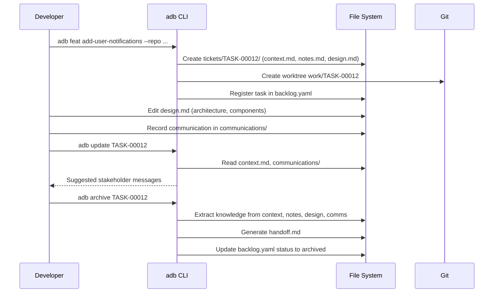
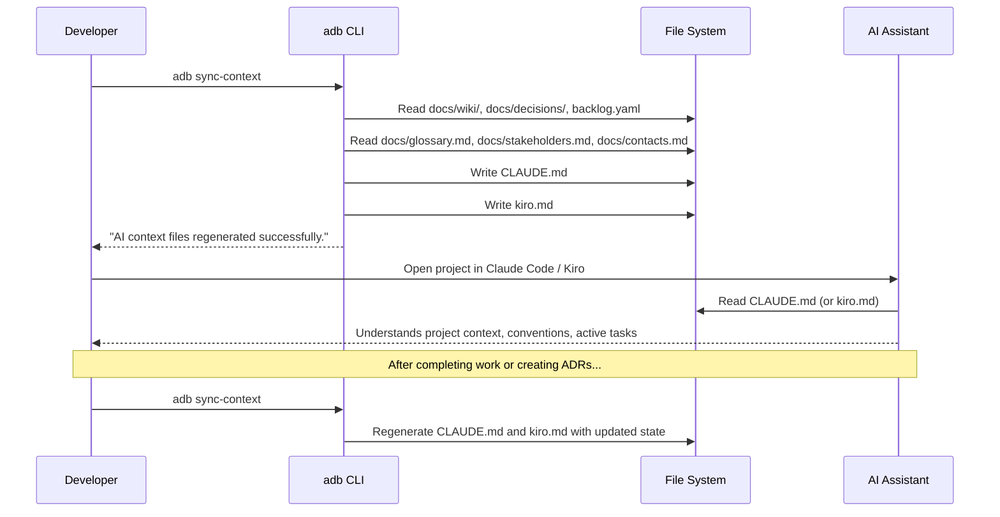
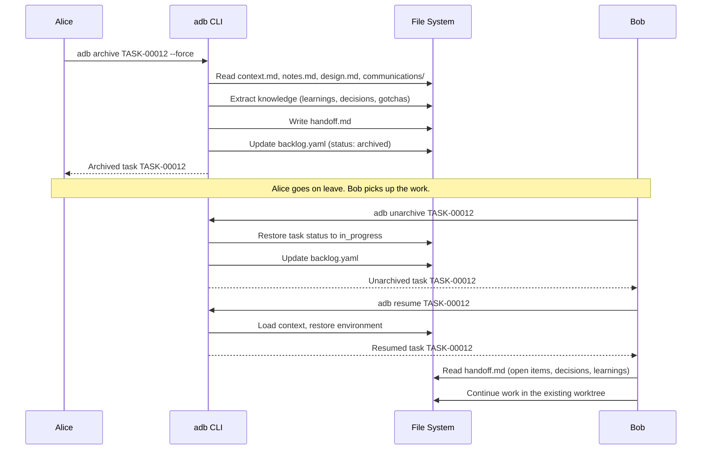
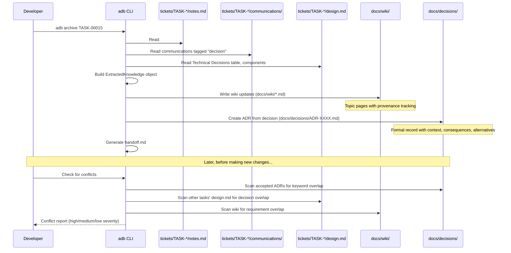

# Usage Scenarios

This document walks through 11 real-world scenarios that demonstrate how to use AI Dev Brain (`adb`) in day-to-day software development. Each scenario is self-contained and shows full command sequences with realistic output.

---

## Table of Contents

1. [Feature Development Workflow](#scenario-1-feature-development-workflow)
2. [Bug Investigation and Fix](#scenario-2-bug-investigation-and-fix)
3. [Multi-Repository Task](#scenario-3-multi-repository-task)
4. [Spike / Research Task](#scenario-4-spike--research-task)
5. [Working with AI Assistants (Claude/Kiro)](#scenario-5-working-with-ai-assistants-claudekiro)
6. [Team Handoff](#scenario-6-team-handoff)
7. [Offline Development](#scenario-7-offline-development)
8. [CLI Tool Integration](#scenario-8-cli-tool-integration)
9. [Knowledge Management](#scenario-9-knowledge-management)
10. [Priority Management and Backlog Grooming](#scenario-10-priority-management-and-backlog-grooming)
11. [Observability and Health Monitoring](#scenario-11-observability-and-health-monitoring)

---

## Scenario 1: Feature Development Workflow

**Situation:** You are tasked with adding a user notifications feature to a web application. This scenario covers the full lifecycle -- from task creation through design, stakeholder communication, and archival.

### Step 1: Create the Feature Task

```bash
$ adb feat add-user-notifications --repo github.com/acme/webapp --priority P1 --owner @alice --tags notifications,frontend
```

```
Created task TASK-00012
  Type:     feat
  Branch:   add-user-notifications
  Repo:     github.com/acme/webapp
  Worktree: work/TASK-00012
  Ticket:   tickets/TASK-00012
```

This command creates:

- A task entry in `backlog.yaml`
- A ticket folder at `tickets/TASK-00012/` with scaffolded files (`context.md`, `notes.md`, `design.md`)
- A git worktree checked out to `work/TASK-00012`

### Step 2: Review the Generated Ticket Structure

```
tickets/TASK-00012/
  context.md          # AI-readable summary, blockers, open questions
  notes.md            # Free-form developer notes
  design.md           # Technical design document with architecture diagram
  communications/     # Stakeholder communication log (empty initially)
  sessions/           # Session summaries (timestamped markdown files)
  knowledge/          # Extracted decisions and facts (decisions.yaml)
```

### Step 3: Edit the Design Document

Open `tickets/TASK-00012/design.md` and fill in the technical design. The scaffolded template includes sections for an overview, a Mermaid architecture diagram, components, technical decisions, and stakeholder requirements:

```markdown
## Overview

Add real-time notification delivery to the webapp using WebSocket push,
with a notification preferences API for per-user channel configuration.

## Architecture

` ` `mermaid
graph TB
    API[Notification API] --> Queue[Message Queue]
    Queue --> WSGateway[WebSocket Gateway]
    Queue --> EmailWorker[Email Worker]
    WSGateway --> Client[Browser Client]
    EmailWorker --> SMTP[SMTP Server]
` ` `

## Components

### Notification API
- **Purpose:** REST endpoints for creating, listing, and dismissing notifications
- **Interfaces:** POST /notifications, GET /notifications, PATCH /notifications/:id
- **Dependencies:** Message Queue

### WebSocket Gateway
- **Purpose:** Push real-time notifications to connected browser clients
- **Dependencies:** Message Queue
```

### Step 4: Record a Stakeholder Communication

After a Slack discussion with the product manager about notification preferences, record it for future reference:

Edit `tickets/TASK-00012/communications/2025-07-15-slack-pm-sarah-notification-preferences.md`:

```markdown
# 2025-07-15-slack-pm-sarah-notification-preferences.md

**Date:** 2025-07-15
**Source:** slack
**Contact:** PM Sarah
**Topic:** notification preferences

## Content

Sarah confirmed that users should be able to opt out of email notifications
individually per notification type. Push notifications should remain on by
default. The preferences page should be accessible from the user profile menu.

## Tags
- requirement
- decision
```

### Step 5: Generate Stakeholder Updates

When it is time to provide a progress report, generate suggested messages:

```bash
$ adb update TASK-00012
```

```
Update plan for TASK-00012 (generated 2025-07-18 14:30)

== Planned Messages (1) ==

[1] To: PM Sarah via slack [normal]
    Subject: Update: TASK-00012
    Reason: Progress update for TASK-00012
    ---
    Update on TASK-00012:

    Summary: Add real-time notification delivery with WebSocket push.

    Recent Progress:
    - Notification API endpoints implemented
    - WebSocket gateway prototype working

    Blockers:
    - (none)
```

Review the suggested message, then copy it into Slack. The `update` command generates content for your review -- it never sends messages automatically.

### Step 6: Archive the Task

After the feature is merged and deployed:

```bash
$ adb archive TASK-00012
```

```
Archived task TASK-00012
  Summary: Add real-time notification delivery with WebSocket push.
  Completed:
    - Notification API endpoints implemented
    - WebSocket gateway deployed
    - Email worker integrated with SMTP
  Open items:
    - Analytics dashboard for notification delivery rates
  Learnings:
    - WebSocket Gateway: Push real-time notifications to connected browser clients
    - Notification API: REST endpoints for creating, listing, and dismissing notifications
```

This generates a `tickets/TASK-00012/handoff.md` document capturing all decisions, learnings, and open items.

### Workflow Diagram



---

## Scenario 2: Bug Investigation and Fix

**Situation:** A production bug is reported -- users receive duplicate email notifications. You need to investigate, document the root cause, and fix it.

### Step 1: Create a Bug Task

```bash
$ adb bug fix-duplicate-email-notifications --repo github.com/acme/webapp --priority P0
```

```
Created task TASK-00013
  Type:     bug
  Branch:   fix-duplicate-email-notifications
  Repo:     github.com/acme/webapp
  Worktree: work/TASK-00013
  Ticket:   tickets/TASK-00013
```

### Step 2: Document Reproduction Steps

Edit `tickets/TASK-00013/notes.md`:

```markdown
# Notes: TASK-00013

## Reproduction Steps

1. Create a new notification via POST /notifications
2. Wait for the email worker to process the message
3. Observe that the email is sent twice

## Environment

- Production cluster: us-east-1
- Email worker version: v2.3.1
- Message queue: RabbitMQ 3.12

## Investigation Log

### 2025-07-20

Checked the RabbitMQ management console. Messages are being acknowledged
correctly but the consumer appears to process each message twice.

Root cause: The email worker's prefetch count was set to 1, but the
acknowledgment was happening after a retry loop that re-queued the message
on the first attempt before processing it.

## Learnings

- RabbitMQ consumers must acknowledge before any retry logic to avoid double delivery
- The email worker retry loop was incorrectly placed around the ack call

## Gotchas

- The prefetch count setting looks correct in isolation; the bug only manifests
  when combined with the retry wrapper
```

### Step 3: Record the Root Cause Decision

Edit `tickets/TASK-00013/communications/2025-07-20-standup-team-duplicate-emails-root-cause.md`:

```markdown
# 2025-07-20-standup-team-duplicate-emails-root-cause.md

**Date:** 2025-07-20
**Source:** standup
**Contact:** Tech Lead Bob
**Topic:** duplicate emails root cause

## Content

Discussed root cause at standup. The email worker retry wrapper was
calling channel.Nack() before attempting reprocessing, causing the
message to be requeued while also being processed. Fix is to
acknowledge first, then retry internally without requeueing.

## Tags
- decision
- blocker
```

### Step 4: Archive After Fix

```bash
$ adb archive TASK-00013
```

```
Archived task TASK-00013
  Summary: Fix duplicate email notifications caused by incorrect ack ordering
  Completed:
    - Root cause identified: ack after retry loop caused requeue
    - Email worker retry logic refactored to ack-first pattern
  Open items:
    - Add integration test for email deduplication
  Learnings:
    - RabbitMQ consumers must acknowledge before any retry logic to avoid double delivery
    - The email worker retry loop was incorrectly placed around the ack call
```

---

## Scenario 3: Multi-Repository Task

**Situation:** You need to add a new API endpoint in the backend service and consume it from the frontend application. This requires coordinated changes across two repositories.

### Step 1: Create the Task with the Primary Repository

```bash
$ adb feat add-search-api --repo github.com/acme/api-server --priority P1 --tags search,api
```

```
Created task TASK-00014
  Type:     feat
  Branch:   add-search-api
  Repo:     github.com/acme/api-server
  Worktree: work/TASK-00014
  Ticket:   tickets/TASK-00014
```

### Step 2: Add a Second Worktree for the Frontend

Create a second worktree manually for the frontend repository under the same task:

```bash
$ cd repos/github.com/acme/webapp
$ git worktree add ../webapp/add-search-api add-search-api
```

Your working directory now has two worktrees for the same task:

```
repos/
  github.com/acme/
    api-server/add-search-api/    # Backend changes
    webapp/add-search-api/         # Frontend changes
```

### Step 3: Document Cross-Repo Decisions

In `tickets/TASK-00014/design.md`, document the API contract that both repositories must agree on:

```markdown
## Overview

Add full-text search to the platform. The backend provides a
GET /api/v2/search endpoint; the frontend consumes it with a new
SearchBar component.

## Components

### Search API (api-server)
- **Purpose:** Full-text search endpoint using Elasticsearch
- **Interfaces:** GET /api/v2/search?q=term&page=1&limit=20
- **Dependencies:** Elasticsearch cluster

### SearchBar (webapp)
- **Purpose:** Frontend search input with debounced API calls and result display
- **Dependencies:** Search API
```

### Step 4: Coordinate Changes

Work in the backend worktree first to implement and deploy the API endpoint. Then switch to the frontend worktree to build the consumer. The shared `tickets/TASK-00014/` folder keeps context centralized regardless of which repository you are working in.

### Step 5: Archive When Both Sides Are Complete

```bash
$ adb archive TASK-00014
```

The handoff document captures the cross-repo design, including which repositories were involved and what contracts were established.

---

## Scenario 4: Spike / Research Task

**Situation:** You need to evaluate whether to replace the existing REST API with GraphQL. This is a time-boxed research task with no code deliverable -- the output is a recommendation and an ADR.

### Step 1: Create a Spike Task

```bash
$ adb spike evaluate-graphql-migration --tags graphql,architecture
```

```
Created task TASK-00015
  Type:     spike
  Branch:   evaluate-graphql-migration
  Ticket:   tickets/TASK-00015
```

### Step 2: Document Research Findings

Edit `tickets/TASK-00015/notes.md` as you research:

```markdown
# Notes: TASK-00015

## Research Goals

- Evaluate GraphQL as a replacement for the REST API
- Assess migration complexity and risk
- Produce a recommendation with ADR

## Findings

### Pros
- Single endpoint reduces frontend request count by ~40%
- Type-safe schema provides compile-time validation
- Subscriptions can replace our WebSocket implementation

### Cons
- Team has no GraphQL experience (2-3 sprint ramp-up)
- Existing REST clients (mobile app, partner integrations) need migration path
- N+1 query risk requires DataLoader pattern

### Performance Benchmarks

Tested with 100 concurrent users:
- REST (4 requests): avg 180ms total
- GraphQL (1 request): avg 95ms total

## Learnings

- GraphQL subscriptions could replace our custom WebSocket gateway
- DataLoader is essential for avoiding N+1 queries in a relay-style schema

## Wiki Updates

- GraphQL evaluation results and benchmarks

## Gotchas

- Apollo Server middleware conflicts with our existing Express error handler
```

### Step 3: Record the Decision Communication

After presenting findings to the architecture review board:

Edit `tickets/TASK-00015/communications/2025-07-25-meeting-arch-board-graphql-decision.md`:

```markdown
# 2025-07-25-meeting-arch-board-graphql-decision.md

**Date:** 2025-07-25
**Source:** meeting
**Contact:** Architecture Board
**Topic:** GraphQL migration decision

## Content

The architecture board decided to proceed with GraphQL migration for
new endpoints only. Existing REST endpoints will remain until all
consumers have migrated. The migration will be phased over 3 quarters.

## Tags
- decision
```

### Step 4: Archive with Knowledge Extraction

```bash
$ adb archive TASK-00015
```

```
Archived task TASK-00015
  Summary: Evaluated GraphQL as a replacement for the REST API
  Completed:
    - Performance benchmarks completed
    - Architecture board presentation delivered
    - Decision reached: phased migration for new endpoints
  Open items:
    - Create migration plan for Q1
    - Set up GraphQL training for the team
  Learnings:
    - GraphQL subscriptions could replace our custom WebSocket gateway
    - DataLoader is essential for avoiding N+1 queries in a relay-style schema
```

The knowledge extracted from this spike -- learnings, decisions, wiki updates -- feeds back into the organizational knowledge base (see [Scenario 9](#scenario-9-knowledge-management)).

---

## Scenario 5: Working with AI Assistants (Claude/Kiro)

**Situation:** You use AI coding assistants (Claude Code, Amazon Kiro) in your development workflow. You want them to understand your project's context -- active tasks, architectural decisions, conventions, and glossary -- without manual prompting every session.

### Step 1: Sync AI Context

Run `sync-context` to generate (or regenerate) the AI context files:

```bash
$ adb sync-context
```

```
AI context files regenerated successfully.
```

This produces two files at the project root:

- `CLAUDE.md` -- Context file for Claude Code
- `kiro.md` -- Context file for Amazon Kiro

### Step 2: Inspect the Generated Context

The generated `CLAUDE.md` contains the following sections, automatically assembled from your project state:

```markdown
# AI Dev Brain Context

> Auto-generated context file for AI coding assistants. Last updated: 2025-07-25T14:30:00Z

## Project Overview

AI Dev Brain is a developer productivity system that wraps AI coding
assistants with persistent context management. This monorepo contains
task management, documentation, and multi-repository worktrees.

## Directory Structure

- `docs/` - Organizational knowledge (wiki, ADRs, runbooks, contacts)
- `tickets/` - Task folders with context, communications, and design docs
- `repos/` - Git worktrees organized by platform/org/repo
- `backlog.yaml` - Central task registry

## Key Conventions

- Branch naming: `{type}/{task-id}-{description}`
- Commit format: Conventional Commits with task ID reference
- PR template: Include task ID, summary, and testing notes

## Glossary

- **Task**: Unit of work with TASK-XXXXX ID
- **Worktree**: Isolated git working directory for a task
- **ADR**: Architecture Decision Record

## Active Decisions Summary

- ADR-0001: Use WebSocket for real-time notifications (TASK-00012)
- ADR-0002: Phased GraphQL migration for new endpoints only (TASK-00015)

## Active Tasks

| Task ID    | Title                     | Status      | Branch                                        |
|------------|---------------------------|-------------|-----------------------------------------------|
| TASK-00014 | Add search API            | in_progress | add-search-api                |

## Key Contacts

See [docs/stakeholders.md](docs/stakeholders.md) for outcome owners.
See [docs/contacts.md](docs/contacts.md) for subject matter experts.

---
*Run `adb sync-context` to regenerate this file.*
```

### Step 3: How AI Assistants Use the Context

When you open a project with Claude Code or Kiro, the assistant reads the context file automatically. This means:

- It understands the project structure without you explaining it
- It knows about active architectural decisions (ADRs) and avoids contradicting them
- It references the glossary so it uses the same terminology as your team
- It can see which tasks are active and their branches

### Step 4: Keep Context Current

After completing tasks, creating ADRs, or updating the wiki, regenerate the context:

```bash
$ adb sync-context
```

The context files are assembled from:

| Section              | Source                                          |
|----------------------|-------------------------------------------------|
| Overview             | Built-in project description                    |
| Directory Structure  | Built-in layout description                     |
| Conventions          | `docs/wiki/*convention*` files, or defaults     |
| Glossary             | `docs/glossary.md`, or defaults                 |
| Decisions Summary    | `docs/decisions/ADR-*.md` (accepted only)       |
| Active Tasks         | `backlog.yaml` (in_progress, blocked, review, backlog) |
| Contacts             | `docs/stakeholders.md`, `docs/contacts.md`      |
| Critical Decisions   | `tickets/*/knowledge/decisions.yaml` (active tasks) |
| Recent Sessions      | Latest `tickets/*/sessions/*.md` (active tasks)     |

### Workflow Diagram



---

## Scenario 6: Team Handoff

**Situation:** Alice has been working on a feature but is going on leave. Bob needs to pick up where she left off. The handoff document generated during archival captures everything Bob needs.

### Step 1: Alice Archives Her In-Progress Task

Alice uses `--force` because the task is still `in_progress`:

```bash
$ adb archive TASK-00012 --force
```

```
Archived task TASK-00012
  Summary: Add real-time notification delivery with WebSocket push.
  Completed:
    - Notification API endpoints implemented
    - WebSocket gateway prototype working
    - Email worker scaffolded
  Open items:
    - WebSocket gateway needs load testing
    - Email worker SMTP integration pending
    - Frontend notification dropdown not started
  Learnings:
    - WebSocket reconnection needs exponential backoff for mobile clients
    - The message queue consumer prefetch count must be tuned per environment
```

### Step 2: Inspect the Handoff Document

The generated `tickets/TASK-00012/handoff.md`:

```markdown
# Handoff: TASK-00012

**Generated:** 2025-07-20T16:00:00Z
**Status:** Archived

## Summary

Add real-time notification delivery with WebSocket push.

## Completed Work

- Notification API endpoints implemented
- WebSocket gateway prototype working
- Email worker scaffolded

## Open Items

- [ ] WebSocket gateway needs load testing
- [ ] Email worker SMTP integration pending
- [ ] Frontend notification dropdown not started

## Key Learnings

- WebSocket reconnection needs exponential backoff for mobile clients
- The message queue consumer prefetch count must be tuned per environment

## Decisions Made

- Use WebSocket for real-time delivery instead of polling
- Separate email worker process for async delivery

## Gotchas

- The prefetch count setting looks correct in isolation; the bug only manifests
  when combined with the retry wrapper

## Related Documentation

## Provenance

This handoff was generated from TASK-00012 communications and notes.
```

### Step 3: Bob Unarchives and Resumes

Bob restores the task to its pre-archive state:

```bash
$ adb unarchive TASK-00012
```

```
Unarchived task TASK-00012
  Type:     feat
  Status:   in_progress
  Branch:   add-user-notifications
  Worktree: work/TASK-00012
  Ticket:   tickets/TASK-00012
```

Then resumes it:

```bash
$ adb resume TASK-00012
```

```
Resumed task TASK-00012
  Type:     feat
  Status:   in_progress
  Branch:   add-user-notifications
  Worktree: work/TASK-00012
  Ticket:   tickets/TASK-00012
```

Bob now has full access to:

- The original design document in `tickets/TASK-00012/design.md`
- All stakeholder communications in `tickets/TASK-00012/communications/`
- The handoff document listing what is done and what remains
- The git worktree with Alice's code changes

### Handoff Workflow Diagram



---

## Scenario 7: Offline Development

**Situation:** You are working on a flight or in an area without internet connectivity. `adb` detects the offline state automatically and queues operations that require network access, replaying them when connectivity is restored.

### Step 1: Normal Operation (Online)

While online, all operations execute immediately:

```bash
$ adb feat improve-caching --repo github.com/acme/api-server
```

```
Created task TASK-00016
  Type:     feat
  Branch:   improve-caching
  Repo:     github.com/acme/api-server
  Worktree: work/TASK-00016
  Ticket:   tickets/TASK-00016
```

### Step 2: Working Offline

When connectivity drops, `adb` detects this via a TCP probe to a public DNS server. Local operations (creating tickets, editing notes, updating context) continue to work because they are file-based. Operations that require network access (such as remote git operations or external integrations) are queued in `.offline_queue.json`:

```json
[
  {
    "id": "op-001",
    "type": "git_push",
    "payload": {
      "branch": "improve-caching",
      "remote": "origin"
    },
    "timestamp": "2025-07-28T10:00:00Z"
  },
  {
    "id": "op-002",
    "type": "git_push",
    "payload": {
      "branch": "improve-caching",
      "remote": "origin"
    },
    "timestamp": "2025-07-28T11:30:00Z"
  }
]
```

All local adb commands work as usual:

```bash
$ adb status
```

```
== IN_PROGRESS (1) ==
  ID           PRI  TYPE       BRANCH
  ----         ---  ----       ------
  TASK-00016   P2   feat       improve-caching
```

### Step 3: Reconnecting and Syncing

When you regain connectivity, the pending operations are replayed:

```
Synced 2 operations, 0 failed.
```

The offline queue uses exponential backoff for retries. If an operation fails (for example, due to a merge conflict on the remote), it remains in the queue with an error description, and you can resolve it manually.

### Key Points

- **Local-first:** Task creation, context editing, note-taking, and status queries all work offline because they operate on local files (`backlog.yaml`, `tickets/`, etc.)
- **Queued operations:** Network-dependent actions are saved to `.offline_queue.json` and replayed automatically
- **Connectivity detection:** Uses a TCP dial to `8.8.8.8:53` with a 3-second timeout
- **Retry logic:** Failed syncs use exponential backoff (100ms, 200ms, 400ms) up to 3 attempts

---

## Scenario 8: CLI Tool Integration

**Situation:** Your team uses several CLI tools (linters, test runners, deployment scripts) throughout development. `adb` can integrate with these tools through aliases in `.taskconfig` and through `Taskfile.yaml` for project automation, injecting task context as environment variables.

### Step 1: Configure CLI Aliases

Add aliases to your `.taskconfig`:

```yaml
cli_aliases:
  - name: lint
    command: eslint
    default_args: ["--fix", "src/"]
  - name: test
    command: jest
    default_args: ["--coverage"]
  - name: deploy
    command: ./scripts/deploy.sh
```

### Step 2: List Configured Aliases

```bash
$ adb exec
```

```
Configured CLI aliases:
  lint -> eslint [--fix src/]
  test -> jest [--coverage]
  deploy -> ./scripts/deploy.sh
```

### Step 3: Execute Through Aliases with Task Context

When a task is active, `adb exec` injects task-specific environment variables into the subprocess:

```bash
$ adb exec lint
```

The subprocess receives these environment variables:

| Variable            | Value                                                         |
|---------------------|---------------------------------------------------------------|
| `ADB_TASK_ID`       | `TASK-00016`                                                 |
| `ADB_BRANCH`        | `improve-caching`                            |
| `ADB_WORKTREE_PATH` | `work/TASK-00016` |
| `ADB_TICKET_PATH`   | `tickets/TASK-00016`                                         |

Your scripts can use these variables. For example, a deploy script could tag the deployment with the task ID:

```bash
#!/bin/bash
echo "Deploying branch $ADB_BRANCH for task $ADB_TASK_ID"
```

### Step 4: Failure Logging

If a CLI tool fails (non-zero exit code) while a task is active, the failure is logged to `tickets/TASK-00016/context.md`:

```markdown
## CLI Failure

- **Command:** `eslint --fix src/`
- **Exit Code:** 1
- **Stderr:**
` ` `
src/components/SearchBar.tsx:42:5 error Unexpected var, use let or const
` ` `
```

This creates a persistent record of build failures tied to the task context.

### Step 5: Pipe Support

If any argument to `adb exec` is the pipe character (`|`), the entire command is delegated to the system shell (`sh -c` on Linux/macOS, `cmd /c` on Windows). This allows piped commands to work transparently:

```bash
$ adb exec grep -r "TODO" src | wc -l
```

The shell delegation preserves alias resolution and task context injection.

### Step 6: Use Taskfile.yaml for Project Automation

Create a `Taskfile.yaml` in your project root:

```yaml
version: "3"

tasks:
  build:
    desc: Build the project
    cmds:
      - go build ./...

  test:
    desc: Run tests with coverage
    cmds:
      - go test -cover ./...

  lint-and-test:
    desc: Lint then test
    cmds:
      - golangci-lint run
      - go test ./...

  deploy-staging:
    desc: Deploy to staging environment
    cmds:
      - ./scripts/deploy.sh staging
```

List available tasks:

```bash
$ adb run --list
```

```
Available Taskfile tasks:
  build                Build the project
  test                 Run tests with coverage
  lint-and-test        Lint then test
  deploy-staging       Deploy to staging environment
```

Execute a task:

```bash
$ adb run test
```

The runner discovers `Taskfile.yaml`, finds the named task, and executes each command sequentially, injecting the same `ADB_*` environment variables as `adb exec`.

---

## Scenario 9: Knowledge Management

**Situation:** After completing several tasks, you want to extract the learnings and decisions into the organizational knowledge base -- creating ADRs for architectural decisions, updating the project wiki, and checking for conflicts with previous decisions.

### Step 1: Extract Knowledge from a Completed Task

Knowledge extraction is **automatic** -- it happens as part of `adb archive` with no separate command required. When you archive a task, the system reads:

- `tickets/TASK-00015/notes.md` -- Sections: `## Learnings`, `## Gotchas`, `## Wiki Updates`, `## Runbook Updates`
- `tickets/TASK-00015/context.md` -- Sections: `## Decisions Made`
- `tickets/TASK-00015/design.md` -- Technical decisions table, component descriptions
- `tickets/TASK-00015/communications/` -- Entries tagged with `decision` or `requirement`

This produces an `ExtractedKnowledge` object containing learnings, decisions, gotchas, wiki updates, and runbook updates.

### Step 2: Create an ADR

For the GraphQL migration decision from the spike task, create a formal Architecture Decision Record:

The system creates `docs/decisions/ADR-0002-phased-graphql-migration.md`:

```markdown
# ADR-0002: Phased GraphQL Migration

**Status:** Accepted
**Date:** 2025-07-25
**Source:** TASK-00015

## Context

The existing REST API serves 15+ endpoints consumed by the web app,
mobile app, and 3 partner integrations. Performance benchmarks show
GraphQL reduces frontend request latency by ~47%.

## Decision

Proceed with GraphQL migration for new endpoints only. Existing REST
endpoints will remain until all consumers have migrated. The migration
will be phased over 3 quarters.

## Consequences

- New endpoints will use GraphQL schema
- REST endpoints remain supported for 3 quarters
- Team needs GraphQL training

## Alternatives Considered

- Full immediate migration (rejected: too risky for partner integrations)
- Keep REST only (rejected: performance gap is significant)
```

### Step 3: Update the Wiki

Knowledge extracted from task notes populates the wiki. If the notes contain a `## Wiki Updates` section, those topics are written to `docs/wiki/`:

```
docs/wiki/graphql-evaluation-results-and-benchmarks.md
```

Content:

```markdown
# GraphQL evaluation results and benchmarks

(content populated from task notes)

---
*Learned from TASK-00015*
```

If the wiki page already exists, the new content is appended as an update with provenance tracking.

### Step 4: Detect Conflicts with Previous Decisions

Before making changes that might contradict existing ADRs or stakeholder requirements, run a conflict check. The conflict detector scans:

1. **ADR violations** -- `docs/decisions/` for accepted ADRs whose decision text overlaps with your proposed changes (severity: high)
2. **Previous task decisions** -- `tickets/*/design.md` for decisions recorded in other tasks (severity: medium)
3. **Stakeholder requirements** -- `docs/wiki/` for documented requirements that may conflict (severity: medium)

The detection uses keyword extraction (significant words of 4+ characters, excluding stop words) and flags potential conflicts when 2 or more keywords overlap between your proposed changes and existing documents.

Example conflict output:

```
[HIGH] ADR Violation
  Source: ADR-0001-use-websocket-for-notifications.md
  Description: Proposed changes may conflict with ADR "Use WebSocket for
    real-time notifications": We will use WebSocket connections...
  Recommendation: Review ADR-0001-use-websocket-for-notifications.md
    and verify the proposed changes align with the accepted decision.

[MEDIUM] Previous Decision
  Source: TASK-00012
  Description: Proposed changes may conflict with decisions in task TASK-00012
  Recommendation: Review the decisions recorded in TASK-00012/design.md
    before proceeding.
```

### Knowledge Management Workflow Diagram



---

## Scenario 10: Priority Management and Backlog Grooming

**Situation:** Your backlog has accumulated several tasks at various stages. You need to review the current state, reprioritize based on new information, and filter by status to focus on what matters.

### Step 1: View All Tasks

```bash
$ adb status
```

```
== IN_PROGRESS (2) ==
  ID           PRI  TYPE       BRANCH
  ----         ---  ----       ------
  TASK-00014   P1   feat       add-search-api
  TASK-00016   P2   feat       improve-caching

== BLOCKED (1) ==
  ID           PRI  TYPE       BRANCH
  ----         ---  ----       ------
  TASK-00017   P1   feat       payment-integration

== REVIEW (1) ==
  ID           PRI  TYPE       BRANCH
  ----         ---  ----       ------
  TASK-00018   P2   bug        fix-login-timeout

== BACKLOG (3) ==
  ID           PRI  TYPE       BRANCH
  ----         ---  ----       ------
  TASK-00019   P3   refactor   extract-auth-module
  TASK-00020   P3   feat       user-profile-page
  TASK-00021   P3   spike      evaluate-cdn-options
```

Tasks are grouped by status in lifecycle order: `in_progress`, `blocked`, `review`, `backlog`, `done`, `archived`.

### Step 2: Filter by Status

Focus on just the blocked tasks:

```bash
$ adb status --filter blocked
```

```
== BLOCKED (1) ==
  ID           PRI  TYPE       BRANCH
  ----         ---  ----       ------
  TASK-00017   P1   feat       payment-integration
```

Or see only backlog items to plan the next sprint:

```bash
$ adb status --filter backlog
```

```
== BACKLOG (3) ==
  ID           PRI  TYPE       BRANCH
  ----         ---  ----       ------
  TASK-00019   P3   refactor   extract-auth-module
  TASK-00020   P3   feat       user-profile-page
  TASK-00021   P3   spike      evaluate-cdn-options
```

### Step 3: Reprioritize Tasks

After a planning meeting, the CDN evaluation spike becomes urgent and the caching improvement drops in priority:

```bash
$ adb priority TASK-00021 TASK-00014 TASK-00016
```

```
Priorities updated:
  TASK-00021 -> P0
  TASK-00014 -> P1
  TASK-00016 -> P2
```

The `priority` command assigns priorities based on argument order: the first task gets P0 (highest), the second P1, the third P2, and any subsequent tasks get P3.

### Step 4: Resume a Backlog Task

Pick up the newly prioritized spike:

```bash
$ adb resume TASK-00021
```

```
Resumed task TASK-00021
  Type:     spike
  Status:   in_progress
  Branch:   evaluate-cdn-options
  Ticket:   tickets/TASK-00021
```

The task is promoted from `backlog` to `in_progress`.

### Step 5: Create Different Task Types

`adb` supports four task types, each creating the same folder structure but tracking different work categories:

```bash
# Feature - new functionality
$ adb feat add-dark-mode --repo github.com/acme/webapp

# Bug - defect fix
$ adb bug fix-session-expiry --repo github.com/acme/api-server --priority P0

# Spike - research / time-boxed investigation
$ adb spike evaluate-redis-cluster --tags infrastructure

# Refactor - code improvement without behavior change
$ adb refactor extract-auth-module --repo github.com/acme/api-server
```

All four commands accept the same flags:

| Flag         | Description                          | Example                            |
|--------------|--------------------------------------|------------------------------------|
| `--repo`     | Repository path                      | `github.com/acme/webapp`           |
| `--priority` | Task priority (P0, P1, P2, P3)       | `P0`                              |
| `--owner`    | Task owner                           | `@alice`                           |
| `--tags`     | Comma-separated tags                 | `frontend,notifications`           |

### Backlog at a Glance

After grooming, verify the updated state:

```bash
$ adb status
```

```
== IN_PROGRESS (2) ==
  ID           PRI  TYPE       BRANCH
  ----         ---  ----       ------
  TASK-00021   P0   spike      evaluate-cdn-options
  TASK-00014   P1   feat       add-search-api

== BLOCKED (1) ==
  ID           PRI  TYPE       BRANCH
  ----         ---  ----       ------
  TASK-00017   P1   feat       payment-integration

== REVIEW (1) ==
  ID           PRI  TYPE       BRANCH
  ----         ---  ----       ------
  TASK-00018   P2   bug        fix-login-timeout

== BACKLOG (2) ==
  ID           PRI  TYPE       BRANCH
  ----         ---  ----       ------
  TASK-00016   P2   feat       improve-caching
  TASK-00019   P3   refactor   extract-auth-module
```

---

## Scenario 11: Observability and Health Monitoring

**Situation:** You want to understand your task workflow health -- how many tasks are being created versus completed, whether anything is stuck, and whether the backlog is growing out of control.

### Step 1: Check Metrics

View aggregated metrics from the event log:

```bash
$ adb metrics --since 30d
```

```
Metrics (since 2025-06-18)

  Events recorded:         42
  Tasks created:           8
  Tasks completed:         5
  Agent sessions:          15
  Knowledge extracted:     3

  Tasks by type:
    feat:                5
    bug:                 2
    spike:               1

  Status transitions:
    in_progress:         12
    done:                5
    review:              4

  Oldest event:          2025-06-20T09:15:00Z
  Newest event:          2025-07-18T14:22:00Z
```

Use `--json` for machine-readable output suitable for dashboards or scripts:

```bash
$ adb metrics --json --since 7d
```

### Step 2: Review Active Alerts

Check for workflow issues that need attention:

```bash
$ adb alerts
```

```
2 active alert(s):

  [HIGH] Task TASK-00017 has been blocked for 72 hours
         triggered at 2025-07-18 10:30 UTC

  [MEDIUM] Task TASK-00018 has been in review for 5 days
         triggered at 2025-07-18 10:30 UTC
```

Alert thresholds are configurable in `.taskconfig`:

```yaml
notifications:
  alerts:
    blocked_threshold_hours: 24
    stale_threshold_days: 3
    review_threshold_days: 5
    max_backlog_size: 10
```

### Step 3: Save a Session Summary

Before ending a work session, save a summary for continuity:

```bash
$ adb session save TASK-00016
```

```
Session saved: /home/you/adb-workspace/tickets/TASK-00016/sessions/2025-07-18T16-30-00Z.md
Edit the file to fill in session details.
```

The generated file contains sections for accomplished work, decisions, blockers, and next steps. If `context.md` exists, its contents are appended as a context snapshot. The AI context generator reads the latest session file per active task to provide continuity across AI assistant sessions.

### Key Points

- **Event log:** All task lifecycle events are recorded automatically to `.adb_events.jsonl` (append-only JSONL)
- **Non-fatal:** If the event log cannot be created, observability is disabled without affecting core functionality
- **On-demand:** Metrics and alerts are derived from the event log at query time, not pre-computed
- **Configurable:** Alert thresholds can be tuned per workspace in `.taskconfig`

---

## Quick Reference: Command Cheat Sheet

| Command                          | Description                                       |
|----------------------------------|---------------------------------------------------|
| `adb feat <branch>`             | Create a new feature task                          |
| `adb bug <branch>`              | Create a new bug task                              |
| `adb spike <branch>`            | Create a new spike/research task                   |
| `adb refactor <branch>`         | Create a new refactor task                         |
| `adb resume <task-id>`          | Resume an existing task                            |
| `adb archive <task-id>`         | Archive a completed task (generates handoff)       |
| `adb archive <task-id> --force` | Archive an active task                             |
| `adb unarchive <task-id>`       | Restore an archived task                           |
| `adb status`                    | View all tasks grouped by status                   |
| `adb status --filter <status>`  | View tasks filtered by status                      |
| `adb priority <id> [id...]`     | Reorder task priorities                            |
| `adb update <task-id>`          | Generate stakeholder communication updates         |
| `adb sync-context`              | Regenerate CLAUDE.md and kiro.md                   |
| `adb exec [alias] [args...]`    | Execute external CLI with alias resolution         |
| `adb exec`                      | List configured CLI aliases                        |
| `adb run [task] [args...]`      | Execute a Taskfile.yaml task                       |
| `adb run --list`                | List available Taskfile tasks                      |
| `adb metrics [--json] [--since]`| Display task and agent metrics from the event log  |
| `adb alerts`                    | Show active alerts (blocked, stale, review, backlog)|
| `adb session save [task-id]`   | Save a session summary to the task's sessions/      |
